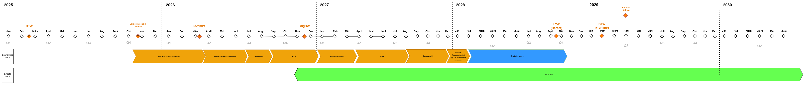

# Wahllokalsystem

The `Wahllokalsystem` is a system that supports elections in the city of munich. It enables the election board of each constituency to enter the counted votes and deliver them securely to the election office.

The system also allows users to document the presence of the election board and occurences during the election. It has certain offline capabilities in case of a broken network connection and is also able to notify all election offices via broadcast messages.

The system was developed and used for the first time during the Bundestags election september 2017.

### Built With

The project is built with technologies we use in our projects
([reference architecture](https://opensource.muenchen.de/publish.html#refarch)):

* [Spring Boot](https://spring.io/projects/spring-boot)
* [Vue.js](https://vuejs.org/)

## Roadmap

The Following graphic shows the Roadmap for the project. Changes to the Roadmap can always occur

See the [open issues](https://github.com/it-at-m/Wahllokalsystem/issues) for a full list of proposed features (and known issues).

## Set up

The Getting Started guide can be found in the documentation here: https://it-at-m.github.io/Wahllokalsystem/technik/get_started/.

## Documentation

We use [VitePress](https://vitepress.dev/) for our documentation. The sources for the documentation is also part of
this repository. After building the documentation is accessible via https://it-at-m.github.io/Wahllokalsystem/.

## Contributing

If you want to Contribute to the Project, please look into our [CONTRIBUTING.md](/CONTRIBUTING.md)

## License

Distributed under the MIT License. See [LICENSE](LICENSE) file for more information.

## Contact

it@M - opensource@muenchen.de
