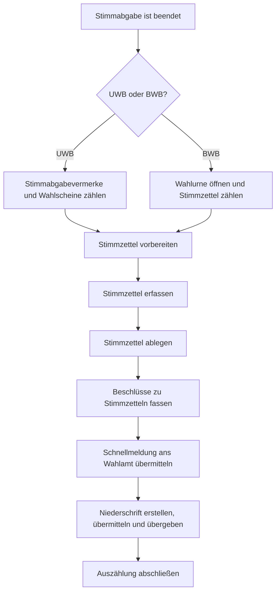

# Digitale Stimmzettel Erfassung (DSE)

Das bisherige Verfahren zur Erfassung von Ergebnissen mittels Stapelbildung soll verbessert werden.

Mit den Stapeln waren diverse manuelle Arbeiten notwendig, die Zeit in Anspruch nehmen und potenzielle Fehlerquellen darstellen. Die
digitale Erfassung der Stimmzettel verringert die Komplexität und die manuellen Schritte durch den Wahlvorstand. Die vorliegenden
Stimmzettel werden im System erfasst. Das System berechnet aus den erfassten Daten das Ergebnis.

Zur Migrationsbeiratswahl 2026 soll mit dem WLS eine erste Testversion der DSE ausprobiert werden.

## Prozess

Mit dem Schritt `Stimmzettel vorbereiten` beginnt der neue Prozess. Mit dem Schritt `Schnellmeldung ans Wahlamt übermitteln`
ist man wieder im gewohnten Prozess.

Die separate Übermittlung einer Schnellmeldung und Niederschrift hat wahlrechtliche Gründe.

### Neuer Prozess zur DSE

Mit dem neuen Prozess wurden neue Statuswerte für die einzelnen Erfassungsteams sowie Wahlbezirke eingeführt:

#### Stimmzettel vorbereiten

In diesem Schritt erfolgen vorbereitende Maßnahmen, um die Erfassung zu erleichtern. Der Stimmzettel wird z.B. vollständig
entfaltet, und es werden Markierungen vorgenommen, die zeigen, wo man Stimmen findet.

#### Stimmzettel erfassen

Sobald sich ein Erfassungsteam im System eingeloggt hat, ist es "registriert" und kann mit der Stimmzettelerfassung
starten, woraufhin der Status "in Bearbeitung" gespeichert wird. Das Schriftführungsteam muss zuvor die Stimmzettel
und Wahlscheine gezählt haben.
Stimmzettel, über die der gesamte Wahlvorstand einen Beschluss fassen muss, werden entsprechend markiert.

#### Stimmzettel ablegen

Die erfassten Stimmzettel werden entsprechend der Regeln der Wahl für die Ablage vorbereitet. Stimmzettel, über die noch
ein Beschluss zu fassen ist, landen so auf einem separaten Stapel.

#### Beschlüsse zu Stimmzetteln fassen

Sind alle Teams mit der Erfassung fertig und der Status "abgeschlossen" wurde erfolgreich übermittelt, startet die
Beschlussdokumentation.
Der Wahlvorstand fasst die Beschlüsse zu den zuvor markierten Stimmzetteln und überträgt die Ergebnisse ins System.
