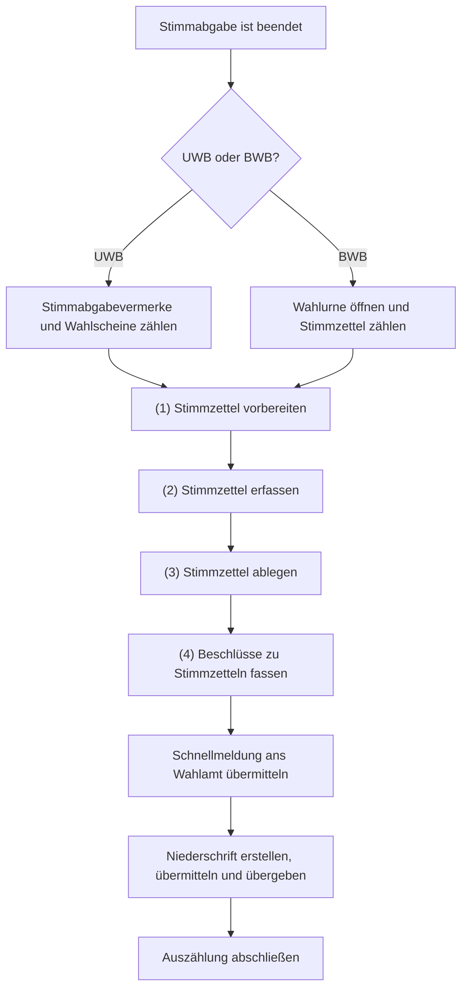
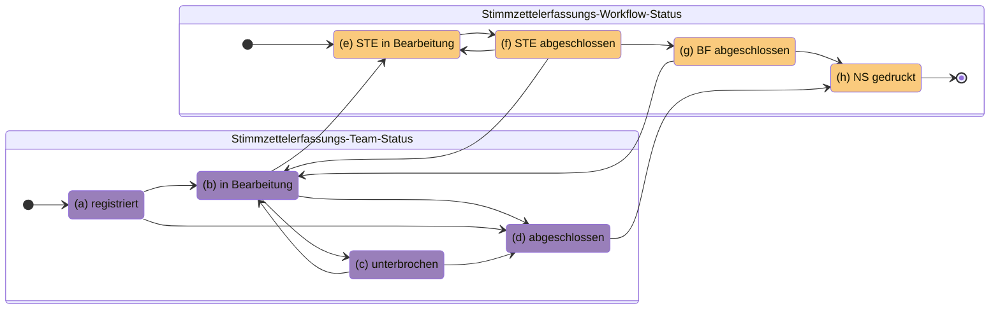
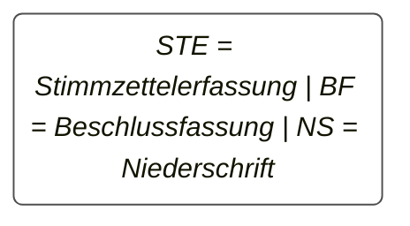
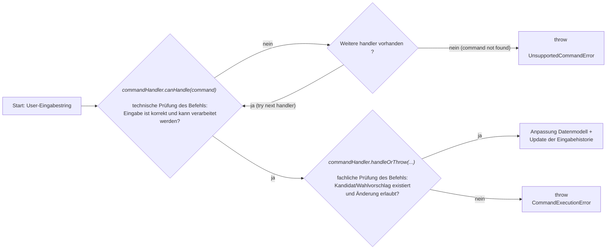

# Digitale Stimmzettel Erfassung (DSE)

Das bisherige Verfahren zur Erfassung von Ergebnissen mittels Stapelbildung soll verbessert werden.

Mit den Stapeln waren diverse manuelle Arbeiten notwendig, die Zeit in Anspruch nehmen und potenzielle Fehlerquellen darstellen. Die
digitale Erfassung der Stimmzettel verringert die Komplexität und die manuellen Schritte durch den Wahlvorstand. Die vorliegenden
Stimmzettel werden im System erfasst. Das System berechnet aus den erfassten Daten das Ergebnis.

Zur Migrationsbeiratswahl 2026 soll mit dem WLS eine erste Testversion der DSE ausprobiert werden.

## Prozess

Mit dem Schritt `Stimmzettel vorbereiten` beginnt der neue Prozess. Mit dem Schritt `Schnellmeldung ans Wahlamt übermitteln`
ist man wieder im gewohnten Prozess.

Die separate Übermittlung einer Schnellmeldung und Niederschrift hat wahlrechtliche Gründe.

### Neuer Prozess zur DSE

#### (1) Stimmzettel vorbereiten

In diesem Schritt erfolgen vorbereitende Maßnahmen, um die Erfassung zu erleichtern. Der Stimmzettel wird z.B. vollständig
entfaltet, und es werden Markierungen vorgenommen, die zeigen, wo man Stimmen findet.

#### (2) Stimmzettel erfassen {#stimmzettel-erfassen}

In diesem Schritt erfolgt die Erfassung der Stimmzettel im System. Der Stimmzettelerfassungs-Workflow-Status wird
auf `(e) STE in Bearbeitung` gesetzt. Stimmzettel, über die der gesamte Wahlvorstand einen Beschluss fassen muss,
werden entsprechend markiert und mit einem oder mehreren `Vormerkungsgründen` versehen.

Um eine möglichst intuitive Erfassung der Stimmen des Stimmzettels zu ermöglichen, haben wir
[Regeln](/technik/adr/ui/adr010-dse-stimmvergabe-stimmen-ergaenzen) definiert.

Zur schnelleren Erfassung können spezielle [Kurzbefehle](#kurzbefehle-fur-die-erfassung) verwendet werden.

#### (3) Stimmzettel ablegen

Die erfassten Stimmzettel werden entsprechend der Regeln der Wahl für die Ablage vorbereitet. Stimmzettel, über die noch
ein Beschluss zu fassen ist, landen so auf einem separaten Stapel.

#### (4) Beschlüsse zu Stimmzetteln fassen {#beschluesse-erfassen}

Sind alle Teams mit der Erfassung fertig und der Stimmzettelerfassungs-Workflow-Status `(f) STE abgeschlossen` wurde
erfolgreich übermittelt, startet die Beschlussdokumentation. Der Wahlvorstand fasst die Beschlüsse zu den zuvor
markierten Stimmzetteln und überträgt die Ergebnisse ins System. Eine Zusammenfassung mehrerer
`Vormerkungsgründe` stellt einen `Beschlussvorschlag` dar, über welchen im Gremium abgestimmt wird. Der Vorschlag,
der am Ende die Abstimmung gewinnt, wird als `Entscheidungsgrund` gespeichert. Sind alle Beschlüsse vollständig
dokumentiert, wird der Stimmzettelerfassungs-Workflow-Status `(g) BF abgeschlossen` gespeichert.

### Neue Statuswerte

Mit dem neuen Prozess wurden neue Statuswerte für die einzelnen Erfassungsteams sowie Wahlbezirke eingeführt:

| Status                   | Beschreibung, wann der Status gesetzt wird                                                                                                                                                                                                                                                                                                                                                                                                    |
|--------------------------|-----------------------------------------------------------------------------------------------------------------------------------------------------------------------------------------------------------------------------------------------------------------------------------------------------------------------------------------------------------------------------------------------------------------------------------------------|
| `(a) registriert`        | Sobald sich ein Erfassungsteam im System eingeloggt hat, ist es `registriert`.                                                                                                                                                                                                                                                                                                                                                                |
| `(b) in Bearbeitung`     | Die Stimzettelerfassung [(2)](#stimmzettel-erfassen) kann von Teams mit der Rolle **Erfassungsteam** gestartet werden, sobald sie `(a) registriert` sind, und von Teams mit der Rolle **Schriftführung**, sobald zuvor alle Stimmzettel und Wahlscheine gezählt wurden. Hat ein Team die Erfassung bereits `(d) abgeschlossen`, kann es nur durch ein Team mit der Rolle **Schriftführung** wieder für die Bearbeitung freigeschalten werden. |
| `(c) unterbrochen`       | Jedes Team kann die Stimzettelerfassung [(2)](#stimmzettel-erfassen) kurzzeitig `(c) unterbrechen`, zum Beispiel für die Situation, dass die Erfassung an einem Abend beendet und am nächsten Morgen wieder aufgenommen wird. Der Stimmzettelerfassungs-Workflow-Status bleibt dabei auf `(e) STE in Bearbeitung`.                                                                                                                            |
| `(d) abgeschlossen`      | Sobald alle Stimmzettel aus dem Vorrat eines Teams erfasst wurden, wird das durch den Status `(d) abgeschlossen` bestätigt. Sollte ein eingeloggtes Team keine Stimmzettel zu erfassen haben, kann auch ein Statuswechsel von `(a) registriert` zu `(d) abgeschlossen` erfolgen.                                                                                                                                                              |
| `(e) STE in Bearbeitung` | Sobald ein Team eines Wahlbezirks (egal welche Rolle) einen Statuswechsel zu `(b) in Berabeitung` vollzieht, wird im Hintergrund geprüft, dass der Status `(e) STE in Bearbeitung` auch für den Wahlbezirk gesetzt ist. Dies ist zum Beispiel der Fall, wenn das erste Team mit der Bearbeitung der Stimmzettelerfassung beginnt, oder wenn nach Abschluss der Erfassung ein oder mehrere Teams wieder freigeschalten werden.                 |
| `(f) STE abgeschlossen`  | Der Stimmzettelerfassungs-Workflow-Status `(f) STE abgeschlossen` wird von Teams mit der Rolle **Schriftführung** gesetzt, wenn alle Teams eines Wahlbezirks die Erfassung `(d) abgeschlossen` haben und bestätigt wurde, dass es keine übrigen Stimmzettel mehr im Erfassungsvorrat gibt.                                                                                                                                                    |
| `(g) BF abgeschlossen`   | Nach der Dokumentation aller Beschlussergebnisse [(4)](#beschluesse-erfassen) bestätigen die Teams mit der Rolle **Schriftführung**, dass die `(g) BF abgeschlossen` ist.                                                                                                                                                                                                                                                                     |
| `(h) NS gedruckt`        | Sobald die Teams mit der Rolle **Schriftführung** die Niederschrift gedruckt haben, wird der Stimmzettelerfassungs-Workflow-Status `(h) NS gedruckt` gesetzt.                                                                                                                                                                                                                                                                                 |

> [!NOTE]
> Sollte kein Team einen Stimmzettel erfasst haben, wird der Status `(e) STE in Bearbeitung` übersprungen.

## Kurzbefehle für die Erfassung {#kurzbefehle-fur-die-erfassung}

Um eine schnelle Erfassung der Daten des Stimmzettels zu ermöglichen, können Befehle eingegeben werden. Die Anwendung
gibt Feedback, wenn der Befehl nicht ausführbar oder falsch war.

### Input-Handling Architektur

### Befehle

| Befehl                                | Funktion                                                                                                                                         | Beispiel  |
|---------------------------------------|--------------------------------------------------------------------------------------------------------------------------------------------------|-----------|
| &lt;Kandidatordnungszahl>             | Fügt eine Stimme bei dem/der Kandidat\*in mit der `Ordnungszahl` hinzu                                                                           | 101       |
| &lt;Kandidatordnungszahl>+            | Fügt eine Stimme bei dem/der Kandidat\*in mit der `Ordnungszahl` hinzu                                                                           | 101+      |
| &lt;Kandidatordnungszahl>+&lt;n>      | Fügt `n` Stimmen bei dem/der Kandidat\*in mit der `Ordnungszahl` hinzu                                                                           | 101+3     |
| [u/U]&lt;Kandidatordnungszahl>        | Fügt 1 ungültige Stimme bei dem/der Kandidat\*in mit der `Ordnungszahl` hinzu                                                                    | u101      |
| [u/U]&lt;Kandidatordnungszahl>+&lt;n> | Fügt `n` ungültige Stimmen bei dem/der Kandidat\*in mit der `Ordnungszahl` hinzu                                                                 | u101+3    |
| &lt;untere>-&lt;obere>                | Fügt je 1 Stimme bei allen Kandidat\*innen im Bereich der `Ordnungszahl` von `untere`–`obere` hinzu                                              | 501-510   |
| &lt;untere>-&lt;obere>+&lt;n>         | Fügt je `n` Stimmen im Bereich der `Ordnungszahl` von `untere`–`obere` hinzu                                                                     | 527-535+2 |
| &lt;Wahlvorschlagsnummer>             | Kennzeichnet den Wahlvorschlag mit `Ordnungszahl` (Die Eingabe erfolgt entweder als Wahlvorschlagsnummer oder als Ordnungszahl mit „00“ am Ende) | 5, 500    |
| [s/S]&lt;Kandidatordnungszahl>        | Streichung für den/die Kandidat\*in mit der `Ordnungszahl`                                                                                       | s501      |
| [s/S]&lt;untere>-&lt;obere>           | Streichungen für alle Kandidat\*innen im Bereich der `Ordnungszahl` von `untere`–`obere`                                                         | s501-509  |
