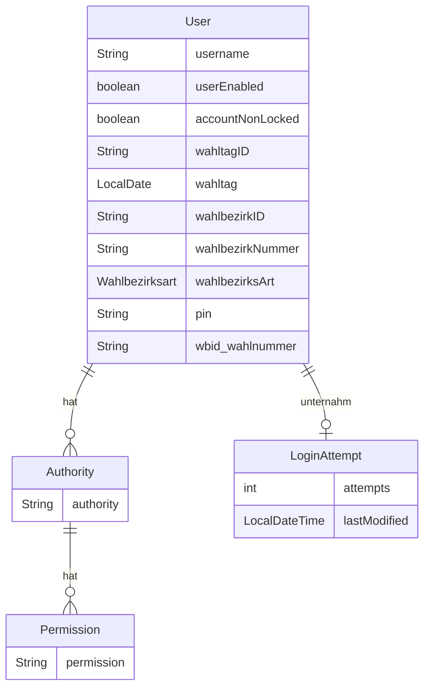

# Auth-Service

Zuständig für die Authentifizierung und Verwaltung der Rechte der User des Systems.

## Abhängigkeiten

Der Service hat keine Abhängigkeiten zu anderen Services.

## Datenmodell

> [!IMPORTANT]
> Der Benutzername liegt in der Datenbank nur verschlüsselt vor.

## Konfigrationsparameter

Alle Konfigurationsparameter beginnen mit dem Prefix `serviceauth`

| Name | Beschreibung                                                                           | Default |
| ---- |----------------------------------------------------------------------------------------| ------- |
| crypto.encryptionPrefix | String vor dem verschlüssten Wert. Auf diese Weise sind verschlüsselte Werte erkennbar | ENCRYPTED: |
| crypto.key | Schlüssel zum ver- und entschlüsseln                                                   | |
| maxLoginAttempts | Maximale Anzahl an Fehlersuchen bis der Account gesperrt wird.                         | 5 |