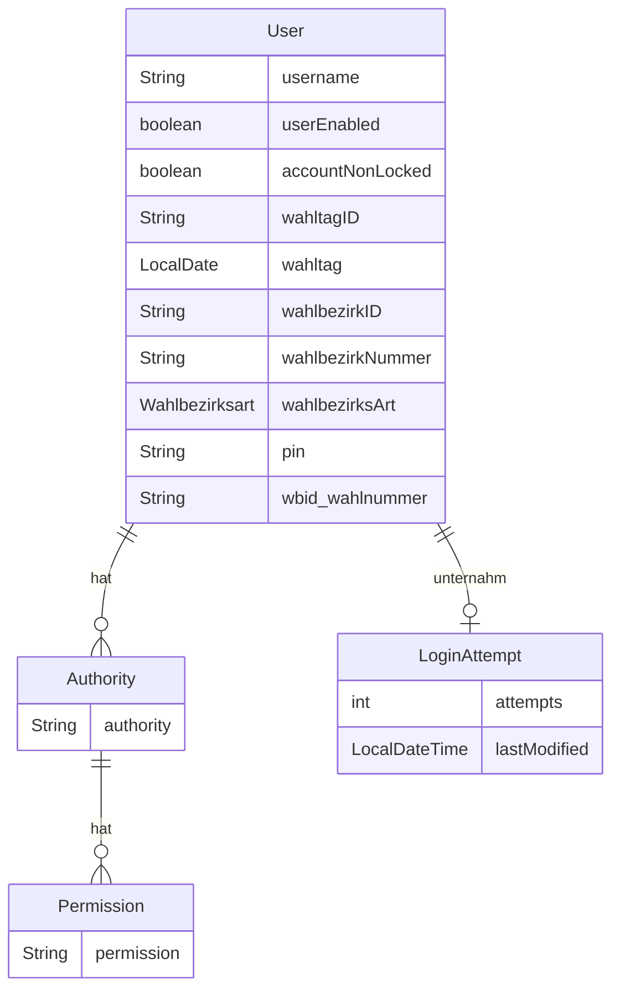
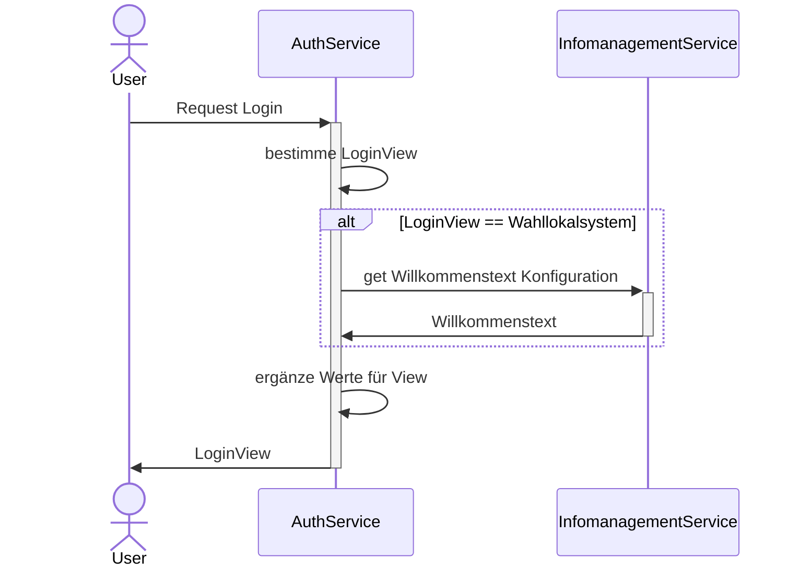

# Auth-Service

Zuständig für die Authentifizierung und Verwaltung der Rechte der User des Systems.

Der Service stellt auch die Loginmaske zur Verfügung. Dazu wird [Freemarker](https://freemarker.apache.org/index.html)
verwendet. Mittels [wro4j](https://github.com/wro4j/wro4j) werden JavaScript Ressource (jquery und Bootstrap)
zur Verfügung gestellt. Im Projekt sind zusätzliche Ressourcen im Ordner `resources-non-filtered` hinterlegt.

## Abhängigkeiten

- Infomanagement-Service

## Datenmodell

> [!IMPORTANT]
> Der Benutzername liegt in der Datenbank nur verschlüsselt vor.
 
## Login

## Konfigrationsparameter

Alle Konfigurationsparameter beginnen mit dem Prefix `serviceauth`

| Name                    | Beschreibung                                                                           | Default |
|-------------------------|----------------------------------------------------------------------------------------| ------- |
| crypto.encryptionPrefix | String vor dem verschlüssten Wert. Auf diese Weise sind verschlüsselte Werte erkennbar | ENCRYPTED: |
| crypto.key              | Schlüssel zum ver- und entschlüsseln                                                   | |
| maxLoginAttempts        | Maximale Anzahl an Fehlersuchen bis der Account gesperrt wird.                         | 5 |
| clients.infomanagement.basepath | URL zum Infomanagement-Service | `http://localhost:39146` |
| clients.infomanagement.configkey.welcomeMessage | Schlüssel für Konfiguration der Willkommensnachricht | WILLKOMMENSTEXT |
| serviceauth.welcomemessage.default | Standartd Willkommensnachricht falls die definierte Willkommensnachricht nicht geladen werden kann | Willkommen zur Wahl! |