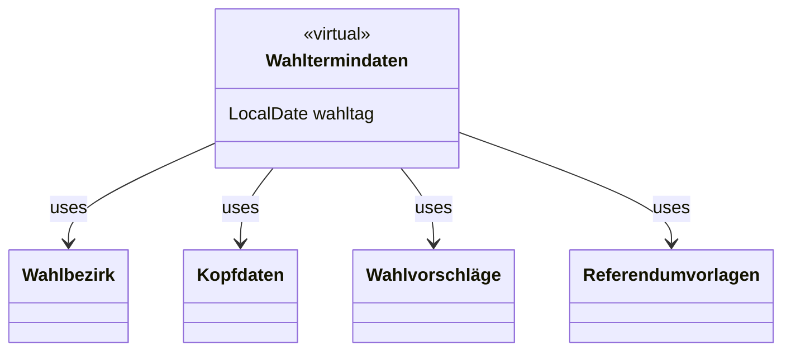

# Basisdaten-Service

Service zur Bereitstellung folgender Basisdaten:

- Wahltage
- Wahlen
- Wahlbezirke
- Wahlvorschläge
- Kopfdaten
- Handbuch
- Ungültige Wahlscheine

Wahlen, Wahlbezirke und Kopfdaten können in der Service-Datenbank gespeichert werden.

## Abhängigkeiten

Folgende Services werden zum Betrieb benötigt:
- EAI-Service
- Infomanagement-Service

## Datenmodell

## Handbuch

In dem Service werden Handbücher verwaltet. Je Wahl und Wahlbezirkart kann ein Handbuch hinterlegt werden.

Bei dem Handbuch soll es sich um ein PDF-Dokument handeln. 

## Ungültige Wahlscheine

Für Wahltage können Listen mit ungültigen Wahlscheinen verwaltet werden. Die Übermittlung der Daten erfolgt
im csv-Format. Dieses umfasst eine Headerzeile, gefolgt von den Daten in den Spalten Name, Vorname und Nummer.

## Wahltermindaten

Wahltermindaten sind eine virtuelle Zusammenfassung von Daten zu einem Wahltermin.

Über den Service können diese Daten für einen Wahltag erstellt und gelöscht werden. Die zu erstellenden Daten
werden von dem EAI-Service importiert.

## Konfigurationsparameter

Alle Konfigurationsparameter beginnen mit `service.config`

| Name | Beschreibung                                      | Default |
| ---- |---------------------------------------------------| ------- |
| ungueltigewahlscheine.filenamesuffix | Dateinamenssuffix für die ungueltigen Wahlscheine | Ungueltigews.csv | 
| manual.filenamesuffix | Dateinamenssuffix für das Handbuch | Handbuch.pdf | 