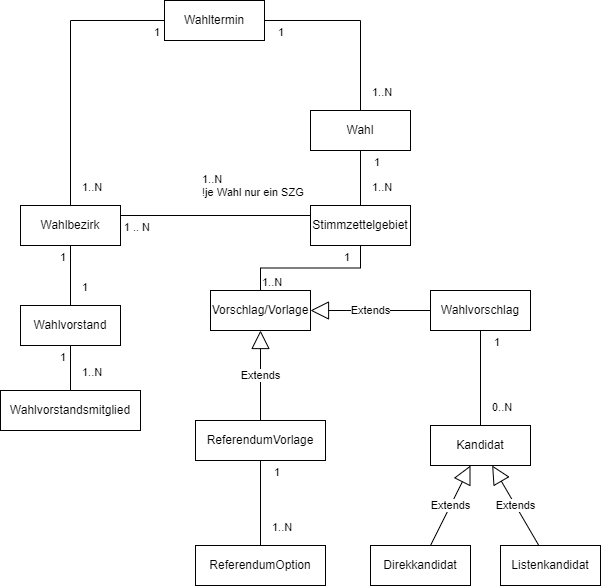
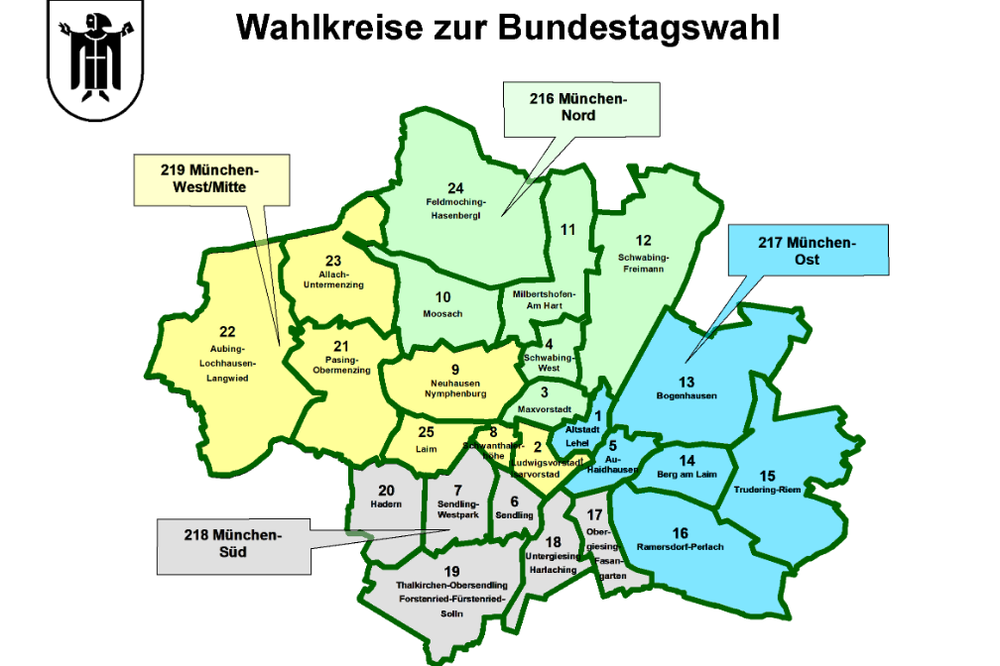
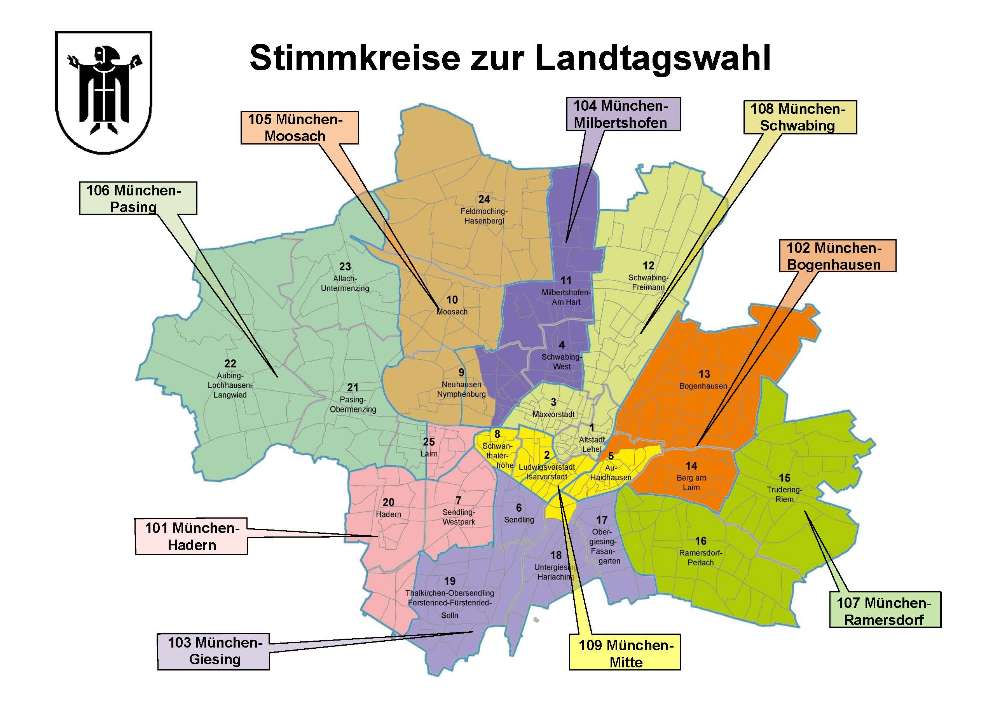

# Features

🚧 in Progress

Für jeden Service gibt es eine separate Beschreibung zu dessen Aufgaben und Funktionen.

## Fachliches Datenmodell

Die Relationen zwischen den fachlichen Elementen können sich von Wahl zu Wahl unterscheiden.
Diese Unterschiede sind Ausfluß der gesetzlichen Grundlage der entsprechenden Wahl, sowie des örtlichen 
Kommunal- und/oder Landes- Wahlrechts.

`Wahltermin` - ein Datum an dem eine Wahl oder auch mehrere Wahlen oder Abstimmungen im
gleichen Wahllokal starten. Diese enden in der Regel auch am gleichen Tag, es gibt aber auch
Wahltermine, die meherere Tage andauern, wie es bei der Kommunalwahl der Fall ist.
In der Praxis, auch wenn dies seltener der Fall ist, können am gleichen Tag sogar mehrere
Wahltermine stattfinden. Diese Notwendigkeit entsteht, wenn sich die berechtigten Wählergruppen
am gleichen Tag in den rechtlichen Grundlagen ihrer Wahlberechtigung stark unterscheiden,
um fehlerhaftes Aufteilen, Ausfüllen und Vermischung der Stimmzettel unterschidlicher
Wählergruppen zu vermeiden. Zum Beispiel, eine Migrationsbeiratswahl bei der Bürger mit
unterschiedlichen Staatsangehörigkeiten wahlberechtigt sind, wird aus dem oberen Hintergrund im Unterschied zu einer
Bundestagswahl in einem getrennten Wahllokal mit dediziertem Wahlvorstand / Wahltisch organisiert.

Wenn aber am gleichen Datum eine Bundestagswahl und ein Bürgerentscheid stattfinden, können diese 
dem gleichen Wahltermin zugeteilt und somit in gemeinsamen Wahllokalen organisiert werden. 

`Stimmzettelgebiet` - siehe hierzu und vergleiche die unten aufgefürten Bedeutungen in verschiedenen Wahlarten;

`Vorschlag` - entspricht einer Partei;

`Vorlage` - entspricht einer Frage / einem Thema eines Volks- oder Bürgerentscheides;

`Wahlbezirk` - auch als Stimmbezirk bezeichnet, entspricht einem Wahllokal (Wahlraum), geführt von einem Wahlvorstand an einem Wahltisch.

[Quellen und mehr Informationen](https://stadt.muenchen.de/rathaus/politik/wahlen.html)

### Erläuterung zu einzelnen Wahlarten

#### Bundestagswahl

`Stimmzettelgebiet` - das im Model als solches bezeichnete Gebiet ist im Bundeswahlrecht der "Wahlkreis". 
Die Landeshauptstadt München hat 4 Wahlkreise: 217 - München Nord, 218 - München Ost, 219 - München Süd und 220 - 
München-West/Mitte. In jedem Wahlkreis gibt es dann mehrere Wahlbezirke (Wahllokale), diese haben in einem Wahlkreis den gleichen Stimmzettel. 
Jedes Wahllokal befindet sich geografisch auch in einem der 25 Stadtbezirke der Landeshauptstadt München. 
Der Inhalt eines Stimmzettels bestimmt sich aus der Zugehörigkeit zum Wahlkreis und nicht zum Stadtbezirk.

##### Beispiel Bundestagswahl

[Mehr Informationen zur Bundestagswahl](https://stadt.muenchen.de/infos/bundestagswahlen.html)

#### Landtagswahl

`Stimmzettelgebiet` - entspricht einem Stimmkreis. Bayern ist in Regierungsbezirke (Wahlkreise), in Landkreise und kreisfreie Städte bzw. in Wahlkreise und Stimmkreise (je max. 125.000 Einwohner) eingeteilt.
Landeshauptstadt München liegt im Wahlkreis Oberbayern und umfasst 9 (Stand 2024) Stimmkreise von 101 bis 109. In jedem Stimmkreis gibt es dann mehrere Wahlbezirke (Wahllokale), diese haben in einem 
Stimmkreis den gleichen Stimmzettel. Jedes Wahllokal befindet sich geografisch auch in einem der 25 Stadtbezirke der Landeshauptstadt München. 
Der Inhalt eines Stimmzettels bestimmt aber seine Zugehörigkeit zum Stimmkreis und nicht zum Stadtbezirk.

##### Beispiel Landtagswahl

[Mehr Informationen zur Landtagswahl.](https://stadt.muenchen.de/infos/landtagswahlen-und-bezirkswahlen-teil-ii.html)

#### Europawahl

`Stimmzettelgebiet` - ist die Bundesrepublik Deutschland. Für das ganze Gebiet der Stadt München mit ihren 25 Stadtbezirken, jeweils mehrere Wahlbezirke/Stimmbezirke umfassend, gibt es also ein einziges Stimmzettelgebiet.
Jedes Wahllokal befindet sich geografisch auch in einem der 25 Stadtbezirke der Landeshauptstadt München. Der Inhalt eines Stimmzettels ist in allen Wahllokalen der Landeshauptstadt München identsich.

[Mehr Informationen zur Europawahl](https://stadt.muenchen.de/infos/europawahlen.html)

