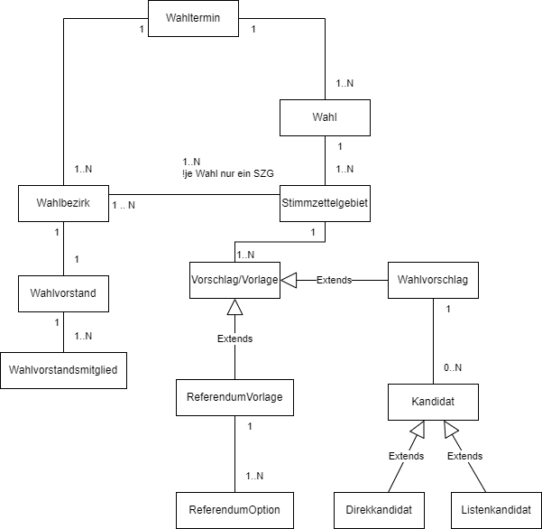

# Features

🚧 in Progress

Für jeden Service gibt es eine separate Beschreibung zu dessen Aufgaben und Funktionen.

## Fachliches Datenmodell

Die Relationen zwischen den fachlichen Elementen können sich von Wahl zu Wahl unterscheiden.
Diese Unterschiede sind Ausfluß der gesetzlichen Grundlage der entsprechenden Wahl, sowie des örtlichen Kommunal- und/oder Landes- Wahlrechts.
Nach der unten stehenden Darstellung des allgemeinen fachlichen Datenmodells, folgen kurze Beispiele für die einzelnen Wahlarten mit entsprechenden Bemerkungen.

### Beispiele:

#### Beispiel Bundestagswahl

Das im Model als `Stimmzettelgebiet` bezeichnetes administrative Gebiet ist im Bundeswahlrecht der "Wahlkreis". 
Die Landeshauptstadt München hat 4 Wahlkreise: 217 - München Nord, 218 - München Ost, 219 - München Süd und 220 - 
München-West/Mitte. (Vergleiche hierzu mit der Landtagswahl - bei der es in der Landeshauptstadt München 9 
Stimmzettelgebiete von 101 bis 109 gibt, die im Landesrecht als Stimmkreise bezeichnet werden. Oder vergeliche mit der 
Europawahl bei der die Bundesrepublik Deutschland das Stimmzettelgebiet darstellt. 
Für das ganze Gebiet der Stadt München mit 25 Stadtbezirke gibt es also ein einziges Stimmzettelgebiet.)

#### Beispiel Europawahl

#### Beispiel Landtagswahl