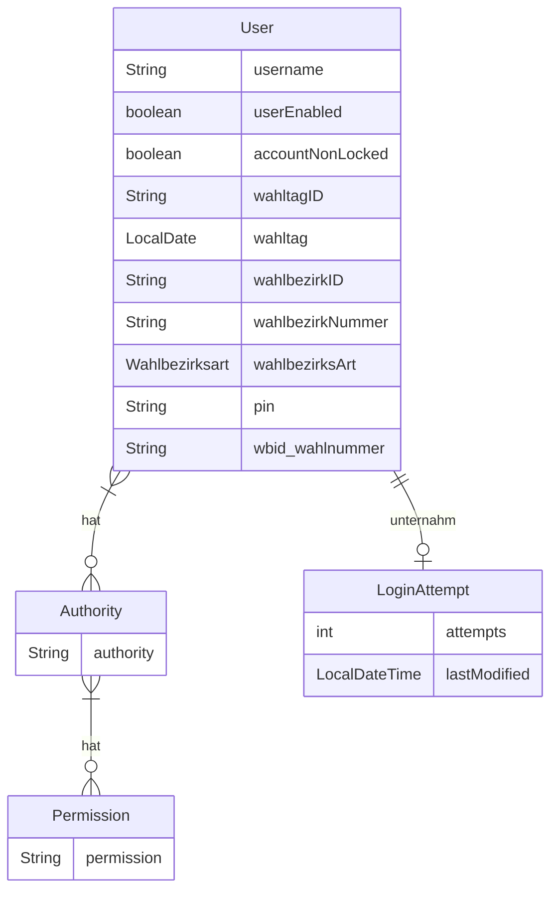
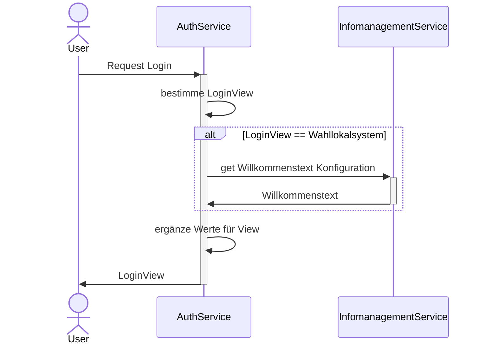
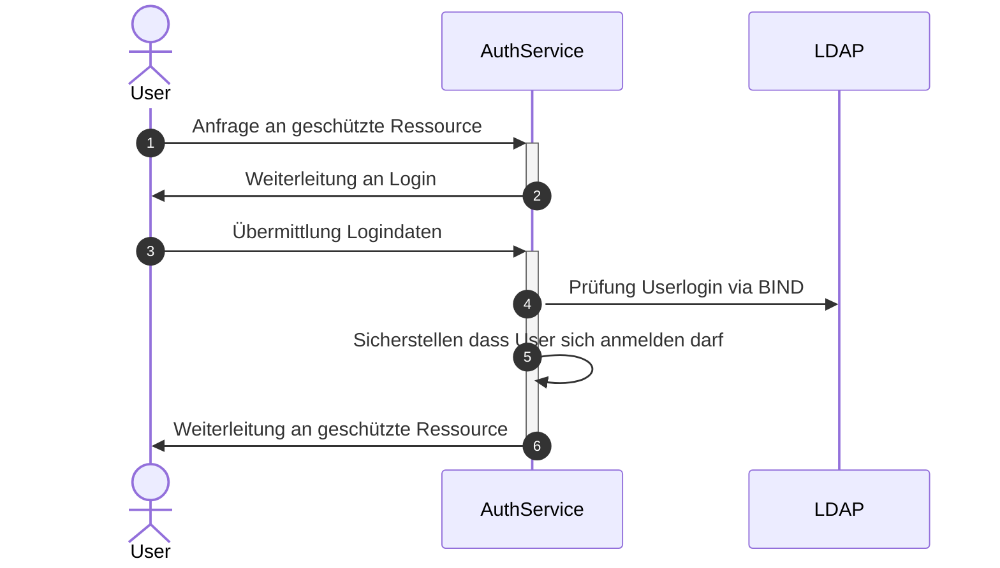

# Auth-Service

Zuständig für die Authentifizierung und Verwaltung der Rechte der User des Systems.

Der Service stellt auch die Loginmaske zur Verfügung. Dazu wird [Freemarker](https://freemarker.apache.org/index.html)
verwendet. Mittels [wro4j](https://github.com/wro4j/wro4j) werden JavaScript Ressource (jquery und Bootstrap)
zur Verfügung gestellt. Im Projekt sind zusätzliche Ressourcen im Ordner `resources-non-filtered` hinterlegt.

## Abhängigkeiten

- Infomanagement-Service

## Datenmodell

> [!IMPORTANT]
> Der Benutzername liegt in der Datenbank nur verschlüsselt vor.
 
## Prozesse

### Auswahl Loginmaske

### Login

1. Der Nutzer fragt eine Resources an die eine Authentifizierung erfordert
1. Client wird zum Login-Formular weitergeleitet
1. Der Nutzer loggt sich mit Benutzername und Password ein
1. Über LDAP wird verifiziert, ob der Benutzername vorhanden ist und sein Password korrekt ist
1. es werden weitere Regeln geprüft die für ein erfolgreiches Login notwendig sind
   1. Ist der Nutzer gesperrt?
   1. Falls der Nutzer gesperrt ist, muss die Sperre abgelaufen sein
   1. darf der Nutzer sich nur innerhalb einer bestimmten Zeitspanne einloggen wird der Zeitraum validiert
   1. erfolgte der Login über eine erlaubte Anwendung (Prüfung der clientID)
1. Der Nutzer wird an die ursprünglich angefragte, geschützte Resource weitergeleitet

> [!NOTE]
> Nutzer des Wahllokalsystems dürfen sich nur innerhalb einer bestimmten Zeit anmelden. Nutzer des Admin-Tools
> dürfen sich zu jeder Zeit anmelden. Um welche Art eines Nutzers es sich handelt, wird anhand von Authorities
> bestimmt.

> [!NOTE]
> Ein erfolgreicher Login setzt alle vorherigen Loginversuche zurück

### Erstellung der Benutzer

> [!IMPORTANT]
> Damit Benutzer angelegt werden können muss die definierte Authority vorhanden sein die den Benutzern zugewiesen werden soll.

> [!NOTE]
> Wird der Service mit dem Profil `db-dummydata` gestartet werden Testdaten erzeugt, welche die notwendige Authority umfasst.
> Im regulären Betrieb werden die Authority sowie Permission mittels Skript erzeugt.

Der Service erzeugt für eine Liste an Wahlbezirken eines Wahltermins (`wahltagID`) Benutzer. Dabei werden der
Benutzername und die PIN zufällig erzeugt.

Die Benutzer die zuvor für den Wahltermin vorhanden waren werden gelöscht.

## Konfigurationsparameter

Alle Konfigurationsparameter beginnen mit dem Prefix `service.config`

| Name                                             | Beschreibung                                                                                       | Default                  |
|--------------------------------------------------|----------------------------------------------------------------------------------------------------|--------------------------|
| crypto.encryptionPrefix                          | String vor dem verschlüssten Wert. Auf diese Weise sind verschlüsselte Werte erkennbar             | ENCRYPTED:               |
| crypto.key                                       | Schlüssel zum ver- und entschlüsseln                                                               |                          |
| falscheLoginZeitstrafe                           | Zeit in Minuten für eine Sperrung                                                                  | 10                       |
| maxLoginAttempts                                 | Maximale Anzahl an Fehlersuchen bis der Account gesperrt wird.                                     | 5                        |
| clients.infomanagement.basepath                  | URL zum Infomanagement-Service                                                                     | `http://localhost:39146` |
| clients.infomanagement.configkey.welcomeMessage  | Schlüssel für Konfiguration der Willkommensnachricht                                               | WILLKOMMENSTEXT          |
| clients.infomanagement.configkey.fruehesterLogin | Schlüssel für Konfiguration des frühesten Zeitpunktes für Login                                    | FRUEHESTE_LOGIN_UHRZEIT  |
| clients.infomanagement.configkey.spaetesterLogin | Schlüssel für Konfiguration des spätesten Zeitpunktes für Login                                    | SPAETESTE_LOGIN_UHRZEIT  |
| clients.infomanagement.dateformat                | Format des Datums wie es vom Infomanagement-Service kommt                                          | dd.MM.yyyy HH:mm         |
| serviceauth.welcomemessage.default               | Standartd Willkommensnachricht falls die definierte Willkommensnachricht nicht geladen werden kann | Willkommen zur Wahl!     |
| ldap.userDn                                      | Username zur Authentifizierung am LDAP-Server                                                      |                          |
| ldap.userDnPassword                              | Passwort zur Authentifizierung am LDAP-Server                                                      |                          |
| ldap.contextSource                               | Url zum LDAP-Server, z.B. `ldaps://my-ldap-server.de:636`                                          |                          |
| ldap.userSearchBase                              | Basispfad für Suche, z.b. `o=myOrg,c=de`                                                           | ou=people                |
| ldap.userSearchFilter                            | Filter für Suche, z.B. `(uid={0})`                                                                 | `uid={0}`                |
| oauth2.clients.wahllokalgui.id                   | ID des Client der Wahllokal-Anwendung                                                              | wahllokalgui             |
| oauth2.clients.admingui.id                       | ID des Client der Admintool-Anwendung                                                              | admingui                 |
| oauth2.jwk.rsa.init.seed                         | Seed für RSA-Schlüsselpaar. Gleiche Seeds sorgen für gleiche Ergebnisse                            |                          |