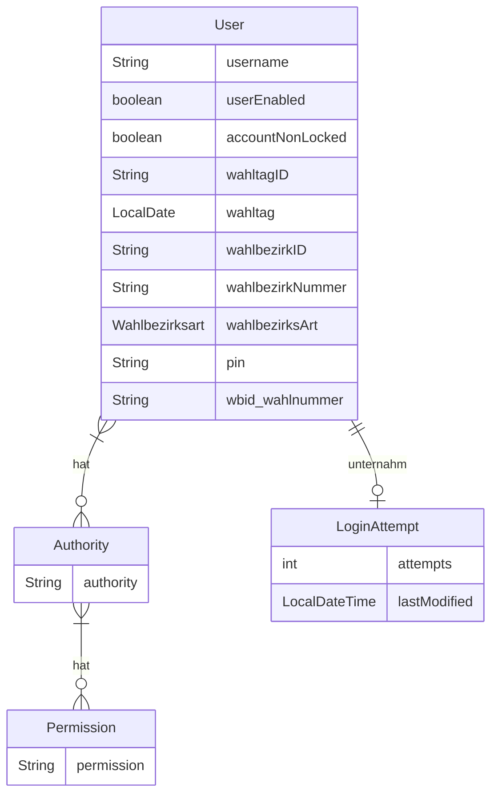
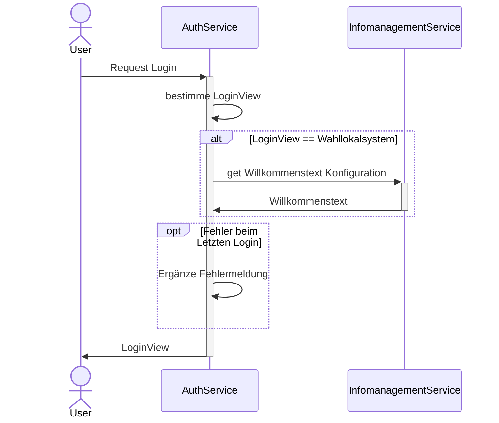

# Auth-Service

Zuständig für die Authentifizierung und Verwaltung der Rechte der User des Systems.

Der Service stellt auch die Loginmaske zur Verfügung. Dazu wird [Freemarker](https://freemarker.apache.org/index.html)
verwendet. Mittels [wro4j](https://github.com/wro4j/wro4j) werden JavaScript Ressourcen (jquery und Bootstrap)
zur Verfügung gestellt. Im Projekt sind zusätzliche Ressourcen im Ordner `resources-non-filtered` hinterlegt.

## Abhängigkeiten

- Infomanagement-Service

## Datenmodell



> [!IMPORTANT]
> Der Benutzername liegt in der Datenbank nur verschlüsselt vor.

## Zusätzliche Claims

Neben den [Standardclaims](https://auth0.com/docs/secure/tokens/json-web-tokens/json-web-token-claims) werden durch
den Auth-Service folgende zusätzliche Claims gesetzt:

| Claimname               | Beschreibung                                                             | Datentyp         |
|-------------------------|--------------------------------------------------------------------------|------------------|
| wahlbezirkID            | technische ID des Hauptwahlbezirkes des Benutzerkontos                   | UUIDv4           |
| wahlbezirksArt          | Art des Wahlbezirks (Urnenwahl oder Briefwahl)                           | Enum: [BWB, UWB] |
| wahlbezirkid_wahlnummer | Wahlbezirke und Wahlen, die dem Benutzerkonto zur Pflege zugewiesen sind | JSON-String      |
| teamID                  | ID des Teams, für das der User zuständig ist                             | String           |

> [!NOTE] Aufbau `wahlbezirkid_wahlnummer`
>
> Der JSON-String bildet folgendes Objekt ab:
>
> ```JSON
> {"wbid_wahlnummer":
>   [{
>       "wahlbezirkID": "e5f6a7b8-c9d0-4e1f-2a3b-4c5d6e7f8a9b",
>       "wahlnummer": "0",
>       "wahlID": "b2c3d4e5-f6a7-4b8c-9d0e-1f2a3b4c5d6e"
>   }]
> }
> ```
>
> - wahlbezirkID ... technische ID des Wahlbezirkes für die Wahl
> - wahlnummer ... Nummer der Wahl in der Reihenfolge der abzuarbeitenden Wahlen
> - wahlID ... technische ID der Wahl, welche durch das Benutzerkonto betreut wird

Diese Informationen sind auch über den Userinfo-Endpunkt des Auth-Services abrufbar.

> [!TIP]
>
> Die Verwendung des Userinfo-Endpunkts wird empfohlen, da man sich so unabhängiger vom Auth-Service macht, und so
> leichter Alternativen, wie z. B. den Keycloak, verwenden kann.

## Prozesse

### Auswahl Loginmaske



### Login

Damit die Nutzer\*innen sich anmelden dürfen, müssen zum einen die Logindaten entsprechend LDAP korrekt sein.
Des Weiteren müssen folgende Regeln beachtet werden:

1. Ist das Benutzerkonto gesperrt?
2. Falls das Benutzerkonto gesperrt ist, muss die Sperre abgelaufen sein
3. Dürfen die Nutzer\*innen sich nur innerhalb einer bestimmten Zeitspanne einloggen wird der Zeitraum validiert
4. Erfolgte der Login über eine erlaubte Anwendung (Prüfung der clientID)

> [!NOTE]
> Ein erfolgreicher Login setzt alle vorherigen Loginversuche zurück

### Erstellung der Benutzerkonten

> [!IMPORTANT]
> Damit Benutzerkonten angelegt werden können, muss die definierte Authority vorhanden sein die den entsprechenden
> Konten zugewiesen werden soll.

> [!NOTE]
> Wird der Service mit dem Profil `db-dummydata` gestartet werden Testdaten erzeugt, welche die notwendige Authority umfasst.
> Im regulären Betrieb werden die Authority sowie Permission mittels Skript erzeugt.

Der Service erzeugt für eine Liste an Wahlbezirken eines Wahltermins (`wahltagID`) Benutzerkonten. Dabei werden der
Benutzername und die PIN zufällig erzeugt.

Die Benutzerkonten die zuvor für den Wahltermin vorhanden waren werden gelöscht.

## Konfigurationsparameter

Alle Konfigurationsparameter beginnen mit dem Prefix `service.config`

| Name                                             | Beschreibung                                                                                      | Default                                                     |
|--------------------------------------------------|---------------------------------------------------------------------------------------------------|-------------------------------------------------------------|
| cors.allowedOrigins                              | Liste mit erlaubten Origins für CORS.                                                             | `http://localhost:8083`, `http://host.docker.internal:8083` |
| crypto.encryptionPrefix                          | String vor dem verschlüsselten Wert. Auf diese Weise sind verschlüsselte Werte erkennbar          | ENCRYPTED:                                                  |
| crypto.key                                       | Schlüssel zum ver- und entschlüsseln                                                              |                                                             |
| falscheLoginZeitstrafe                           | Zeit in Minuten für eine Sperrung                                                                 | 10                                                          |
| maxLoginAttempts                                 | Maximale Anzahl an Fehlversuchen bis der Account gesperrt wird.                                   | 5                                                           |
| clients.infomanagement.basepath                  | URL zum Infomanagement-Service                                                                    | `http://localhost:39146`                                    |
| clients.infomanagement.configkey.welcomeMessage  | Schlüssel für Konfiguration der Willkommensnachricht                                              | WILLKOMMENSTEXT                                             |
| clients.infomanagement.configkey.fruehesterLogin | Schlüssel für Konfiguration des frühesten Zeitpunktes für Login                                   | FRUEHESTE_LOGIN_UHRZEIT                                     |
| clients.infomanagement.configkey.spaetesterLogin | Schlüssel für Konfiguration des spätesten Zeitpunktes für Login                                   | SPAETESTE_LOGIN_UHRZEIT                                     |
| clients.infomanagement.dateformat                | Format des Datums wie es vom Infomanagement-Service kommt                                         | dd.MM.yyyy HH:mm                                            |
| serviceauth.welcomemessage.default               | Standard Willkommensnachricht falls die definierte Willkommensnachricht nicht geladen werden kann | Willkommen zur Wahl!                                        |
| ldap.userDn                                      | Username zur Authentifizierung am LDAP-Server                                                     |                                                             |
| ldap.userDnPassword                              | Passwort zur Authentifizierung am LDAP-Server                                                     |                                                             |
| ldap.contextSource                               | Url zum LDAP-Server, z.B. `ldaps://my-ldap-server.de:636`                                         |                                                             |
| ldap.userSearchBase                              | Basispfad für Suche, z.b. `o=myOrg,c=de`                                                          | ou=people                                                   |
| ldap.userSearchFilter                            | Filter für Suche, z.B. `(uid={0})`                                                                | `uid={0}`                                                   |
| oauth2.logoutUri                                 | Url des AuthServices für den Logout. Ist der selbe Service über den der Login erfolgte            | `http://host.docker.internal:8100/logout`                   |
| oauth2.clients.wahllokalgui.id                   | ID des Client der Wahllokal-Anwendung                                                             | wahllokalgui                                                |
| oauth2.clients.admingui.id                       | ID des Client der Admintool-Anwendung                                                             | admingui                                                    |
| oauth2.jwk.rsa.init.seed                         | Seed für RSA-Schlüsselpaar. Gleiche Seeds sorgen für gleiche Ergebnisse                           |                                                             |
| rsa.rsa-key-setting                              | Enum (GENERATED_KEY,STATIC_KEY), das bestimmt welcher RSA-Key verwendet werden soll               |                                                             |
| rsa.public-key                                   | Verwendeter Public-Key                                                                            |                                                             |
| rsa.private-key                                  | Verwendeter Private-Key                                                                           |                                                             |
| spring.ldap.embedded.ldif                        | Ort der LDAP-Resource für embedded LDAP-Server (Profil: `dummy.ldap`)                             | classpath:users.ldif                                        |
| user.sizeOfTeam                                  | Die Anzahl der Benutzerkonten eines Auszählungsteams inklusive der Schriftführung                 | 5                                                           |

## Token-Settings

Für einen automatischen Refresh des Token sind folgende Einstellungen wichtig. Diese Werte werden für den jeweiligen OAuth2-Client in `OAUTH2_REGISTERED_CLIENT.TOKEN_SETTINGS` gepflegt und nicht als `service.config.*`-Property gesetzt.
Die Lebensdauer des Access-Tokens muss kleiner als die Lebensdauer des Refresh-Tokens sein.
Außerdem muss die Lebensdauer des Refresh-Token länger sein als das Intervall zur Abfrage des Heartbeats. Ansonsten kann die automatische Aktualisierung im Gateway nicht erfolgen.
So wird der Anwendung ermöglicht, automatisch neue Access-Tokens zu generieren, ohne dass der Benutzer sich erneut authentifizieren muss.
Zusätzlich muss die Einstellung für `reuse-refresh-tokens` auf `false` gesetzt sein.
