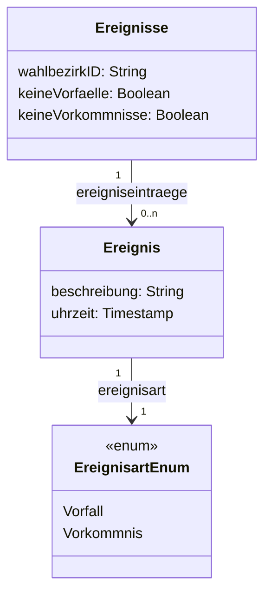

# Vorfälle und Vorkommnisse-Service

Service zum Erfassen und Einsehen von Ereignissen: Vorfälle (während der Stimmabgabe von 8:00 bis 18:00 Uhr) und Vorkommnisse (während der Auszählung)

## Abhängigkeiten

Der Service hat keine Abhängigkeiten zu anderen Services.

## Daten und Funktionen

- Verwalten und Übermitteln von Vorfällen und Vorkommnissen
- Laden und Anzeigen besonderer Ereignisse

## Fachliches Datenmodell

