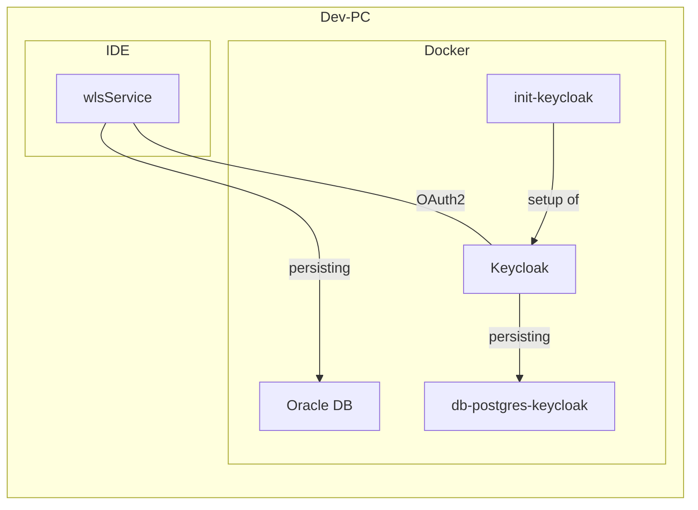

# Entwicklungsumgebung

## Zusammenspiel IDE mit Docker

## Keycloak

### Benutzer

| Name | Passwort | Beschreibung                                                          |
| --- | --- |-----------------------------------------------------------------------|
| keycloak_test | test | Ein Benutzer ohne weitere Rechte                                      |
| wls_all | test | Ein Benutzer mit allen Rechten                                        |
| wls_all_bwb | test | Ein Benutzer mit allen Rechten mit der WahlbezirksArt BWB (Briefwahl) |
| wls_all_uwb | test | Ein Benutzer mit allen Rechten mit der WahlbezirksArt UWB (Urnenwahl) |                 

### Beispiel-Requests

Im Soap-UI-Projekt (`DockerTest-soapui-project`) und `docker.keycloak.http` sind Beispielrequests vorhanden.
Es kann für den jeweiligen Nutzer ein Token geholt werden. Außerdem ist die Anfrage an den UserInfo-Endpoint hinterlegt.

## Datenbank

Jeder Service bekommt einen eigenen Benutzer für die Datenbank. Die Zugriffs-URL ist für alle Services gleich:
`jdbc:oracle:thin:@//localhost:1521/XEPDB1`

Neben dem Standardbenutzer der auf alles zugreifen kann (siehe `docker-compose.yml`) müssen alle weiteren Benutzer über `stack/add-user-on-startup.sql` erstellt werden.

Dabei sollte auf folgendes Schema geachtet werden:
- Benutzername: \<Name des Services\>
- Passwort: secret