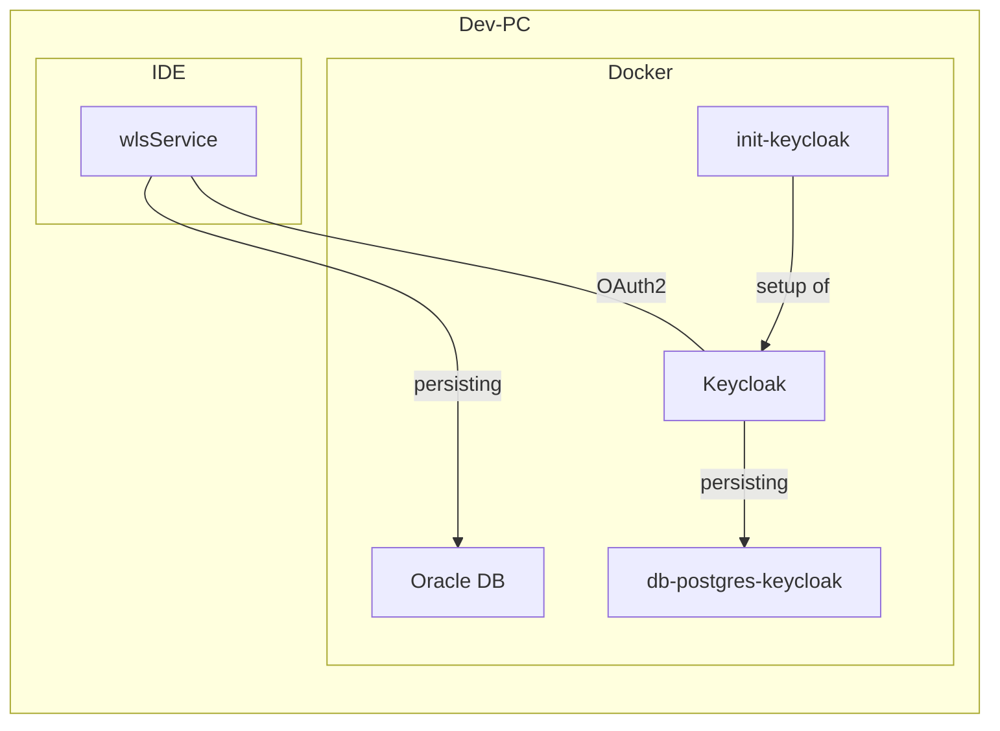

# Entwicklungsumgebung

## Zusammenspiel IDE mit Docker

## Keycloak

### Benutzer

| Name | Passwort | Beschreibung                                                          |
| --- | --- |-----------------------------------------------------------------------|
| keycloak_test | test | Ein Benutzer ohne weitere Rechte                                      |
| wls_all | test | Ein Benutzer mit allen Rechten                                        |
| wls_all_bwb | test | Ein Benutzer mit allen Rechten mit der WahlbezirksArt BWB (Briefwahl) |
| wls_all_uwb | test | Ein Benutzer mit allen Rechten mit der WahlbezirksArt UWB (Urnenwahl) |                 

### Migration

Alle Konfigurationselemente, wie zum Beispiel User, Rollen und Client, werden automatisiert erstellt. Der Realm wird
beim Start von Keycloak importiert. Alle weiteren Elemente werden durch den `init-keycloak`-Container erstellt.

Im Rahmen der Migration werden immer alle Elemente erstellt. Daher ist notwendig, dass zuvor alte Elemente gelöscht wurden.
Somit ergeben sich folgende Schritte bei der Migration:

- alten Realm löschen
- Realm anlegen
- Migrieren von Client, Rolles und Usern

#### Löschen des alten Realm

Über die Weboberfläche kann der Realm gelöscht werden. Dazu ist der Realm `wls_realm` auszuwählen. Unter dem Menüpunkt
`Realm settings` kann über die Action (Drop-Down im oberen rechter Bereich) `Delete` der Realm gelöscht werden.

  
*Löschen des Realms über die Actions in den Realm Settings*

#### Realm anlegen

Um den Client, die Rollen und die User im nächsten Schritt anlegen zu können muss der Realm wieder angelegt werden.
Dies erfolgt über den Import der Realmsettings. Dazu gibt es zwei Varianten

**Variante 1 - Neustarten des Containers**

Beim Starten des Containers wird der Realm importiert.

**Variante 2 - Realm über Weboberfläche anlegen**

Über die Weboberfläche kann ein neuer Realm angelegt werden. In der darauffolgenden Ansicht wird über `browse` das
Konfigurationsfile ausgewählt und abschließend nach dem Klick auf `Create` wird der Realm angelegt.

Die Datei `import-wls-realm.json` liegt im Pfad `stack/keycloak/import` des Projektes.

  
*Button zum Anlegen eines neues Realm im Dropdown der Realms*

#### Ausführen von `wls-init-keycloak`

Die abschließende Migration des Clients, der User, Gruppen und Rollen erfolgt durch den Container `wls-init-keycloak`.
Dazu den Container starten. Nach Abschluss der Migration beendet sich der Container.

  
*Auszug aus dem Log einer erfolgreich durchgeführten Migration*

### Beispiel-Requests

Im Soap-UI-Projekt (`DockerTest-soapui-project`) und `docker.keycloak.http` sind Beispielrequests vorhanden.
Es kann für den jeweiligen Nutzer ein Token geholt werden. Außerdem ist die Anfrage an den UserInfo-Endpoint hinterlegt.

## Datenbank

Jeder Service bekommt einen eigenen Benutzer für die Datenbank. Die Zugriffs-URL ist für alle Services gleich:
`jdbc:oracle:thin:@//localhost:1521/XEPDB1`

Neben dem Standardbenutzer der auf alles zugreifen kann (siehe `docker-compose.yml`) müssen alle weiteren Benutzer über `stack/add-user-on-startup.sql` erstellt werden.

Dabei sollte auf folgendes Schema geachtet werden:
- Benutzername: \<Name des Services\>
- Passwort: secret