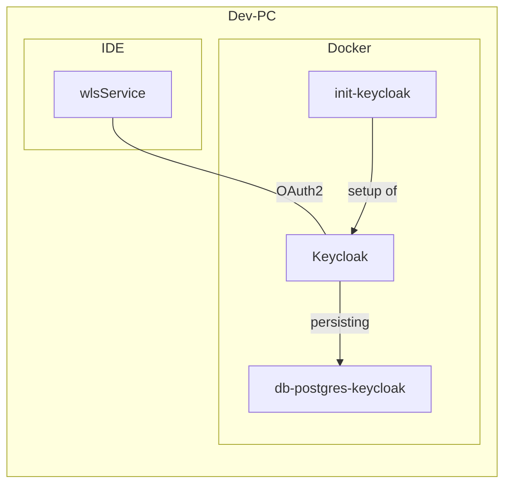

# Entwicklungsumgebung

## Zusammenspiel IDE mit Docker

## Benutzer

| Name | Passwort | Beschreibung |
| --- | --- | --- |
| keycloak_test | test | Ein Benutzer ohne weitere Rechte |
| wls_all | test | Ein Benutzer mit allen Rechten |

## Beispiel-Requests

Im Soap-UI-Projekt (`DockerTest-soapui-project`) und `docker.keycloak.http` sind Beispielrequests vorhanden.
Es kann für den jeweiligen Nutzer ein Token geholt werden. Außerdem ist die Anfrage an den UserInfo-Endpoint hinterlegt.