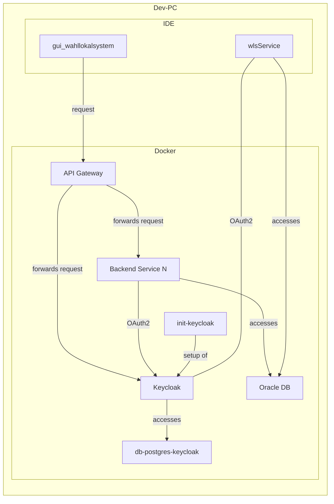

# Entwicklungsumgebung

## Zusammenspiel IDE mit Docker

```mermaid
flowchart LR
    
    subgraph Dev-PC 
        subgraph IDE 
            wlsService
            frontend_gui[gui_wahllokalsystem]
        end
        
        subgraph Docker 
            keycloak[Keycloak]
            keycloakDB[db-postgres-keycloak]
            keycloakInit[init-keycloak]
            oracleDB[Oracle DB]
            apiGateway[API Gateway]
            backendServiceN[Backend Service N]
        end

        apiGateway --->|forwards request| keycloak
        apiGateway --->|forwards request| backendServiceN

        backendServiceN --->|accesses| oracleDB
        backendServiceN --->|OAuth2| keycloak

        frontend_gui --->|request| apiGateway

        keycloak-->|accesses| keycloakDB
        keycloakInit-->|setup of| keycloak

        wlsService ---|OAuth2| keycloak
        wlsService --->|accesses|oracleDB
    end
```

## Services und Ports

Übersicht über die Services und auf welchen Port im Standard lauschen

| Service                                                                  | Port |
|--------------------------------------------------------------------------|------|
| [Admin](/services/admin-service/)                                        | 8209 |
| [Auth](/services/auth-service/)                                          | 8100 |
| [Basisdaten](/services/basisdaten-service/)                              | 8205 |
| [Briefwahl](/services/briefwahl-service/)                                | 8202 |
| Broadcast                                                                | 8200 |
| [EAI](/services/eai-service/)                                            | 8300 |
| [Ergebnismeldung](/services/ergebnismeldung-service/)                    | 8208 |
| [Infomanagement](/services/infomanagement-service/)                      | 8201 |
| [Monitoring](/services/monitoring-service/)                              | 8206 |
| [Vorfälle und Vorkommnisse](/services/vorfaelleundvorkommnisse-service/) | 8204 |
| Wahlvorbereitung                                                         | 8203 |
| [Wahlvorstand](/services/wahlvorstand-service/)                          | 8207 |

## Keycloak

### Benutzer

| Name          | Passwort | Beschreibung                                                          |
|---------------|----------|-----------------------------------------------------------------------|
| keycloak_test | test     | Ein Benutzer ohne weitere Rechte                                      |
| wls_all       | test     | Ein Benutzer mit allen Rechten                                        |
| wls_all_bwb   | test     | Ein Benutzer mit allen Rechten mit der WahlbezirksArt BWB (Briefwahl) |
| wls_all_uwb   | test     | Ein Benutzer mit allen Rechten mit der WahlbezirksArt UWB (Urnenwahl) |                 

### Migration

Alle Konfigurationselemente, wie zum Beispiel User, Rollen und Client, werden automatisiert erstellt. Der Realm wird
beim Start von Keycloak importiert. Alle weiteren Elemente werden durch den `init-keycloak`-Container erstellt.

Im Rahmen der Migration werden immer alle Elemente erstellt. Daher ist notwendig, dass zuvor alte Elemente gelöscht
wurden. Somit ergeben sich folgende Schritte bei der Migration:

- alten Realm löschen
- Realm anlegen
- Migrieren von Client, Rolles und Usern

#### Löschen des alten Realm

Über die Weboberfläche kann der Realm gelöscht werden. Dazu ist der Realm `wls_realm` auszuwählen. Unter dem Menüpunkt
`Realm settings` kann über die Action (Drop-Down im oberen rechter Bereich) `Delete` der Realm gelöscht werden.

  
*Löschen des Realms über die Actions in den Realm Settings*

#### Realm anlegen

Um den Client, die Rollen und die User im nächsten Schritt anlegen zu können muss der Realm wieder angelegt werden.
Dies erfolgt über den Import der Realmsettings. Dazu gibt es zwei Varianten

**Variante 1 - Neustarten des Containers**

Beim Starten des Containers wird der Realm importiert.

**Variante 2 - Realm über Weboberfläche anlegen**

Über die Weboberfläche kann ein neuer Realm angelegt werden. In der darauffolgenden Ansicht wird über `browse` das
Konfigurationsfile ausgewählt und abschließend nach dem Klick auf `Create` wird der Realm angelegt.

Die Datei `import-wls-realm.json` liegt im Pfad `stack/keycloak/import` des Projektes.

  
*Button zum Anlegen eines neues Realm im Dropdown der Realms*

#### Ausführen von `wls-init-keycloak`

Die abschließende Migration des Clients, der User, Gruppen und Rollen erfolgt durch den Container `wls-init-keycloak`.
Dazu den Container starten. Nach Abschluss der Migration beendet sich der Container.

  
*Auszug aus dem Log einer erfolgreich durchgeführten Migration*

### Beispiel-Requests

Im Soap-UI-Projekt (`DockerTest-soapui-project`) und `docker.keycloak.http` sind Beispielrequests vorhanden.
Es kann für den jeweiligen Nutzer ein Token geholt werden. Außerdem ist die Anfrage an den UserInfo-Endpoint hinterlegt.

## Datenbank

Jeder Service bekommt einen eigenen Benutzer für die Datenbank. Die Zugriffs-URL ist für alle Services gleich:
`jdbc:oracle:thin:@//localhost:1521/XEPDB1`

Neben dem Standardbenutzer der auf alles zugreifen kann (siehe `docker-compose.yml`) müssen alle weiteren Benutzer über
`stack/add-user-on-startup.sql` erstellt werden.

Dabei sollte auf folgendes Schema geachtet werden:

- Benutzername: \<Name des Services\>
- Passwort: secret

## Starten des Frontend

Standardmäßig wird das Frontend über den Befehl `"dev": "vite"` in der `package.json`-Datei gestartet. Da es im
Wahllokalsystem so viele verschiedene Rollen gibt, ist die Standard Http-Request-Header-Size von 8KB nicht ausreichend
und wurde in den Services auf 32KB angepasst. Damit das Frontend nun mit den Backend-Services kompatibel bleibt, wurde
der Standard Befehl angepasst in `"dev": "set NODE_OPTIONS=--max-http-header-size=32000 && vite"`.

Nachdem das Frontend in der IDE und das ApiGateway über Docker gestartet wurde, kann es über `http://localhost:8400/`
aufgerufen werden. Allerdings befindet sich die Oberfläche dann in einer Ladeschleife und man sieht nur einen
flackernden Bildschirm. Um diese Schleife während der Entwicklung zu umgehen, gibt es zwei Möglichkeiten:

### 1. Starten über das Gateway + Keycloak-Anmeldung

Eine Möglichkeit, die Ladeschleife zu umgehen, ist es, sich lokal mit einem der [Keycloak-User](#benutzer) anzumelden.
Nachdem das Frontend über die IDE gestartet wurde, muss die URL `http://localhost:8083/` mit dem Port `8083` aufgerufen
werden, um auf die Keycloak Seite zu kommen. Nach der Anmeldung bleibt man auf dem Port `8083`, wird aber vom Gateway
zum Frontend weitergeleitet und die Ladeschleife ist weg.

> [!NOTE]
> Der Anmeldevorgang muss jedes Mal wiederholt werden, sobald das ApiGateway neu gestartet wird.

### 2. `no-security`-Profil

Die zweite Möglichkeit ist es, das ApiGateway mit dem `no-security`-Profil zu starten.
Dazu muss im `/stack/docker-compose.yml` File beim Service refarch-gateway unter environment in der Zeile
`- SPRING_PROFILES_ACTIVE=hazelcast-local` das Profil `no-security` hinzugefügt werden. Damit die Änderung wirksam wird,
sollte der Container in Docker einmal komplett gelöscht und über das `docker-compose.yml` File neu gestartet werden.

> [!WARNING]
> Bei dieser Variante ist es wichtig, dass die Änderung im `docker-compose.yml` File nicht gepusht wird, weil alle
> anderen Container mit security laufen und das `no-security`-Profil nur für die Entwicklung benötigt wird.

