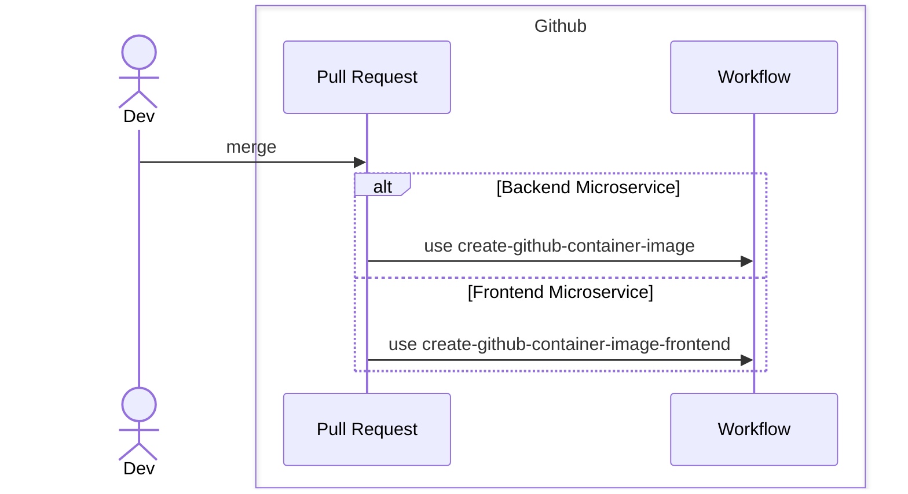
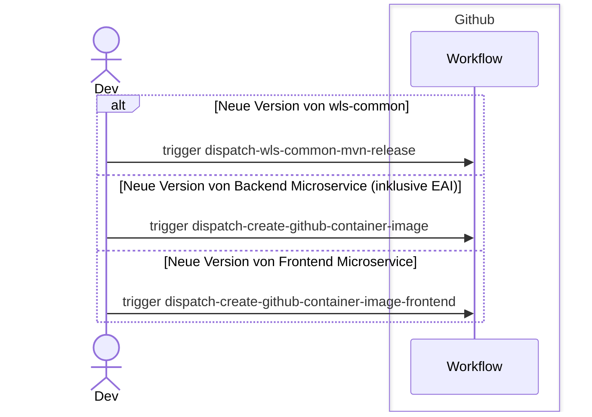

# Workflows

Mit [Workflows](https://docs.github.com/en/actions/writing-workflows) automatisieren wir Prozesse in der Entwicklung.
Wir sichern damit die Qualität und stellen Versionen bereit.

## Pull-Requests

Mit der Erstellung eines Pull-Requests wird geprüft, dass der Code den Anforderungen und den Richtlinien entspricht.

````mermaid

sequenceDiagram

    actor Dev
    actor Reviewer
    
    box Github
        participant PR as Pull Request
        participant Workflow
    end
    
    Dev ->> PR: Create
    
    PR ->> Workflow: run CoderabbitAI Review
    
    PR ->> Workflow: run CodeQL
    alt Backend Microservice
        PR ->> Workflow: use callable-run-mvn-verify
    else wls-common
        PR ->> Workflow: use callable-run-npm-build
    else Frontend Microservice
        PR ->> Workflow: use callable-run-npm-build
    end
    
    loop do review
        Reviewer ->> PR: Review
        Dev ->> PR: apply changes
        PR ->> Workflow: run CodeQL
        alt Backend Microservice
            PR ->> Workflow: use callable-run-mvn-verify
        else wls-common
            PR ->> Workflow: use callable-run-npm-build
        else Frontend Microservice
            PR ->> Workflow: use callable-run-npm-build
        end
    end
    
    Reviewer ->> PR: approve
    Dev ->> PR: merge
````

### Output

Es gibt nur Feedback für den Pull-Request.

## Push auf Defaultbranch

Unser Defaultbranch ist `dev`. Mit einem Push auf den Branch werden neue Testversionen bereitgestellt.



### Output

#### wls-common

Es gibt kein Output.

#### Mikroservice

- Github-Imageregistry: https://github.com/orgs/it-at-m/packages?repo_name=Wahllokalsystem
    - das neue Image hat den Tag `latest-dev`

## Releasing

Im Rahmen des Releasing werden getestete Versionen zur Verfügung gestellt.

### Ablauf



### Output

#### wls-common

- [Maven-Artefakte](https://central.sonatype.com/search?q=de.muenchen.oss.wahllokalsystem&sort=published)
- [Github-Tag][link-github-tag]
- [Github-Release][link-github-release]

#### Mikroservice

- [Github-Tag][link-github-tag]
- [Github-Release][link-github-release]
  - bei Backend-Services wird die openAPI-Spezifikation den Assets beigelegt 
- [Github-Imageregistry](https://github.com/orgs/it-at-m/packages?repo_name=Wahllokalsystem)
  - das neue Image hat den Tag `latest` und bei Backend-Services zusätzliche Tags entsprechend der Version

[link-github-tag]: https://github.com/it-at-m/Wahllokalsystem/tags
[link-github-release]: https://github.com/it-at-m/Wahllokalsystem/releases