# Beziehungen der Workflows und Actions

Unsere Workflows bestehen aus wiederverwendbaren Workflows aus unserem Repository, sowie aus Actions von ITM
und anderen Github-Actions.

## Legende

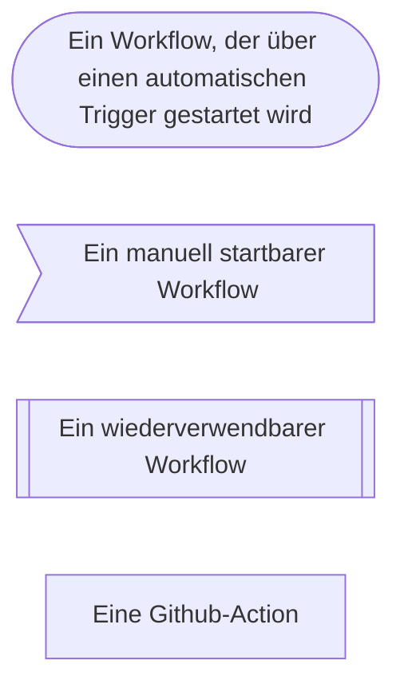

<em>Legende zu den verwendeten Symbolen</em>

### Pull-Requests nach Dev

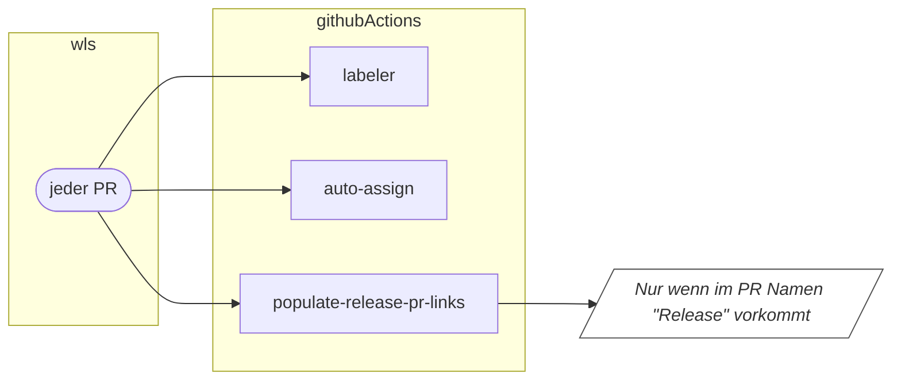

<em>Workflow und Action, die bei jedem Pull-Request ausgeführt wird</em>

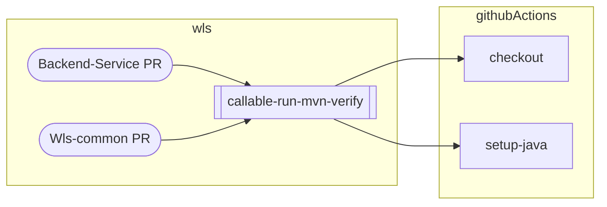

<em>Workflows und Actions, die bei einem Pull-Requests eines Backend-Services oder bei Wls-common ausgeführt werden</em>

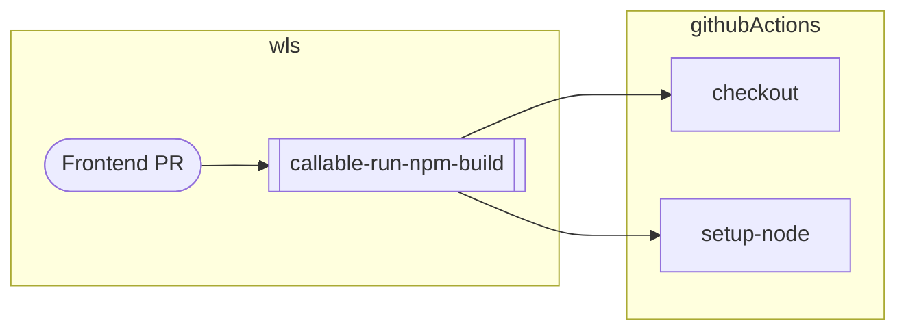

<em>Workflows und Actions, die bei einem Pull-Request zu einem Frontend ausgeführt werden</em>

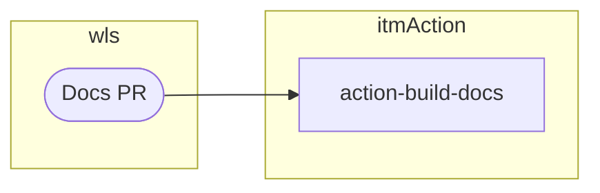

<em>Workflow und Action, die bei einem Pull-Request zur Dokumentation ausgeführt werden</em>

### Push auf Dev

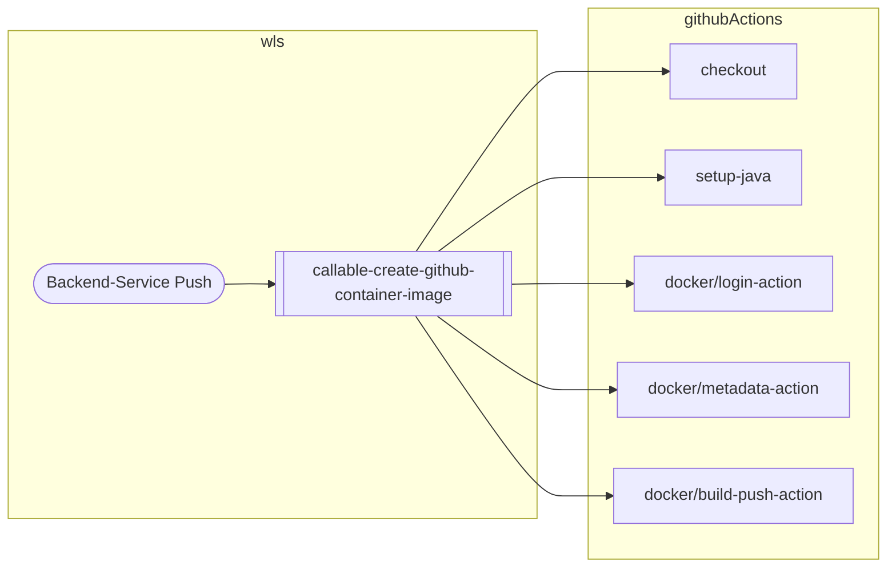

<em>Workflows und Actions, die bei einem Push eines Backend-Services ausgeführt werden</em>

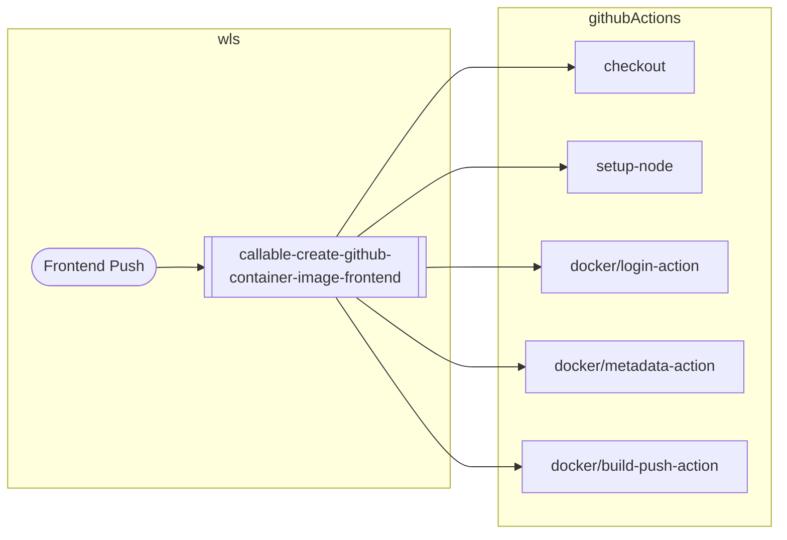

<em>Workflows und Actions, die bei einem Push eines Frontends ausgeführt werden</em>

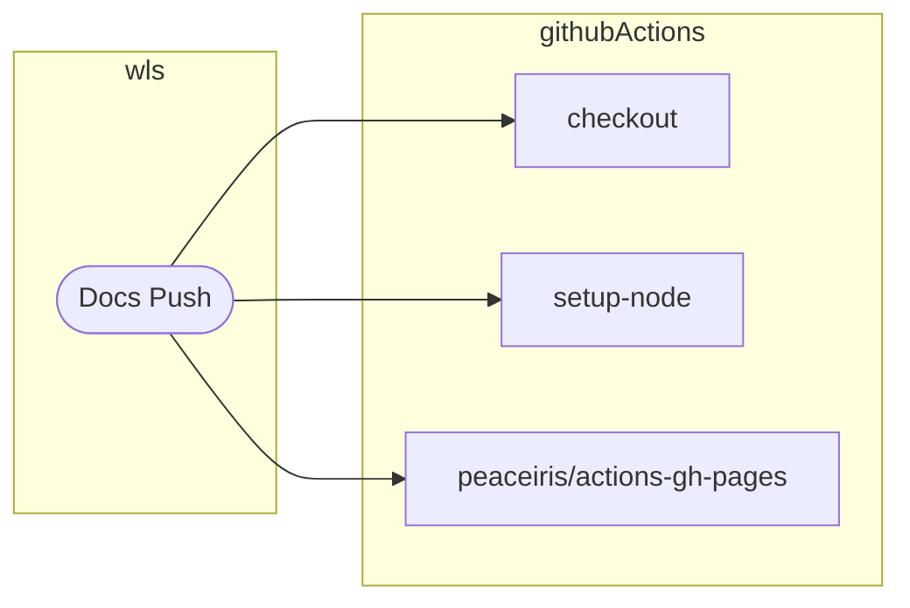

<em>Workflow und Actions, die bei einem Push der Dokumentation ausgeführt werden</em>

### Manuell gestartet

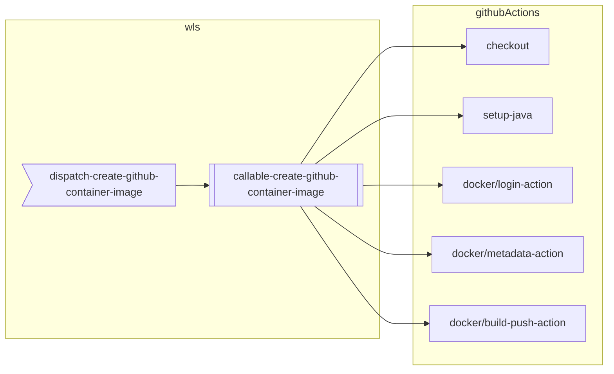

<em>Workflows und Actions, die bei der Erstellung eines Images für einen Backend-Service ausgeführt werden</em>

<em>Workflows und Actions, die bei der Erstellung eines Images für ein Frontend ausgeführt werden</em>

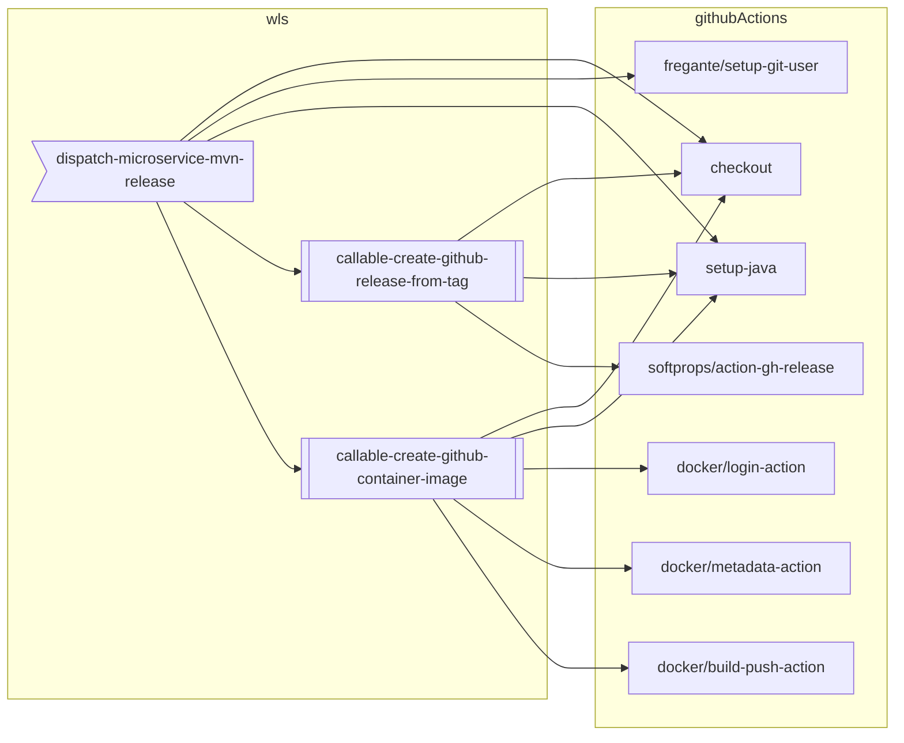

<em>Workflows und Actions, die bei der Durchführung eines Releases eines Backend-Services ausgeführt werden</em>

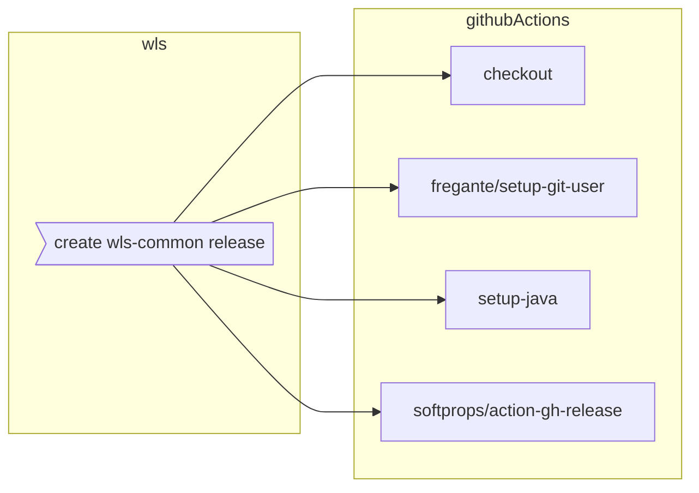

<em>Workflow und Actions, die bei der Durchführung eines Releases für Wls-common ausgeführt werden</em>
