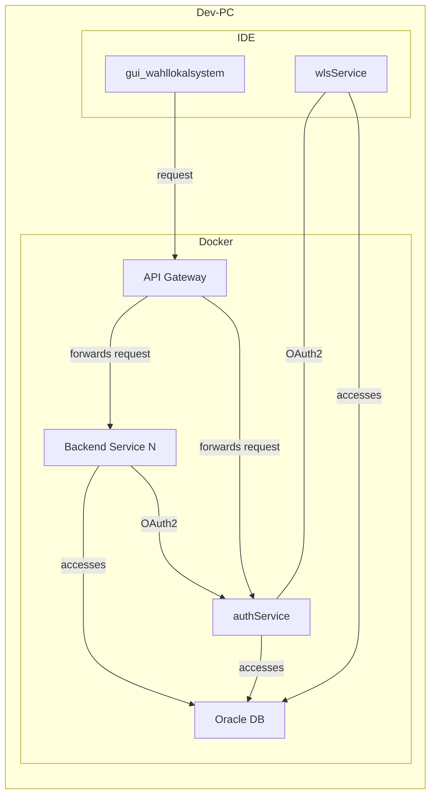

# Getting started

## Formatter einrichten

Im Projekt verwenden wir `checkstyle` und `spotless` um für einen möglichst einheitlichen Codestyle zu sorgen.
Dazu haben wir Regeln definiert. Diese Regeln und deren Hinterlegung in der jeweiligen IDE ist
[hier](https://github.com/it-at-m/itm-java-codeformat) beschrieben.

## Zusammenspiel IDE mit Docker

## Services und Ports

Übersicht über die Services und auf welchen Port sie im Standard lauschen:

> [!IMPORTANT]
> Diese Ports werden sowohl in der IDE als auch in Docker verwendet.
> Beachten Sie, dass somit nur eine Instanz eines Services gleichzeitig laufen kann.

| Service                                                                                   | Port |
|-------------------------------------------------------------------------------------------|------|
| [Admin](/services/backend-services/admin-service/)                                        | 8209 |
| [Auth](/services/backend-services/auth-service/)                                          | 8100 |
| [Basisdaten](/services/backend-services/basisdaten-service/)                              | 8205 |
| [Briefwahl](/services/backend-services/briefwahl-service/)                                | 8202 |
| Broadcast                                                                                 | 8200 |
| [EAI](/services/backend-services/eai-service/)                                            | 8300 |
| [Ergebnismeldung](/services/backend-services/ergebnismeldung-service/)                    | 8208 |
| [Infomanagement](/services/backend-services/infomanagement-service/)                      | 8201 |
| [Monitoring](/services/backend-services/monitoring-service/)                              | 8206 |
| [Vorfälle und Vorkommnisse](/services/backend-services/vorfaelleundvorkommnisse-service/) | 8204 |
| [Wahlvorbereitung](/services/backend-services/wahlvorbereitungs-service/)                 | 8203 |
| [Wahlvorstand](/services/backend-services/wahlvorstand-service/)                          | 8207 |

## Benutzer

| Name        | Passwort | Beschreibung                                                          |
|-------------|----------|-----------------------------------------------------------------------|
| wls_test    | test     | Ein Benutzer ohne weitere Rechte                                      |
| wls_all     | test     | Ein Benutzer mit allen Rechten                                        |
| wls_all_bwb | test     | Ein Benutzer mit allen Rechten mit der WahlbezirksArt BWB (Briefwahl) |
| wls_all_uwb | test     | Ein Benutzer mit allen Rechten mit der WahlbezirksArt UWB (Urnenwahl) |

## Datenbank

Der Zugriff auf die Oracle-Datenbank über die IDE ist gemäß [dieser Anleitung](/technik/guides/db-access) einzurichten.

## Starten des Frontends

Standardmäßig wird das Frontend über den Befehl `"dev": "vite"` in der `package.json`-Datei gestartet.

Nachdem das Frontend in der IDE und das ApiGateway über Docker gestartet wurde, kann es über `http://localhost:8400/`
aufgerufen werden. Allerdings befindet sich die Oberfläche dann in einer Ladeschleife und man sieht nur einen
flackernden Bildschirm. Um diese Schleife während der Entwicklung zu umgehen, gibt es zwei Möglichkeiten:

### 1. Starten über das Gateway + Authentifizierung

Eine Möglichkeit, die Ladeschleife zu umgehen, ist es, sich lokal mit einem der [User](#benutzer) anzumelden.
Nachdem das Frontend über die IDE gestartet wurde, muss die URL `http://localhost:8083/` mit dem Port `8083` aufgerufen
werden, um auf die Login-Seite zu kommen. Nach der Anmeldung bleibt man auf dem Port `8083`, wird aber vom Gateway
zum Frontend weitergeleitet und die Ladeschleife ist weg.

> [!NOTE]
> Der Anmeldevorgang muss jedes Mal wiederholt werden, sobald das ApiGateway neu gestartet wird.

### 2. `no-security`-Profil

Die zweite Möglichkeit ist es, das ApiGateway mit dem `no-security`-Profil zu starten.
Dazu muss im `/stack/docker-compose.yml` File beim Service refarch-gateway unter environment in der Zeile
`- SPRING_PROFILES_ACTIVE=hazelcast-local` das Profil `no-security` hinzugefügt werden. Damit die Änderung wirksam wird,
sollte der Container in Docker einmal komplett gelöscht und über das `docker-compose.yml` File neu gestartet werden.

> [!WARNING]
> Bei dieser Variante ist es wichtig, dass die Änderung im `docker-compose.yml` File nicht gepusht wird, weil alle
> anderen Container mit security laufen und das `no-security`-Profil nur für die Entwicklung benötigt wird.

