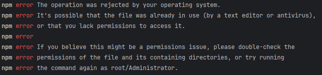

# API-Client aus einem openapi.json File im Frontend

## Einleitung

Durch einen CLI-Befehl lässt sich aus der `openapi.json`-Datei das Datenmodell und die API des Services erstellen.

## Installation

Anders als im Backend gibt es für das Frontend kein Plugin, um den Openapi Generator zu integrieren, sondern muss
als CLI Befehl ausgeführt werden. Mit diesem Befehl kann der openapi-generator global auf dem Rechner 
installiert werden:

```shell
npm install @openapitools/openapi-generator-cli -g typescript-fetch
```

<details>
<summary>Errorhandling</summary>

Sollte dabei diese Fehlermeldung auftauchen:

können die Schritte aus 
[diesem Stack-Beitrag](https://stackoverflow.com/questions/18088372/how-to-npm-install-global-not-as-root/59227497#59227497)
befolgt werden.

</details>

Bei Bedarf muss zusätzlich noch der Proxy konfiguriert werden. Anschließend kann im Terminal mit dem Befehl 
`openapi-generator-cli version` geprüft werden, ob die Installation erfolgreich war. 

## Individualisieren des Generators

Damit der generierte Code zum Projekt passt, wurden die Templates des openapi-generators angepasst.

> [!IMPORTANT]
> Die Anpassung der Templates ist einmalig erfolgt und muss nicht für jeden Service wiederholt werden. Die geänderten
> Template Files wurden mit auf GitHub gepushed und liegen unter
> [wls-gui-wahllokalsystem/src/api/wls-clients/custom-openapi-template-files](https://github.com/it-at-m/Wahllokalsystem/tree/dev/wls-gui-wahllokalsystem/src/api/wls-clients/custom-openapi-template-files).
> Dieser Abschnitt dient nur zur Information und muss nicht für die Generierung des Codes ausgeführt werden.

Mit dem Befehl

```shell
openapi-generator-cli author template -g typescript-fetch -o ./my-custom-template
```

können die Template Files heruntergeladen werden. Hierbei steht `-o` für Output und es kann der Ort angegeben werden, an
dem die heruntergeladenen Files gespeichert werden sollen. Für das WLS wurden die Files `runtime.mustache` und
`apis.mustache` angepasst, indem folgende Code-Zeilen hinzugefügt wurden:

::: code-group
```:line-numbers=123 [runtime.mustache (Teil 1)]
protected async request(context: RequestOpts, initOverrides?: RequestInit | InitOverrideFunction): Promise<Response> {
    const { url, init } = await this.createFetchParams(context, initOverrides);
    const response = await this.fetchApi(url, init);
    if (response && (response.status >= 200 && response.status < 300)) {
        return response;
    } else if (response && response.status == 400) {    // [!code ++]
      const raw = await response.text();    // [!code ++]
      let content;  // [!code ++]
      try {   // [!code ++]
          content = JSON.parse(raw);  // [!code ++]
      } catch (e) {  // [!code ++]
          content = {};  // [!code ++]
      }  // [!code ++]
      const content = JSON.parse(raw);  // [!code ++]
      const wlsError = isWLSException(content)  // [!code ++]
        ? generateWlsExceptionFromJson(content) // [!code ++]
        : createDefaultWlsError({   // [!code ++]
            message: "Ungültige Anfrage",   // [!code ++]
            code: response.status.toString(),   // [!code ++]
          });   // [!code ++]
      throw new WLSError(   // [!code ++]
        response,   // [!code ++]
        wlsError.message,   // [!code ++]
        wlsError.category,  // [!code ++]
        wlsError.code,  // [!code ++]
        wlsError.service    // [!code ++]
      );    // [!code ++]
    }
    throw new ResponseError(response, 'Response returned an error code');
}
```

```:line-numbers=291 [runtime.mustache (Teil 2)]
export class WLSError extends Error {   // [!code ++]
  override name: "WLSError" = "WLSError";   // [!code ++]
  category?: string;   // [!code ++]
  code?: string;   // [!code ++]
  service?: string;   // [!code ++]

  constructor(   // [!code ++]
    public response: Response,   // [!code ++]
    msg?: string,   // [!code ++]
    category?: string,   // [!code ++]
    code?: string,   // [!code ++]
    service?: string   // [!code ++]
  ) {   // [!code ++]
    super(msg);   // [!code ++]
    this.category = category;   // [!code ++]
    this.code = code;   // [!code ++]
    this.service = service;   // [!code ++]
  }   // [!code ++]
}   // [!code ++]
   // [!code ++]
export function createDefaultWlsError({   // [!code ++]
  message = "Ein unbekannter Fehler ist aufgetreten",   // [!code ++]
  category = "T",   // [!code ++]
  code = "undefined",   // [!code ++]
  service = "undefined",   // [!code ++]
}: {   // [!code ++]
  message?: string;   // [!code ++]
  category?: string;   // [!code ++]
  code?: string;   // [!code ++]
  service?: string;   // [!code ++]
}): WLSError {   // [!code ++]
  const error = new Error(message) as WLSError;   // [!code ++]
  error.name = "WLSError";   // [!code ++]
  error.category = category;   // [!code ++]
  error.code = code;   // [!code ++]
  error.service = service;   // [!code ++]
  return error;   // [!code ++]
}   // [!code ++]
   // [!code ++]
export default interface WLSException {   // [!code ++]
  category: string;   // [!code ++]
  code: string;   // [!code ++]
  message: string;   // [!code ++]
  service: string;   // [!code ++]
}   // [!code ++]
   // [!code ++]
/**   // [!code ++]
 * Type guard to check if an object is a WLSException   // [!code ++]
 * @param obj - The object to check   // [!code ++]
 * @returns True if the object has all required WLSException properties with correct types   // [!code ++]
 */   // [!code ++]
// eslint-disable-next-line @typescript-eslint/no-explicit-any   // [!code ++]
export function isWLSException(obj: any): obj is WLSException {   // [!code ++]
  return (   // [!code ++]
    obj &&   // [!code ++]
    typeof obj.category === "string" &&   // [!code ++]
    typeof obj.code === "string" &&   // [!code ++]
    typeof obj.message === "string" &&   // [!code ++]
    typeof obj.service === "string"   // [!code ++]
  );   // [!code ++]
}   // [!code ++]
   // [!code ++]
/**   // [!code ++]
 * Generates a WLSError instance from a JSON object.   // [!code ++]
 * @param content - The JSON-object with all relevant information   // [!code ++]
 * @returns the generated WLSError object from JSON data   // [!code ++]
 */   // [!code ++]
// eslint-disable-next-line @typescript-eslint/no-explicit-any   // [!code ++]
export function generateWlsExceptionFromJson(content: any): WLSException {   // [!code ++]
  return {   // [!code ++]
    category: content.category,   // [!code ++]
    code: content.code,   // [!code ++]
    message: content.message,   // [!code ++]
    service: content.service,   // [!code ++]
  };   // [!code ++]
}   // [!code ++]
```

```:line-numbers=312 [apis.mustache]
    {{/hasFormParams}}
}, initOverrides);

if (response.status === 204) {   // [!code ++]
    throw new runtime.WLSError(response, "Es konnten keine Daten gefunden werden", "T", response.status.toString())   // [!code ++]
}   // [!code ++]

{{#returnType}}
{{#isResponseFile}}
return new runtime.BlobApiResponse(response);
```
:::

## Generierung des Codes

Es gibt zwei Möglichkeiten, den Befehl auszuführen, um den gewünschten Code generieren zu lassen.

#### 1) Ausführen des Befehls im Terminal
Im Terminal kann, wenn man sich innerhalb der `wls-gui-wahllokalsystem`-Directory befindet, für jedes
`openapi.json`-File mit folgendem Befehl der entsprechende Code generiert werden:

```shell
openapi-generator-cli generate -i src/resources/openapis/<openapi-file> -g typescript-fetch -o src/api/wls-clients/generated-<servicename>-api --template-dir src/api/wls-clients/custom-openapi-template-files
```

Dabei gilt:
- Das `-i` steht für Input und gibt den Ort an, an welchem das `openapi.json`-File gespeichert ist:
  _"src/resources/openapis/\<openapi-file\>"_. `<openapi-file>` wird dabei durch das entsprechende
  Release-File ersetzt. Beispiel: `openapi.broadcast.0.2.0.json`
- Das `-o` steht für Output und gibt den Ort an, an welchem der generierte Code gespeichert werden soll:
  _"src/api/wls-clients/generated-\<servicename\>-api"_. `<servicename>` wird dabei durch den entsprechenden
  WLS-Service ersetzt. Beispiel: `generated-broadcast-api`
- Das `--template-dir` sorgt dafür, dass die angepassten Templates bei der Generierung berücksichtigt werden und gibt
  den Ort an, an dem diese gespeichert sind: _"src/api/wls-clients/custom-openapi-template-files"_

::: details Beispiel Broadcast-API
Der komplette Befehl für die Generierung der Broadcast API über das Terminal würde so aussehen:
```shell
openapi-generator-cli generate -i src/resources/openapis/openapi.broadcast.0.2.0.json -g typescript-fetch -o src/api/wls-clients/generated-broadcast-api --template-dir src/api/wls-clients/custom-openapi-template-files
```
:::

#### 2) Ausführen des Skripts `gen:gen-<servicename>`

In der `package.json` kann der oben genannte Befehl als Skript hinzugefügt werden. Das sieht dann so aus:

```json
 "scripts": {
    "dev": "vite",
    /* ... */
    "gen:gen-<servicename>": "openapi-generator-cli generate -i src/resources/openapis/<openapi-file> -g typescript-fetch -o src/api/wls-clients/generated-<servicename>-api --template-dir src/api/wls-clients/custom-openapi-template-files" // [!code ++]
  },
```

::: details Beispiel Broadcast-API
Der komplette Befehl für die Generierung der Broadcast API über das `package.json`-File würde so aussehen:
```json
 "scripts": {
    "gen:gen-broadcast": "openapi-generator-cli generate -i src/resources/openapis/openapi.broadcast.0.2.0.json -g typescript-fetch -o src/api/wls-clients/generated-broadcast-api --template-dir src/api/wls-clients/custom-openapi-template-files"
  },
```
:::

## Nutzung des generierten Codes

Es werden bei der Generierung unter anderem `*ControllerApi.ts`-Files und `*DTO.ts`-Files erstellt.
Am Beispiel vom Broadcast-Service wird gezeigt, wie der Code anschließend aufgerufen werden kann:

Damit die korrekte URL hinterlegt wird, muss beim Erstellen jeder `*ControllerApi`-Instanz der `basePath` überschrieben
werden:

::: code-group
```typescript [Vue File]
import {BroadcastControllerApi, Configuration} from "@/api/wls-clients/generated-broadcast-api";
import {BROADCAST_SERVICE_API_URL} from "@/constants";

const broadcastCA = new BroadcastControllerApi(
    new Configuration({
      basePath: BROADCAST_SERVICE_API_URL,
    })
);
```

```typescript [constants.ts]
const WLS_SERVICE_API_URL = "http://localhost:8083/api/";

export const BROADCAST_SERVICE_API_URL = WLS_SERVICE_API_URL + "broadcast-service";
```
:::

Die Fetch Aufrufe erfolgen dann zum Beispiel so:

```typescript
import type {DeleteMessageRequest, GetMessageRequest} from "@/api/wls-clients/generated-broadcast-api";
import {WLSError} from "@/api/wls-clients/generated-broadcast-api";

const getParams: GetMessageRequest = {wahlbezirkID};
broadcastCA
    .getMessage(getParams)
    .then((content) => {
        const nachrichtID = content.oid;
        const deleteParams: DeleteMessageRequest = {nachrichtID};
        broadcastCA.deleteMessage(deleteParams, postConfig()).catch(() => {
            errorToShow.value = "Es ist ein Fehler beim Lesen der Nachricht aufgetreten";
        });
        messageToShow.value = content.nachricht;
    })
    .catch((error: WLSError) => {
        errorToShow.value = error.message;
    });
```

Im Fall eines `400`er Codes in der Response, was in den meisten Fällen einer WlsException entspricht, können diese Werte
dann wie folgt aufgerufen und weiterverarbeitet werden:

```typescript
broadcastCA
    .then(/*xyz*/)
    .catch((error: WLSError) => {
        errorToShow.value = error.service + " - " + error.message + " (Code: " + error.code + ")";
    });
```

Die Ausgabe wäre in diesem Beispiel: `WLS-BROADCAST - Das Object BroadcastMessage ist nicht vollständig. (Code: 150)`