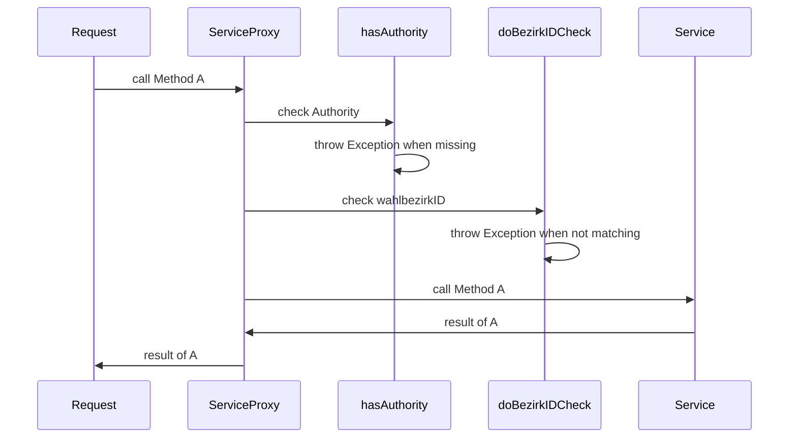
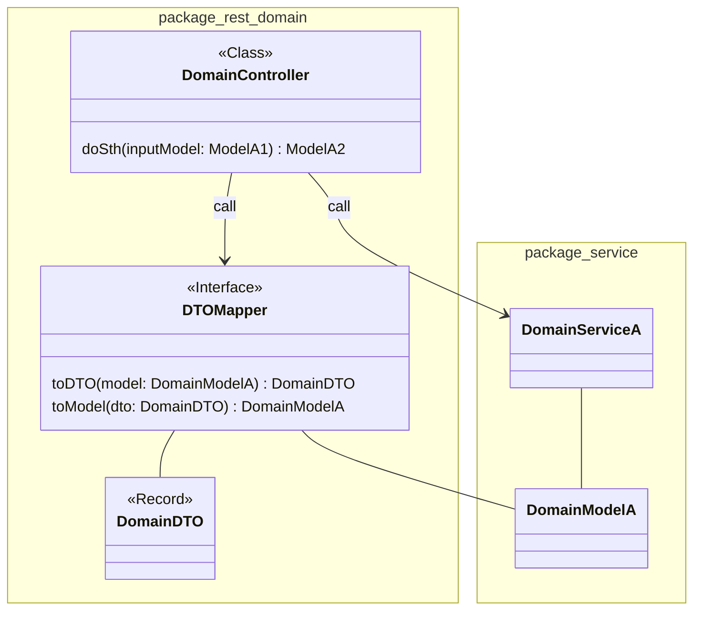
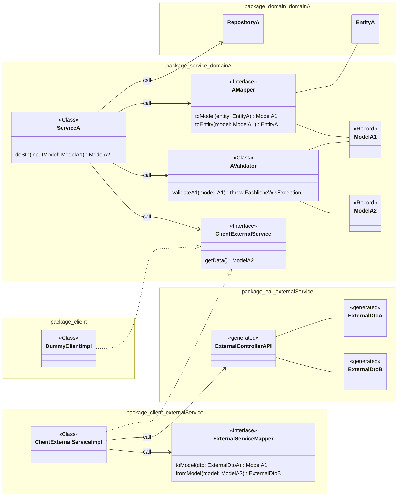
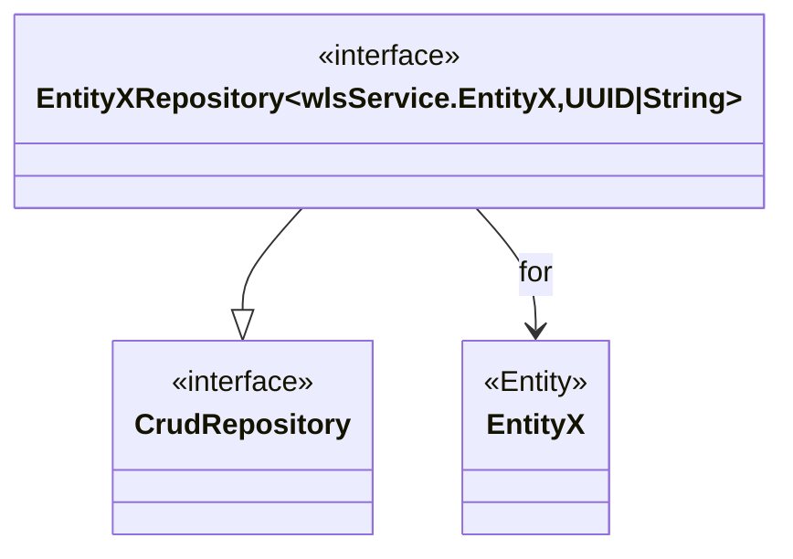

# Servicearchitektur

In diesem Abschnitt wird beschrieben, wie ein Microservice in der Regel aufgebaut ist. Abweichungen von diesem
Aufbau werden bei dem jeweiligen Service dokumentiert.

  
*Ein Backenservice verwendet wls-common bei der Implementierung*

## Backendservices

  
*Grundlegende Architektur eines Backendservices*

Ein Backendservice besteht in der Regel aus 3 Layern.

- `access layer` ... Ermöglicht den Zugriff auf den Backendservice von außen
- `service layer` ... Durchführung der fachlichen Logik, wie Validierung oder Lesen und Speichern, sowie die Verwendung  
  dritter Services zur Erfüllung der Aufgaben
- `persistence layer` ... Zugriff auf die Datenbank

### Security

Komponenten die eine rote Umrandung haben sind Teil der Security.

#### Authentifizierung

Es gibt eine Zugriffskontrolle im `access layer`. Hier wird geprüft, ob für den Zugriff auf die geforderte
Ressource die erforderliche Authentifizierung gegeben ist. Bis auf wenige Ausnahmen ist für jeden Zugriff auf eine Ressource
eine Authentifizierung erforderlich.

#### Autorisierung

Die Security im `service layer` und `persistence layer` prüft die Autorisierung. Die Ausführung der Methoden erfordert in der Regel
mindestens ein der Funktion entsprechendes Recht. Das Verändern der Daten eines bestimmten Wahlbezirkes erfordert auch, dass
der User berechtigt ist für diesen Wahlbezirk Daten zu verändern.



Der `bezirkIDCheck` wird definiert durch das Interface
`de.muenchen.oss.wahllokalsystem.wls.common.security.BezirkIDPermissionEvaluator` und hat folgende Implementierungen:

- `BezirkIDPermissionEvaluatorImpl` ... führt eine Prüfung des Authentication-Objektes durch
- `DummyBezirkIdPermissionEvaluatorImpl` ... liefert immer `true`

### Fehlerbehandlung

Exceptions, die während der Verarbeitung geworfen werden, werden durch den `GlobalExceptionHandler` verarbeitet.
Dieser erzeugt ein `WlsExceptionDTO` und definiert den entsprechenden Http-Statuscode.

Grundlegen gilt folgendes Mapping von Subklassen einer WlsException zu dem Http-Statuscode:

| WlsExceptionDTO               | Http-Statuscode |
|-------------------------------|-----------------|
| FachlicheWlsException         | 400             |
| TechnischeWlsException        | 500             |
| InfrastrukturelleWlsException | 500             |
| SicherheitsWlsException       | 403             |

Weil das Fehlerhandling in allen Services gleich sein soll, wird es über die Bibliothek `wls-common:exception`
bereitgestellt.

Restclients, die auf andere Services zugreifen, verwenden den
[`WlsResponseErrorHandler`](../guides/api-client-generation/how-to-create-client-from-open-api-json.html#context-um-beans-erweitern)
um konsequent `WlsException`s zu werfen.

### Accesslayer

Im Accesslayer befinden sich die Klassen, Interfaces und Records, welche den Zugriff auf den Microservice mitels REST via Http
ermöglichen.

  
*Komponenten des Accesslayers*



<em>Abhängigkeiten der Klassen des Accesslayers untereinander, sowie den Zugriff auf den Servicelayer</em>

Je Domain gibt es ein Subpackage. In jedem Subpackage gibt es einen RestController, einen Mapper und die Records für
das Datenmodell.

<details>

<summary>Beispiel Packagestruktur in Basisdatenservice</summary>

```text
├─ rest
|     ├─ common
|     |    ├─ WahlbezirkArtDTO
|     ├─ handbuch
|     |    ├─ HandbuchController
|     |    ├─ HandbuchDTOMapper
|     ├─ wahlbezirke
|     |    ├─ WahlbezirkDTO
|     |    ├─ WahlbezirkDTOMapper
|     |    └─ WahlbezirkeController
```  

*`WahlbezirkArtDTO` wird in `handbuch` und `wahlbezirke` verwendet.*

</details>

### Servicelayer

Im Servicelayer befinden sich die Klassen, Interfaces und Records, die zur Umsetzung der fachlichen Anforderungen
notwendig sind.

  
*Komponenten des Servicelayers*



<em>Abhängigkeiten der Klassen des Serviceslayers untereinander, sowie den Zugriff auf den Persistencelayer</em>

<details>

<summary>Beispiel Packagestruktur in Basisdatenservice</summary>

```text
├─ client
|     ├─ DummyClientImpl
|     ├─ WahlbezirkeClientImpl
|     └─ WahlbezirkeClientMapper
├─ service
|     ├─ common
|     |    ├─ WahlbezirkArtModel
|     |    └─ WahltagIdUndWahlbezirksart
|     ├─ wahlbezirke
|     |    ├─ WahlbezirkeClient
|     |    ├─ WahlbezirkeValidator
|     |    ├─ WahlbezirkeService
|     |    ├─ WahlbezirkModel
|     |    └─ WahlbezirkModelMapper
|     ├─ handbuch
|     |    ├─ HandbuchModelMapper
|     |    ├─ HandbuchReferenceModel
|     |    ├─ HandbuchService
|     |    ├─ HandbuchValidator
|     |    └─ HandbuchWriteModel
```  

*`WahlbezirkArtModel` wird in `handbuch` und `wahlbezirke` verwendet. `client.WahlbezirkeClientImpl` implementiert
`service.wahlbezirke.WahlbezirkeClient`*

</details>

#### Servicepackage

Der Großteil der Implementierung erfolgt im Package `service`. Je Domain, die durch den Microservice abgedeckt wird,
gibt es ein Subpackage. Dieses beinhaltet die Serviceklasse, den Mapper, den Validator sowie die Klassen für das Datenmodell.

Die Rückgabewerte und Parameter der Methoden des Services sind Klassen des Datenmodells des Services. Im Mapper werden die Klassen
des Servicedatenmodells auf die Klassen des Domaindatenmodells gemappt. Durch den Validator wird sichergestellt, dass
die Parameter valide sind. Werden Daten von anderen Microservices benötigt, so wird diese Schnittstelle durch ein Interface
abgebildet. Die Rückgabewerte und Parameter sind wie beim Service Klassen des Datenmodells des Services.

#### Clientpackage

Im Package `client` ist die Funktionalität für den Zugriff auf einen anderen Microservice implementiert.
Der Dummyclient implementiert alle in den Subpackages definierten Interfaces, die für den Zugriff auf andere Microservices
definiert sind. Er dient primär den Testzwecken und soll eine Eigenständigkeit des Services ermöglichen.

In den Subpackages von `client` werden die Zugriffe nach externen Microservices gebündelt. In den jeweiligen
Packages gibt es eine Implementierungsklasse für den Zugriff auf den externen Microservice sowie einen Mapper. Der Mapper
konvertiert das Datenmodell des externen Microservices auf das geforderte Datenmodell im Microservice.

> [!IMPORTANT]
> Unter [Umständen](../adr/adr002-controller-service-datamodels.md) kann auf ein Datenmodell im Servierlayer verzichtet werden.

### Persistencelayer

Für den Zugriff auf die Datenbank wird [Spring-Data](https://spring.io/projects/spring-data) verwendet.

  
*Komponenten des Persistencelayers*



<em>Beziehungen der Komponenten des Persistencelayers</em>

Die Klassen und Interfaces werden im Package `domain` abgelegt. Analog zu den Services werden Subpackages je
Domain definiert. Klassen, die durch Entitäten verschiedene Subpackages verwenden, sind in dem Subpackage `common` abzulegen.

<details>

<summary>Beispiel Packagestruktur in Basisdatenservice</summary>

```text
├─ domain
|     ├─ common
|     |    ├─ WahlbezirkArt
|     |    └─ WahltagIdUndWahlbezirksart
|     ├─ handbuch
|     |    ├─ Handbuch
|     |    └─ HandbuchRepository
|     ├─ ungueltigeWahlscheine
|     |    ├─ UngueltigeWahlscheine
|     |    └─ UngueltigeWahlscheineRepository
```  

<em>`WahlbezirkArt` wird in `handbuch` und `ungueltigeWahlscheine` auf dieselbe Weise verwendet</em>

</details>
