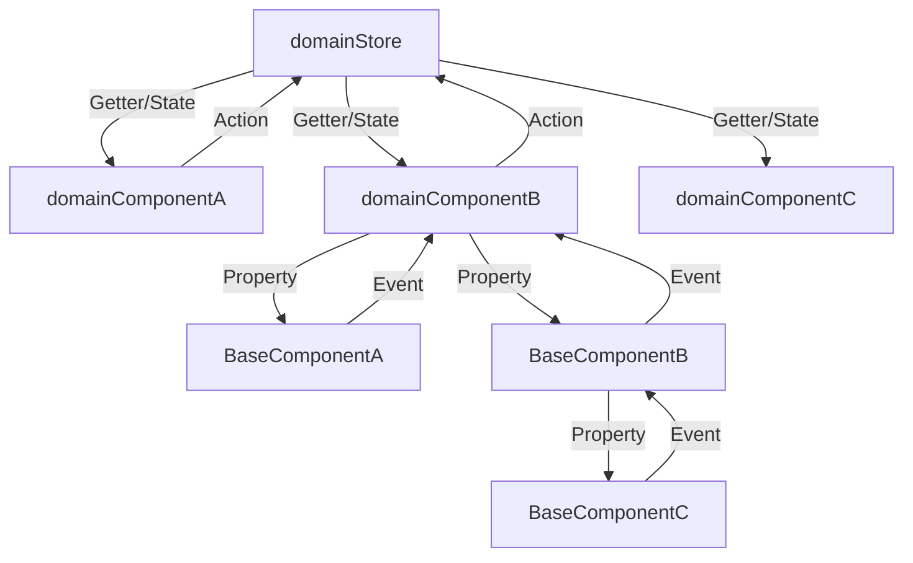
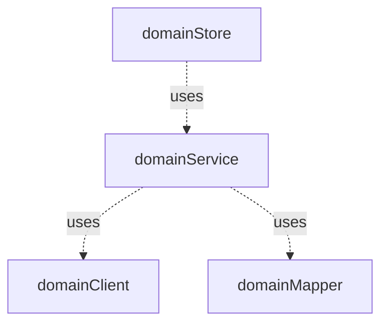
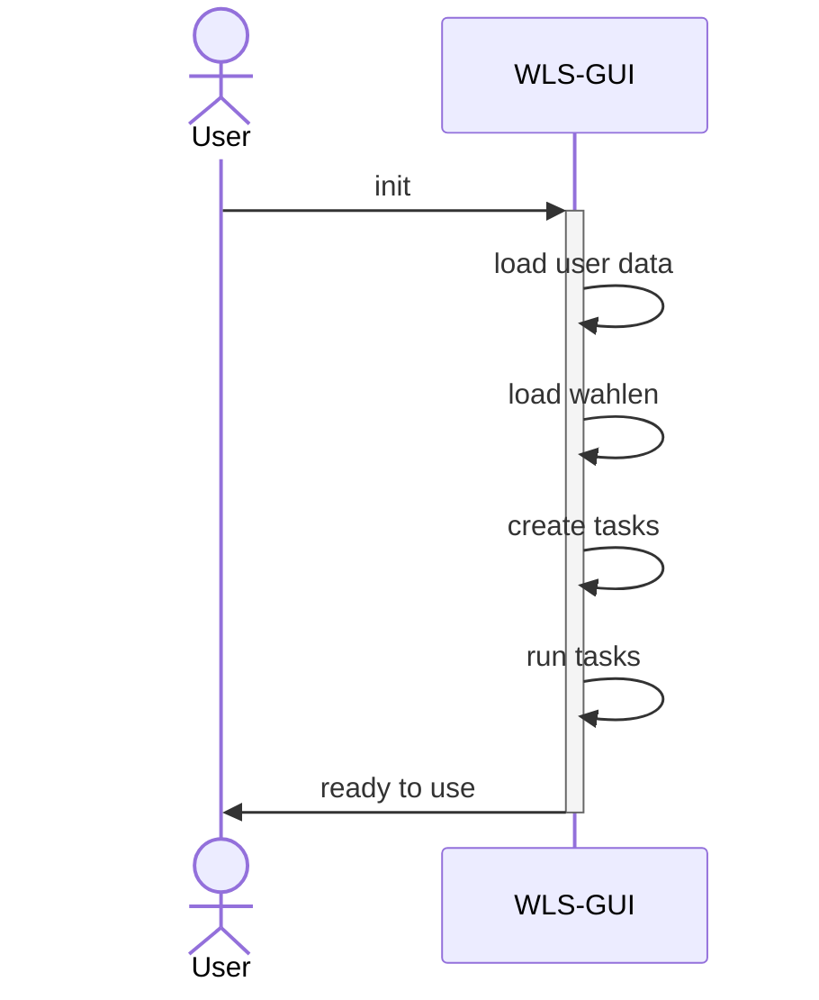

# Frontend

## Dateistruktur

::: details Grafische Darstellung

```text
frontend-project
├─ src
|  ├─ api
|  ├─ components
|  |  ├─ common
|  |  |  └─ buttons
|  |  |     └─ TheBaseRefreshButton.vue
|  |  └─ wahlvorstand
|  |     └─ TheWahlvorstandAnwesenheitRequirementCard.vue
|  ├─ composables
|  |  ├─ common
|  |  |   └─ formatter.ts
|  |  └─ wahlvorstand
|  |     └─ wahlvorstandService.ts
|  ├─ plugins
|  |     ├─ index.ts
|  |     ├─ pinia.ts
|  |     ├─ router.ts
|  |     └─ vuetify.ts
|  ├─ resources
|  |     └─ openapis
|  |        └─ openapi.broadcast.0.2.0.json
|  ├─ service-worker
|  |     └─ wahl-worker.ts
|  ├─ stores
|  |     └─ wahlvorstandStore.ts
|  ├─ types
|  |     └─ wahlvorstand
|  |        ├─ Wahlvorstand.ts
|  |        └─ WahlvorstandsMitglied.ts
|  └─ views
|     └─ WahlvorstandView.vue
├─ stories
|  └─ components
|     └─ wahlvorstand
|        └─ TheWahlvorstandAnwesenheitRequirementCard.stories.ts
└─ tests
   └─ components
      └─ wahlvorstand
         └─ TheWahlvorstandAnwesenheitRequirementCard.spec.ts
```

:::

Das Frontend besteht für die Entwicklung aus 3 Komponenten, welche sich jeweils in einem Ordner auf der Rootebene
wiederspiegeln.

| Komponente | Beschreibung                                                |
| ---------- | ----------------------------------------------------------- |
| src        | Der Code der Anwendung mit allen Komponenten und Funktionen |
| tests      | Tests zum Anwendungscode                                    |
| stories    | Stories für StorybookJS zu den Komponenten der Anwendung    |

### Anwendungscode

Der Anwendungscode besteht auf folgenden Ordnern:

| Ordner            | Beschreibung                                                               |
|-------------------|----------------------------------------------------------------------------|
| api               | (generierte) Clients für den Zugriff auf die Backend-Services              |
| components        | Komponenten die zur Verfügung stehen                                       |
| composables       | Wiederverwendbarer Code                                                    |
| resources/openapi | openAPI Beschreibung die für die Clients verwendet werden                  |
| plugins           | Konfiguration der verwendeten Plugins, z.B. Pinia, Router oder Vuetify     |
| store             | Stores der Anwendung                                                       |
| service-worker    | Initialisierung und Routeregistrierung                                     |
| types             | Eigenen Datentypen der Anwendung (Die Datentypen der Clients sind in `api` |
| views             | Views der Anwendung                                                        |

Sofern es mehrere Elemente gibt, die zu unterschiedlichen fachlichen Domainen gehörten, kann es je Ordner verschiedene Unterordner geben.

`common` ... Elemente ohne spezifische fachliche Zugehörigkeit

`<domain>` ... Elemente mit spezifischer fachlicher Zugehörigkeit

#### Beispiel

`components/common` ... Enthält Komponenten, die überall zum Einsatz kommen können.

`components/wahlvorstand` ... Enthält Komponenten, die im Kontext vom Wahlvorstand zum Einsatz kommen

### Tests und Stories

Die Tests und Stories bilden die gleiche Ordnerstruktur ab wie der jeweilige Testgegestand bzw. die Komponente der Stories.

Für die Komponte im Ordner `src/components/wahlvorstand/TheWahlvorstandAnwesenheitRequirementCard.vue` liegen die Tests
in `tests/components/wahlvorstand/TheWahlvorstandAnwesenheitRequirementCard.spec.ts` und die Stories in
`stories/components/wahlvorstand/TheWahlvorstandAnwesenheitRequirementCard.stories.ts`.

Bei den Tests zu Komponenten gibt es zusätzlich, parallel zu den Testfiles, einen Ordner `__snapshots__`.
Dieser enthält die Referenzen für die Darstellung für [Komponententest](#komponententests).

## UI-Struktur

Das Frontend wird aus diversen [Single-File-Components](https://vuejs.org/guide/scaling-up/sfc.html) zusammengesetzt. Dabei verwenden wir Typescript und die
[Composition-API](https://vuejs.org/guide/introduction.html#composition-api).

### Layout

  
*Die Grundelemente des Wahllokalsystem UI*

Das Wahllokalsystem UI besteht im Wesentlichen aus drei Komponenten.

Die `app-bar` stellt den Nutzer\*innen grundlegende Informationen zu ihrem Wahlbezirk bereit. Die `navigation` 
umfasst die Navigationselemente der Seite, und die `router-view` zeigt den jeweils angeforderten Inhalt an.

### router-view


Die `router-view` ist eine Komponente von [vueRouter](https://router.vuejs.org/), um die Darstellung je nach URL zu variieren.
Meistens wird als dessen Inhalt das `component`-Element von Vue.js verwendet.

> [!IMPORTANT]
> Wir verwenden `keep-alive`, um Daten einer View über den Wechsel hinaus zu behalten.

Im UI kann man zwischen den einzelnen Views relativ frei navigieren. Die Arbeit an einer View muss nicht beendet sein.
Kehrt man später zu der View zurück, soll noch der Zustand vorhanden sein, der vorlag, als man die View verlassen hat.

Das lässt sich auf zwei Wegen erreichen. Zum einen kann man mit Stores arbeiten. Stores stellen einen anwendungsweiten Zustand dar.

Alternativ kann man eine View cachen, sodass beim Wechsel der View die alte nicht abgebaut wird. Wird eine View bei mehreren
URLs verwendet, muss ein zusätzlicher Key definiert werden, damit unterschiedliche URLs unterschiedliche Views erhalten.
Wir verwenden dafür den kompletten Pfad.

> [!NOTE]
> Der zusätzliche Key wird auf der Komponente innerhalb von `keep-alive` über das Attribut `key` realisiert.

> [!NOTE] Beispiel eines Cachings
>
> Für jede Wahl ist zu erfassen, wie viele Stimmzettel in der Wahlurne vorliegen. Dafür wurde eine View erstellt. Im Router
> wurde eine Route definiert, die unter anderem als Parameter die `wahlID` enthält. Nur durch diesen Parameter als Teil des Pfades ist es möglich,
> dass für die Wahl mit der ID-A eine andere gecachte Komponente verwendet wird als für die Wahl mit ID-B.

Durch die Verwendung der gecachten Komponenten erreichen wir, dass der letzte Bearbeitungszustand erhalten bleibt, können
aber im Gegensatz zu Stores die View autonomer und weniger komplex entwickeln.

### Aufbau von Views


*Übersicht der Arten von Elementen, die zur Erstellung einer View verwendet werden*

Eine View stellt Informationen und Aktionen zu einem Thema bereit.

Dazu werden `SingleUse`-Komponenten, also Komponenten, die nur einmal je View vorkommen sollen, verwendet. Diese
setzen sich wiederum aus `SingleUse`- oder `Basis`-Komponenten zusammen.

`Views` und `SingleUse`-Komponenten können auf Stores zugreifen. `Basis`-Komponenten sollen das nicht. Die `Views` und die
Komponenten können Composables verwenden.

> [!IMPORTANT]
> Dadurch, dass alle Komponenten Composables nutzen dürfen, wäre es auch denkbar, dass eine `Basis`-Komponenteein Speichern
> ausführt. Das ist aber Aufgabe einer `SingleUse`-Komponente. `Basis`-Komponenten verwenden Composables primär zur
> Validierung oder Formatierung, aber keine komplexere Logik.

> [!NOTE] Beispiel: Zählen der Stimmzettel
> Diese View besteht nur aus einer `SingleUse`-Komponente zur Erfassung der Daten. Diese `SingleUse`-Komponente verwendet als
> Basiskomponenten unser `NumberInput` zur Eingabe von Zahlen und `TimeInput` zur Erfassung der Uhrzeit.
>
> Die Property, über die die `SingleUse`-Komponente bestimmt, ob eine Uhrzeit zu erfassen ist, wird durch die View unter
> Verwendung des `UserStores` befüllt.
>
> Die `SingleUse`-Komponente verwendet ein Composable zur Formatierung von Text.

## Kommunikation

### zwischen Komponenten



### mit dem Backend



## Ablauf Initiales Laden von Tasks

Das folgende Sequenzdiagramm beschreibt den Ablauf des initialen Ladens und Erstellens von Tasks:



## Testkonzept

### Unittesting

Funktionen, die in Composables, Stores und Datentypen enthalten sind, werden mit Unit-Tests abgedeckt.
Die Kommunikation mit Funktionen anderer Module wird gemockt. Dabei ist die korrekte Interaktion mit dem Mock
zu verifizieren.

### Komponententests

Bei Komponententest wird die korrekte Darstellung (Rendering) und das Eventhandling verifiziert.

Die korrekte Darstellung wird mit Hilfe von [Snapshots](https://vitest.dev/guide/snapshot.html) verifiziert.
