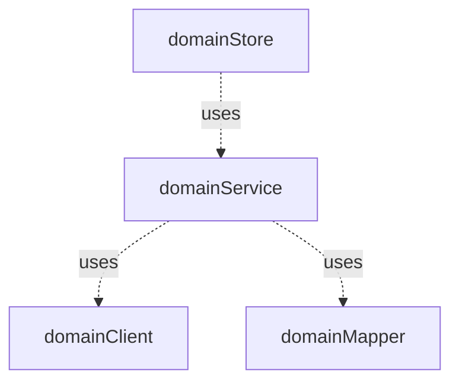

# Frontend

## Struktur

### Ordner

Das Projekt besteht im Wesentlichen aus folgenden Hauptordnern:

| Ordner               | Beschreibung                                                              |
|----------------------|---------------------------------------------------------------------------|
| api                  | (generierte) Clients für den Zugriff auf die Backend-Services             |
| components           | Komponenten die zur Verfügung stehen.                                     |
| composables          | Wiederverwenbarer Code                                                    |
| resources/openapi    | openAPI Beschreibung die für die Clients verwendet werden                 |
| store                | Stores des Anwendung                                                      |
| types                | Eigenen Datentype der Anwendung. (Die Datentype der Clients sind in `api` |                                                    
| views                | Views der Anwendung                                                       |                                                    
| **/\_\_snapshots\_\_ | Snapshots von Komponenten für Tests                                       |

je Ordner kann, sofern es meherer Elemente gibt die zu unterschiedlichen fachlichen Domainen gehörten Unterordner geben.

`common` ... Elemente ohne spezifische fachliche Zugehörigkeit

`<domain>` ... Elemente mit spezifischer fachliche Zugehörigkeit

**Beispiele**

`components/common` ... Enthält Komponenten die über zum Einsatz kommen können.

`components/wahlvorstand` ... Enthält Komponenten die im Kontext vom Wahlvorstand zum Einsatz kommen


### Komponentenkommunikation

````mermaid

flowchart TD

domainStore
domainComponentA
domainComponentB
domainComponentC
BaseComponentA
BaseComponentB
BaseComponentC

domainStore -- Getter/State --> domainComponentA
domainStore -- Getter/State --> domainComponentC
domainStore -- Getter/State --> domainComponentB

domainComponentB -- Property --> BaseComponentA
domainComponentB -- Property --> BaseComponentB
BaseComponentB -- Property --> BaseComponentC

domainComponentA -- Action --> domainStore
domainComponentB -- Action --> domainStore

BaseComponentA -- Event --> domainComponentB
BaseComponentB -- Event --> domainComponentB
BaseComponentC -- Event --> BaseComponentB
````

### Kommunikation mit dem Backend



## Testkonzept

### Unittesting

Funktionen in Composables, Stores und Datentypen werden mit Unit-Tests abgedeckt. Die Kommunikation mit anderen Funktionen
anderer Module werden gemockt. Dabei ist die korrekte Interaktion mit dem Mock zu verifizieren.

### Komponententests

Bei Komponententest wird die korrekte Darstellung (Rendering) und das Eventhandling verifiziert.

Die korrekte Darstellung wird mit Hilfe von [Snapshots](https://vitest.dev/guide/snapshot.html) verifiziert.