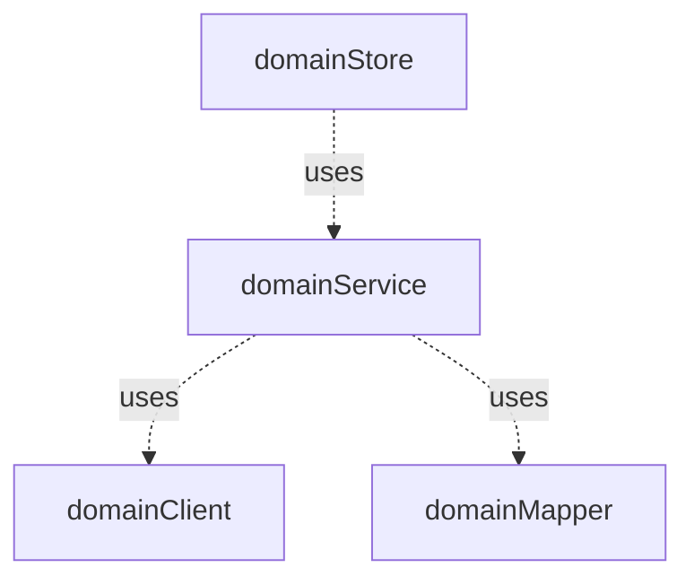

# Frontend

## Struktur

::: details Grafische Darstellung

```
frontend-project
├─ src
|  ├─ api
|  ├─ components
|  |  ├─ common
|  |  |  └─ buttons
|  |  |     └─ TheBaseRefreshButton.vue
|  |  └─ wahlvorstand
|  |     └─ TheWahlvorstandAnwesenheitRequirementCard.vue
|  ├─ composables
|  |  ├─ common
|  |  |   └─ formatter.ts
|  |  └─ wahlvorstand
|  |     └─ wahlvorstandService.ts
|  ├─ plugins
|  |     ├─ index.ts
|  |     ├─ pinia.ts
|  |     ├─ router.ts
|  |     └─ vuetify.ts
|  ├─ resources
|  |     └─ openapis
|  |        └─ openapi.broadcast.0.2.0.json
|  ├─ stores
|  |     └─ wahlvorstandStore.ts
|  ├─ types
|  |     └─ wahlvorstand
|  |        ├─ Wahlvorstand.ts
|  |        └─ WahlvorstandsMitglied.ts
|  └─ views
|     └─ WahlvorstandView.vue
├─ stories
|  └─ components
|     └─ wahlvorstand
|        └─ TheWahlvorstandAnwesenheitRequirementCard.stories.ts
└─ tests
   └─ components
      └─ wahlvorstand
         └─ TheWahlvorstandAnwesenheitRequirementCard.spec.ts
```

:::

Das Frontend besteht für die Entwicklung aus 3 Komponenten, welche sich jeweils in einem Ordner auf der Rootebene
wiederspiegeln.

| Komponente | Beschreibung                                                |
|------------|-------------------------------------------------------------|
| src        | Der Code der Anwendung mit allen Komponenten und Funktionen |
| tests      | Tests zum Anwendungscode                                    |
| stories    | Stories für StorybookJS zu den Komponenten der Anwendung    |

### Anwendungscode

Der Anwendungscode besteht auf folgenden Ordnern:

| Ordner            | Beschreibung                                                              |
|-------------------|---------------------------------------------------------------------------|
| api               | (generierte) Clients für den Zugriff auf die Backend-Services             |
| components        | Komponenten die zur Verfügung stehen                                      |
| composables       | Wiederverwendbarer Code                                                   |
| resources/openapi | openAPI Beschreibung die für die Clients verwendet werden                 |
| plugins           | Konfiguration der verwendeten Plugins, z.B. Pinia, Router oder Vuetify     |
| store             | Stores der Anwendung                                                      |
| types             | Eigenen Datentypen der Anwendung (Die Datentypen der Clients sind in `api` |                                                    
| views             | Views der Anwendung                                                       |

Sofern es mehrere Elemente gibt, die zu unterschiedlichen fachlichen Domainen gehörten, kann es je Ordner verschiedene Unterordner geben.

`common` ... Elemente ohne spezifische fachliche Zugehörigkeit

`<domain>` ... Elemente mit spezifischer fachlicher Zugehörigkeit

**Beispiele**

`components/common` ... Enthält Komponenten, die überall zum Einsatz kommen können.

`components/wahlvorstand` ... Enthält Komponenten, die im Kontext vom Wahlvorstand zum Einsatz kommen

### Tests und Stories

Die Tests und Stories bilden die gleiche Ordnerstruktur ab wie der jeweilige Testgegestand bzw. die Komponente der Stories.

Für die Komponte im Ordner `src/components/wahlvorstand/TheWahlvorstandAnwesenheitRequirementCard.vue` liegen die Tests
in `tests/components/wahlvorstand/TheWahlvorstandAnwesenheitRequirementCard.spec.ts` und die Stories in
`stories/components/wahlvorstand/TheWahlvorstandAnwesenheitRequirementCard.stories.ts`.

Bei den Tests zu Komponenten gibt es zusätzlich, parallel zu den Testfiles, einen Ordner `__snapshots__`.
Dieser enthält die Referenzen für die Darstellung für [Komponententest](#komponententests).

## Komponenten

Das Frontend wird aus diversen [Single-File-Components](https://vuejs.org/guide/scaling-up/sfc.html) zusammengesetzt. Dabei verwenden wir Typescript und die
[Composition-API](https://vuejs.org/guide/introduction.html#composition-api).


## Kommunikation

### zwischen Komponenten

````mermaid

flowchart TD

domainStore
domainComponentA
domainComponentB
domainComponentC
BaseComponentA
BaseComponentB
BaseComponentC

domainStore -- Getter/State --> domainComponentA
domainStore -- Getter/State --> domainComponentC
domainStore -- Getter/State --> domainComponentB

domainComponentB -- Property --> BaseComponentA
domainComponentB -- Property --> BaseComponentB
BaseComponentB -- Property --> BaseComponentC

domainComponentA -- Action --> domainStore
domainComponentB -- Action --> domainStore

BaseComponentA -- Event --> domainComponentB
BaseComponentB -- Event --> domainComponentB
BaseComponentC -- Event --> BaseComponentB
````

### mit dem Backend



## Testkonzept

### Unittesting

Funktionen, die in Composables, Stores und Datentypen enthalten sind, werden mit Unit-Tests abgedeckt.
Die Kommunikation mit Funktionen anderer Module wird gemockt. Dabei ist die korrekte Interaktion mit dem Mock
zu verifizieren.

### Komponententests

Bei Komponententest wird die korrekte Darstellung (Rendering) und das Eventhandling verifiziert.

Die korrekte Darstellung wird mit Hilfe von [Snapshots](https://vitest.dev/guide/snapshot.html) verifiziert.