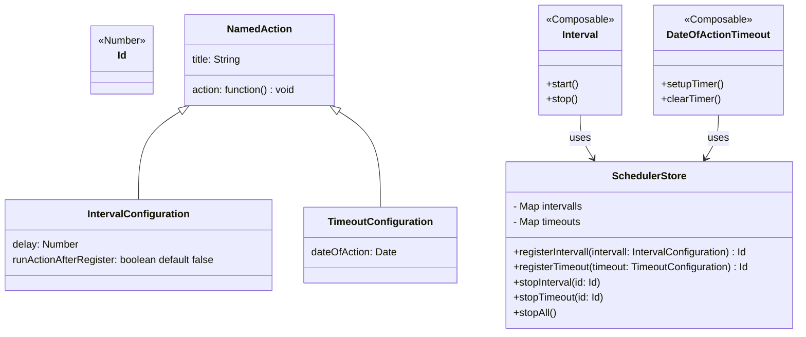

# Intervalle und Timeouts

Im Wahllokalsystem werden Intervalle und Timeouts verwendet, um wiederkehrende Aufgaben und zeitlich festgelegte Aktionen zu verwalten.

## Intervalle

Intervalle werden eingesetzt, um wiederkehrende Aufgaben zu implementieren.
Bei der Definition eines Intervalls wird die zu erfüllende Aufgabe sowie die zeitliche Frequenz für die Wiederholung angegeben.
Im Wahllokalsystem sind die folgenden Intervalle konfiguriert:

| Titel                | Beschreibung                                                                   | Frequenz         |
|----------------------|--------------------------------------------------------------------------------|------------------|
| LastSeen             | Überprüft, ob das Wahllokalsystem online ist und setzt entsprechend den Status | alle 30 Sekunden |
| Broadcast Message    | Lädt die älteste Nachricht für das jeweilige Wahllokal                         | alle 5 Minuten   |
| Send Wahlbeteiligung | Sendet die Wahlbeteiligung an das Backend                                      | alle 30 Minuten  |

## Timeouts

Timeouts werden verwendet, um Aktionen auszuführen, die zu einem bestimmten Zeitpunkt erfolgen sollen.
Hierbei wird die Zeitspanne vom aktuellen Zeitpunkt bis zum gewünschten Zeitpunkt an das Timeout übergeben, zusammen mit der Funktion, die ausgeführt werden soll.
Im Wahllokalsystem sind die folgenden Timeouts definiert:

| Titel                                          | Beschreibung                                                                                                               |
|------------------------------------------------|----------------------------------------------------------------------------------------------------------------------------|
| Überprüfung der Anwesenheit des Wahlvorstandes | Fragt die Anwesenheit des Wahlvorstandes ab. Der spezifische Zeitpunkt wird anhand der Konfigurationsparameter festgelegt. |

## Technische Umsetzung

