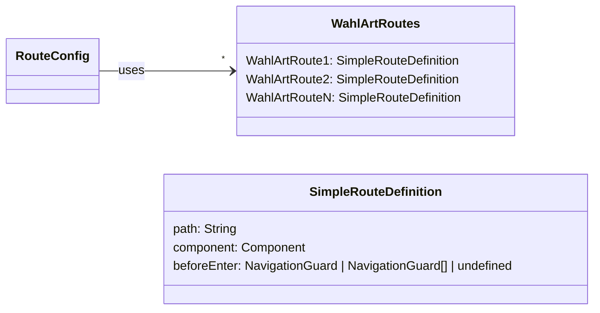
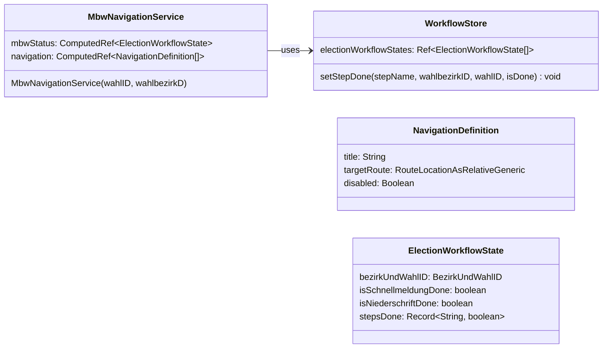
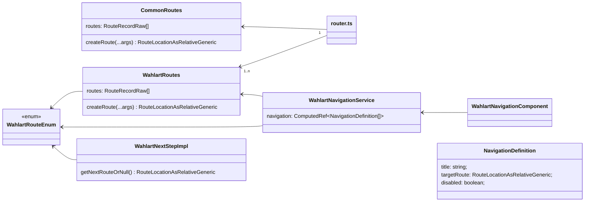

# Navigation und Bearbeitungsreihenfolge

Die Bearbeitungsreihenfolge an einem Wahltag folgt einem klar definierten Schema. Die ["Was kann die Software"-Übersicht](/about/#was-kann-die-software) zeigt alle Schritte, die dabei zu berücksichtigen sind.

Das Wahllokalsystem unterstützt die Wahlhelfer bei der korrekten Bearbeitung, in dem bestimmte Funktionen erst genutzt werden können, wenn die notwendigen
Schritte zuvor abgeschlossen wurden.

Umgesetzt wird dies durch Navigationguards, bedingt verfügbare Links und einer dynamischen Ermittlung der nächsten Seite.

Der aktuelle Bearbeitungszustand wird im `WorkflowStore` gepflegt.

## Navigation- und Workflowelemente

### Navigationguards

[Navigationguards](https://router.vuejs.org/guide/advanced/navigation-guards.html) ermöglichen es, dass der Aufruf
einer View unterbunden wird.

Im Wahllokalsystem wird geprüft, ob die direkt notwendigen Schritte abgeschlossen wurden.

Für jede Wahlart (MBW, BTW, ...) werden die Routen der jeweiligen möglichen Schritte definiert. Über die Property
`beforeEnter` werden die Navigationguards definiert.

### Aktive/Inaktive Links

Über die Links in der Navigation können Benutzer des Wahllokalsystems gezielt die Seiten für bestimmte
Bearbeitungsschritte aufrufen. Diese Links sind inaktiv, solange nicht alle notwendigen Schritte abgeschlossen wurden.

> [!important] Auf Reaktivität achten
> Die Navigation wird mit dem Start der Anwendung erstellt. Damit der Abschluss eines Bearbeitungsschrittes den
> nächsten Schritt verfügbar macht, muss die Navigation reaktiv sein.

#### Beschreibung anhand der Implementierung für die MBW

Das Composable `mbwNavigationService` liefert die einzelnen Bearbeitungsschritte für die MBW, die in der Navigation
angezeigt werden. Bei der Initialisierung muss die `wahlID` und `wahlbezirkID` definiert werden. Anhand der IDs
wird der WorkflowStatus für diese konkrete Wahl ermittelt. Anhand des WorkflowStatus wird dann bestimmt, ob die Links aktiv oder inaktiv
sind. Die Reaktivität wird durch `ComputedRef` erreicht. Ändert sich am WorkflowStatus etwas, erfolgt eine Evaluierung
entlang der Reaktivitätskette und ggf. eine Änderung der Verfügbarkeit der Links.

### dynamische Bestimmung des nächsten Schrittes {#dynamische-bestimmung-des-nachsten-schrittes}

Fast alle Seiten leiten den Nutzer weiter zum nächsten Schritt, sobald die Daten der aktuellen Seite gespeichert wurden.
Die Bestimmung der nächsten Seite erfolgt über die Funktion `getNextRouteOrNull` der `navigationUtils`. Folgende Prüfungen
erfolgen dabei:

1. welcher allgemeine, nicht wahlspezifische, Schritt ist als Nächstes zu bearbeiten
2. welche Wahl ist noch nicht abgeschlossen
3. welcher Schritt der nicht-abgeschlossenen Wahl ist als Nächstes zu bearbeiten

> [!NOTE]
> Eine Wahl gilt als abgeschlossen, wenn die Niederschrift der Wahl gedruckt wurde.

> [!NOTE]
> Konnte kein nächster Schritt ermittelt werden, wird der Benutzer auf die `Home`-Seite weitergeleitet.

## Implementierung

Die folgende Grafik zeigt die wesentlichen Strukturelemente, die für die Implementierung von Bedeutung sind.

### WahlartRouteEnum

Grundlage bildet ein `enum`, welches Namen für alle aufrufbaren Views und damit notwendigen Routen beinhaltet. Die erste
Implementierung erfolgte mit `MbwRoutesEnum.ts`.

Anstelle einer zentralen `enum` für alle Views wird mit den wahlspezifischen Enums eine Modularisierung erreicht.

### WahlartRoutes

Der `vue-router` umfasst alle Routen, die in der Anwendung aufrufbar sind. Damit die Datei aufgrund der Vielzahl
an Wahlen nicht zu umfangreich ist, wird sie modularisiert. Je Wahlart gibt es eine Datei, welche in einem Array alle
Routen der Wahl zur Verfügung stellt (`routes`). Bei der `MBW` heißt die Datei `mbwRoutes.ts`. Über die Funktion
`createRoute` wird sichergestellt, dass eine valide Routinglocation erzeugt wird.

### CommonRoutes

Ist fast das gleiche wie `WahlartRoutes`. Der Unterschied besteht darin, dass hier alle wahlunspezifischen Routen
enthalten sind.

### router.ts

Die Datei `router.ts` ist die Konfiguration des `vue-router`. Aus diesem Grund werden hier alle Routen aus
den `WahlartRoutes` und `CommonRoutes` verwendet.

### WahlartNavigationService

Der `WahlartNavigationService` ist ein Composable, welches Navigationskomponenten unterstützt. `navigation` liefert
alle Navigationseinträge, die darzustellen sind. Weitere, für die Komponente notwendige Funktionen werden
ebenfalls hier hinterlegt.

### WahlartNextStepImpl

Je Wahlart wird hier bestimmt, welcher Schritt entsprechend [Punkt 3](#dynamische-bestimmung-des-nachsten-schrittes)
als Nächstes zu bearbeiten ist.
