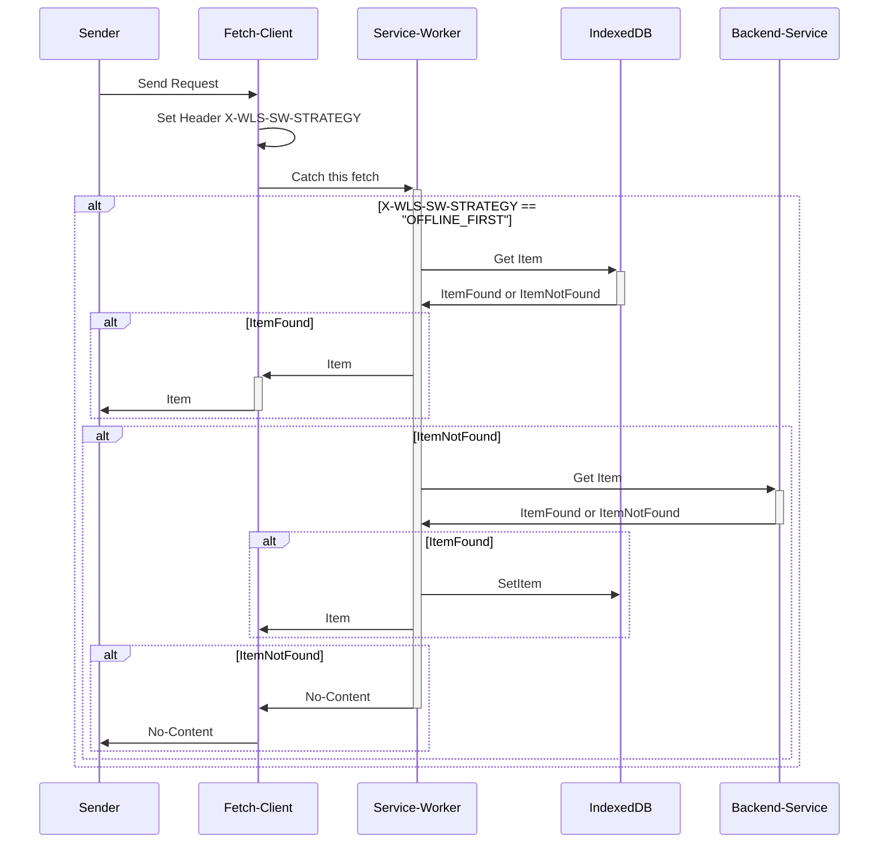
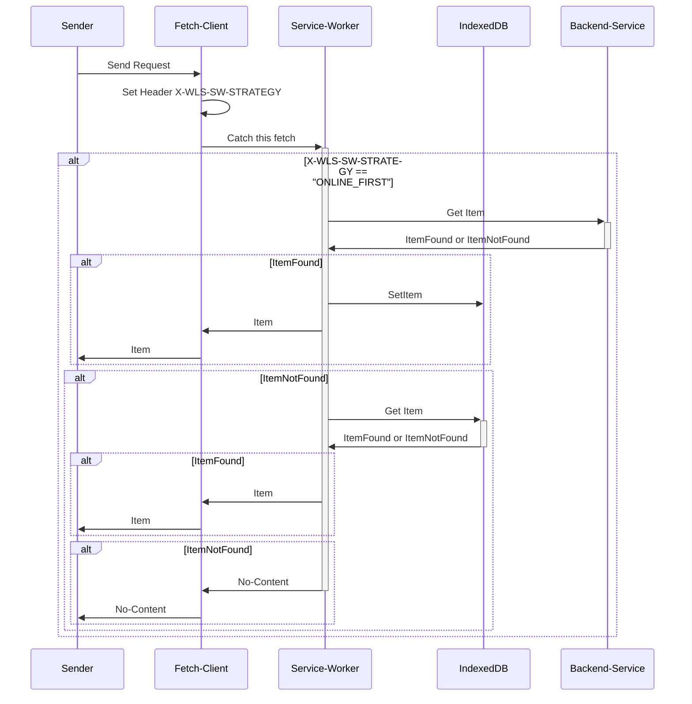
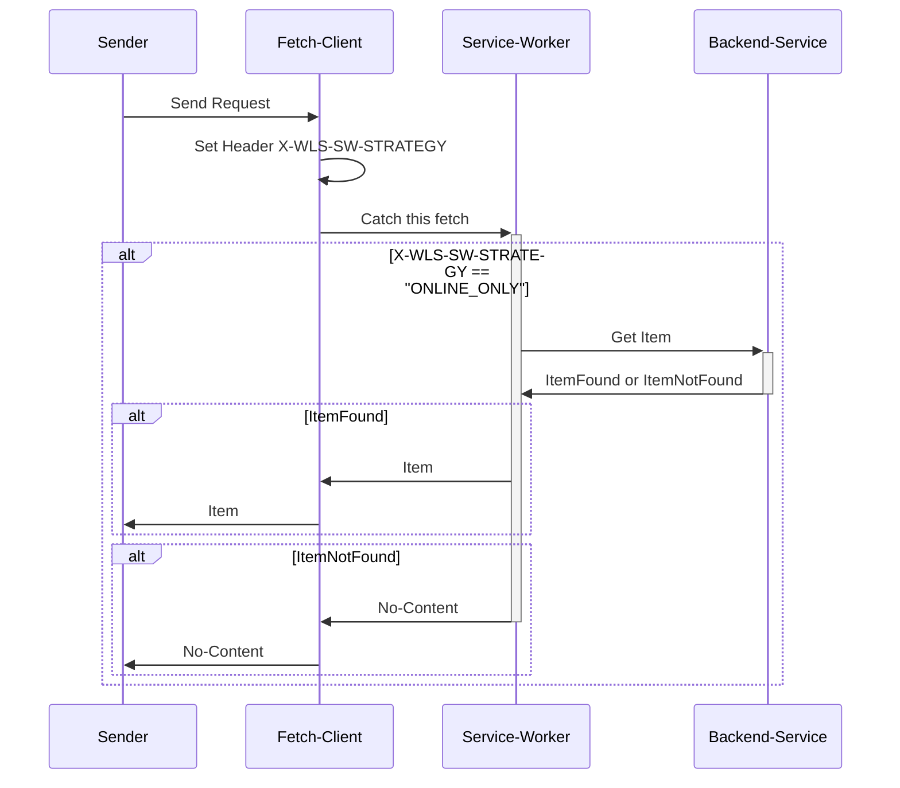
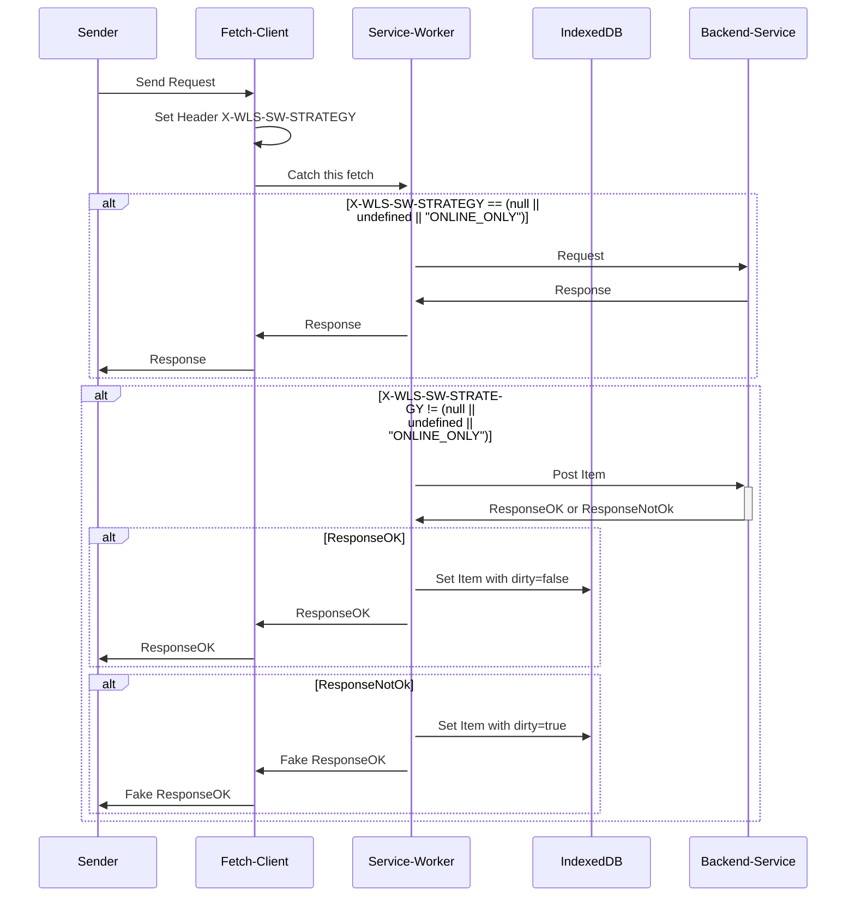
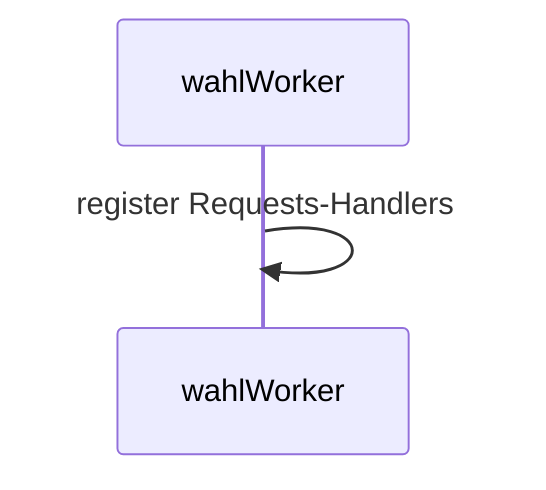
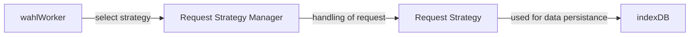

# Offlinefähigkeit-Konzept

In den Wahllokalen kann die Internetverbindung instabil sein, was jedoch die Bedienbarkeit des Clients nicht beeinträchtigen darf.
Eine Voraussetzung für die Nutzung ist, dass zu Beginn des Wahltages beim Anmelden eine Internetverbindung verfügbar ist.
Anschließend sollte der Benutzer bis einschließlich des Drucks der Niederschrift durchgehend arbeiten können. Sollte am Ende des Tages
weiterhin keine Verbindung bestehen, wird die Niederschrift im Wahllokal gedruckt und telefonisch übermittelt.
Die Datenübertragung an das Backend kann auch am nächsten Tag durch das Hochfahren des Notebooks erfolgen.

## Beschreibung Offlinefähigkeit

Grundsätzlich läuft die Kommunikation des Clients mit dem Backend über REST Schnittstellen.
Die dahinter verborgenen Ressourcen sind über Schreib- und Lese-Operationen zugänglich.
Sollte der Client offline sein, kann auf die Ressourcen nicht zugegriffen werden.
Offlinefähigkeit beschreibt das Konzept, die Ressourcen lokal im Client abzubilden und mit dem
Backend zu synchronisieren.
Diese Anforderung lässt sich mit dem Service Worker (im folgenden SW) umsetzen.

## Anforderungen an die REST-Schnittstellen der Microservices

Um einen möglichst konfigurations- und wartungsarmen Code zu ermöglichen ist es notwendig,
dass alle WLS-Schnittstellen einer Objektart, die Lese- und Schreiboperationen bieten, die
gleiche URL anbieten und die Unterscheidung der Operation einzig und allein anhand der
HTTP-Methode durchgeführt wird. So haben wir zum Beispiel für die Objektart `Eroeffnungsuhrzeit` eine GET und eine POST Operation an die URL: "_/businessActions/eroeffnungsuhrzeit/wahlbezirkID_".

## Umgesetztes Verhalten

Beim Lesen und Schreiben werden die Netzwerk-Anfragen des Browsers vom Service Worker
(der als eine Art Middleware aggiert) abgefangen und wahlweise lokal gespeichert oder aus
dem lokalen Speicher geladen, bzw. mit dem Backend ausgetauscht.
Die Identifizierung der Anfragen erfolgt dabei allein anhand der URL des Requests, die in der `IndexedDB` als `Key` fungiert.
Das `Value` das dem `Key` enspricht soll ein JSON-String sein, das neben dem Payload noch ein paar Informationen enthalten muss.
Für mehrere Details siehe unten: [Beispiel eines möglichen IndexedDB-Eintrags](#beispieleintrag-in-der-indexeddb).


Ergebnisse weiterer Requests zu der selben Ressource-URL führen zur Aktualisierung des `Values` unter dem gleichen `Key`.

### Strategien

Es gibt drei unterschiedliche Strategien zum Lesen von Daten, mit denen der Service-Worker umgehen kann. Bei `POST`-Requests gibt es nur
`ONLINE_FIRST`

#### OFFLINE_FIRST (default)

Hat der Service Worker Daten im lokalen Speicher, werden diese Daten zurückgeliefert. Nur wenn keine Daten vorhanden sind, wird ein Request ans Backend geschickt.



#### ONLINE_FIRST

Es gibt Daten, die remote und nicht im Client entstehen und somit, falls verfügbar, Priorität vor dem lokalen Speicher haben.



#### ONLINE_ONLY

Diese Strategie wird für Operationen benötigt, die nur remote relevant sind und im lokalen Speicher nicht gespeichert werden.



Für Beispiele für Ressourcen unter den nicht-default Strategien, siehe Kapitel [Beispieldaten pro Offline-Strategie](#beispieldaten-pro-offline-strategie).

#### Definieren der Strategy

Soll eine andere Strategie als die Standardstrategie bei einem Request zum Einsatz kommen, muss dies explizit definiert werden:

```typescript{4}
await wahlvorstandControllerApi.getWahlvorstand(
        wahlbezirkID,
        forceUpdate,
        axiosConfigWrapper().requestAsOnlineFirst()
      )
```

### Initialisierung

Bei Login am Wahllokalsystem prüft der Client zunächst, welcher Benutzer als letztes an diesem Browser angemeldet war. Ist der aktuelle Benutzer ungleich dem letzten Benutzer, wird die lokale Datenbank gelöscht. Handelt es sich aber um den gleichen Benutzer, bleiben seine Offline erfassten Daten bestehen und er kann weiter arbeiten.
Anschließend wird die Initialisierungsseite des WLS aufgerufen. Auf dieser werden alle lesenden Endpunkte, welche für die aktuelle Systemsituation (Art des Wahllokals, Anzahl und Arten der stattfindenden Wahlen) relevant sind einmalig aufgerufen. Da der SW alle Anfragen unterbricht und speichert, wird mit dieser Aktion sichergestellt, dass alle Daten ab sofort Offline zur Verfügung stehen.

### Behandlung der aus- oder eingehenden Requests oder Responses

#### Ist `online` und `kein Fehler` tritt auf

In diesem Fall wird davon ausgegangen, dass keine Probleme auftreten.

Der Client sendet seine Anfrage und die enthaltenen Daten werden erfolgreich im Backend gespeichert.
Alles was der SW in diesem Fall tut ist, seine lokalen Daten aktuell zu halten. Bedeutet: Der Client sendet Daten, diese leitet der SW ans Backend.
Anschließend speichert er die gesendeten Daten wie unter [Umgesetztes Verhalten](#umgesetztes-verhalten) beschrieben.

#### Ist `offline` oder `ein Fehler` ist aufgetreten

In diesem Fall wird davon ausgegangen, dass der Client offline ist, oder Fehler im Backend auftreten.

In jedem der Fälle wird der SW merken, dass Anfragen ans Backend nicht mit einem gültigen HTTP-Statuscode (200, 201 und 204) beantwortet werden.

Passiert dies bei lesenden Anfragen wird, wie unter [Strategien](#strategien) beschrieben, mit den in der `IndexedDB` offline-vorhandenen Daten geantwortet.

Passiert dies bei schreibenden Anfragen, verschattet der SW den Fehler, sodass der Benutzer nichts von den Problemen sieht. Außerdem werden die soeben gesendeten Daten lokal nicht nur gespeichert, sondern auch als `dirty:true` markiert zusammen mit dem Zeitpunkt ([timestamp](#beispieleintrag-in-der-indexeddb)) zu dem die Daten zu senden versucht wurde, gespeichert.



### Datensynchronisation

Um die Daten, die bisher nicht erfolgreich an das Backend übermittelt werden konnten, bei wiederhergestellter Verbindung zu übermittelt, erfolgt eine Synchronisierung:

- beim Wechseln vom `offline` in den `online` Status, die sog. Hintergrund-Synchronisation);
- beim Senden der Ergebnismeldung (Schnellmeldung oder Niederschrift) die sog. Vordergrund-Synchronisation);
- beim Ausloggen des Benutzers.


#### Hintergrundsynchronisation beim offline-online Wechsel

Wenn der Wahllokalclient den Zustand von _Offline_ zu _Online_ wechselt, wird der `Offline-Syncer` aktiv.
Dies geschieht im Hintegrund und ist für den Benutzer nur durch eine Einblendung erkennbar.

Der `Offline-Syncer` prüft, ob in den lokalen Daten mit `dirty=true` markierte Daten vorhanden sind und sortiert diese anhand der ursprünglichen Speicherung-Reihenfolge ([timestamp](#beispieleintrag-in-der-indexeddb)).
Dann versucht er jede dieser Datensätze (aus der `indexedDB`) erneut ans Backend zu senden. Bei erfolgreich durchgeführten Anfragen wird das `dirty` auf `false` gesetzt.
Nicht erfolgreiche Anfragen haben keine Konsequenzen. Nachdem alle Anfragen zu synchronisieren versucht wurden, verschwindet die Anzeige unten rechts wieder.

#### Vordergrundsynchronisation beim Senden der Ergebnismeldung

Vor dem Senden einer Schnellmeldung oder Niederschrift muss der `Offline-Syncer` erfolgreich durchlaufen sein. War die Synchronisierung nicht erfolgreich kann kein Senden erfolgen.

Zur Besseren Nachvollziehbarkeit wird der Synchronisierungsforschritt dem User angezeigt.

#### Vordergrundsynchronisation beim Ausloggen des Benutzers

Wie oben [beim Senden der Ergebnismeldung](#vordergrundsynchronisation-beim-senden-der-ergebnismeldung) wird auch vor dem Ausloggen eines Benutzers versucht,
falls `dirty=true`-markierte Daten in der `IndexedDB` vorhanden, diese ans Backend zu senden.

### Logout eines Benutzers

Daten werden NICHT gelöscht, wenn ein Nutzer sich abmeldet. Dadurch wird verhindert, dass durch

1. Koffertausch
2. Abmeldung durch Inaktivität
3. Schließen des Tabs
4. Etc.

offline-erfasste Daten verloren gehen. Die Daten bleiben solange im Offline-Speicher enthalten, bis sich ein
anderer Benutzer am gleichen Rechner anmeldet (siehe [Initialisierung](#initialisierung)).

### Beispieleintrag in der IndexedDB

Das `Value` das dem `Key` enspricht soll ein JSON-String sein, das neben dem Payload noch die folgenden Informationen enthält:

- das Payload (`data` = Inhalt des Requests);
- die Art des Inhalts (`contentType` z.Bsp. `application/json; charset=utf8`, `text/csv; charset=utf8` usw.);
- ob der Eintrag mit dem Backend unsynchronisiert (`dirty:true`) oder synchronisert (`dirty:true`) ist;
- der Zeitpunkt der versuchten oder erfolgten Speicher-/Leseoperation (`timestamp`);
- der Status des Requests (`200`, `201`, oder `204`).

Ein Beispiel für einen möglichen Eintrag in der IndexedDB wäre:

- `Key`: `eroeffnungsuhrzeit/wahlbezirkID123`
- `Value`: `{
            "data":{"wahlbezirkID":"wahlbezirkID123", "eroeffnungsuhrzeit":"2025-03-11T05:05:00.000"},
            "contentType":"application/json; charset=utf8",
            "dirty":"false",
            "timestamp":"2025-03-11T05:05:00.020Z",
            "status":"200"
         }`

Die Properties-Namen werden hier nur orientativ aufgeführt.

Wenn also der Client (mit Wahlbezirk-ID „123“) beim ersten Anmelden (um dem obigen Beispiel zu folgen) die
Eröffnungsuhrzeit lädt, um ggf. bereits erfasste Daten zu laden, wird im lokalen Speicher mit
dem Key "_/eroeffnungsuhrzeit/123_" der Wert gespeichert der geladen wird (in unserem Beispiel wäre das JSON-Objekt `Eroeffnungsuhrzeit`).
Arbeitet der Client nun weiter und erfasst eine neue Eroeffnungsuhrzeit, wird unter dem obigen Key der neue Wert gespeichert.

### Beispieldaten pro Offline-Strategie

#### ONLINE_FIRST

- `/ergebnismeldung/awerte/wahlbezirkID` (AWerte);
- `/infomanagement/konfiguration` (Konfiguration);
- `/basisdaten/ungueltigews/wahltagID/wahlbezirksart` (UngueltigeWahlscheine);
- `/wahlvorstand/wahlbezirkID` (Wahlvorstand);

Daher wird mit dieser Strategie zuerst ein Request ans Backend geschickt. Ist dieser erfolgreich, werden die neuen Daten lokal gespeichert und zurückgegeben,
ist er nicht erfolgreich, wird der ggf. vorhandene Eintrag aus der `IndexedDB` zurück gegeben.

#### ONLINE_ONLY

- `/auth/user` (Der User des Wahlbezirks wird geladen);
- `/broadcast/getMessage/wahlbezirkId` (Es wird nach für den Wahlbezirk vorhandenen Broadcast Informationen gesucht);
- `/broadcast/messageRead/nachrichtId` (Information, dass die Broadcast-Nachricht gelesen wurde);
- `/monitoring/lastSeen/wahlbezirkID` (Uhrzeit der letzten Abmeldung);
- `/monitoring/letzteAbmeldung/wahlbezirkID` (Uhrzeit der letzten Abmeldung).

## Umsetzung

### Abläufe

#### Start der Anwendung



_Mit dem Start der Anwendung werden für bestimmte Requests Request-Handler registriert._

Die Registrierung erfolgt mittels `registerRoute(<RegEx für URL>, <Requesthandlerfunktion>, <Http-Methode>)`

#### Requesthandling



_Übersicht über die wesentlichen Komponenten, die bei der Verarbeitung eines Requests zum Einsatz kommen._

### Komponenten

#### Request Strategy Manager

Der Request Strategy Manager ist die Fassade zur Verarbeitung einer Anfrage, die durch den Service Worker behandelt werden soll.

In ihm sind alle Request-Strategien definiert. Anhand des Headers `X-WLS-SW-STRATEGY` und der HTTP-Methode wird entschieden,
welche Strategie verwendet werden soll. Ist keine konkrete Strategie definiert, wird eine Standardstrategie verwendet.
Ist für die Strategie und die HTTP-Methode kein expliziter Handler definiert, erfolgt ein klassischer Fetch ohne zusätzliche Behandlung.

Die Strategie erhält die Anfrage, um sie zu bearbeiten. Die Antwort der Strategie ist auch die Antwort des Managers.

#### Requeststrategie

Requeststrategien sind die jeweiligen konkreten Implementierungen der zuvor beschriebenen [Varianten](#strategien),
wie mit Requests im Rahmen der Offlinefähigkeit umzugehen ist.

Um Daten über eine Sitzung hinaus zu persistieren, wird die IndexedDB des Browsers verwendet.
Die Strategie nutzt für den Zugriff das entsprechende [Composable](#indexdb).

#### IndexDB

IndexDB ist ein Composable, das als Fassade für den Zugriff auf die IndexedDB des Browsers dient.
Es stellt alle notwendigen Funktionen zur Einrichtung sowie zum Lesen und Schreiben bereit.

#### Common API Utils

Das Composable `commonApiUtils` stellt mit dem `axiosConfigWrapper` eine Fluent-API bereit, damit bei den Requests
über Axios der korrekte Header für die Offline-Strategie gesetzt wird.

```ts
const { axiosConfigWrapper } = useCommonApiUtils();

//Abrufen des Wahlvorstandes mit ONLINE_FIRST-Strategie
await wahlvorstandControllerApi.getWahlvorstand(
    wahlbezirkID,
    forceUpdate,
    axiosConfigWrapper().requestAsOnlineFirst()
);

//Senden der Wahlbeteiligung mit ONLINE_ONLY-Strategie
await waehlerAnzahlControllerApi.postWahlbeteiligung(
    wahlbezirkID,
    wahlID,
    toDto(wahlbeteiligung),
    axiosConfigWrapper().requestAsOnlineOnly()
);

//Versenden von Ereignissen ohne explizite Strategie. Somit gilt die Standardstrategie.
await ereignisControllerApi.postEreignisse(
    wahlbezirkID,
    ereignisseWriteDto
);
```
