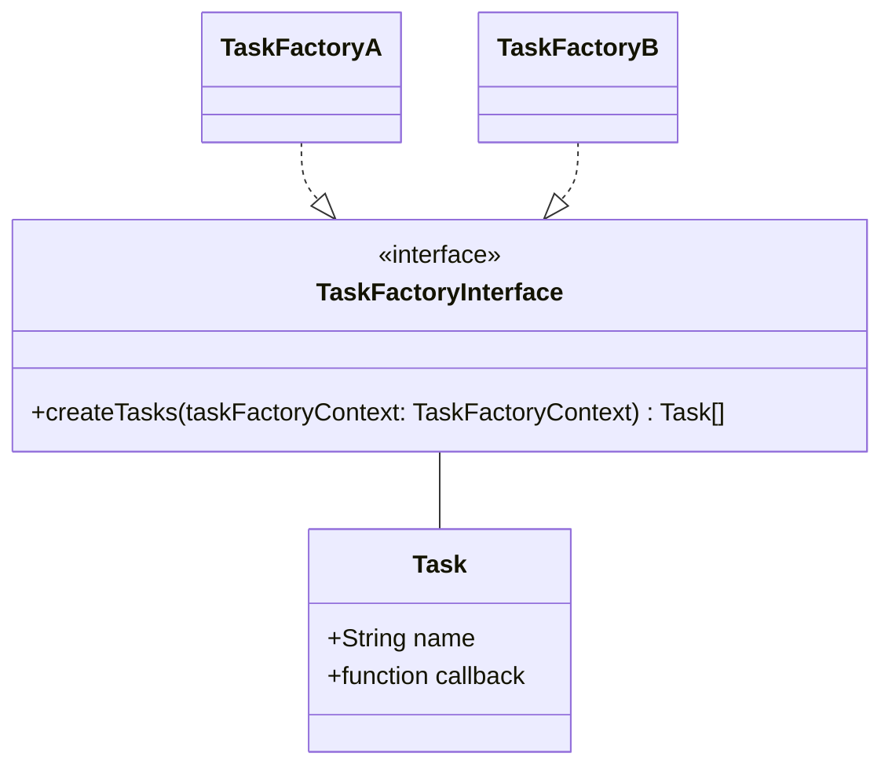
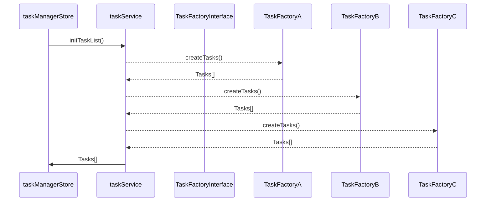

# Erstellen der Task List

Beim initialen Aufruf des `Wahllokalsystem UI` müssen eine Reihe von Daten geladen werden, u.a. damit diese Offline zur Verfügung stehen (siehe [Offlinekonzept](./offlinefaehigkeit-konzept)).
Dazu wird eine Liste von Tasks erstellt.
Anhand dieser Liste wird angezeigt, wie viele Tasks noch geladen werden müssen und ob die ausgeführten Tasks erfolgreich abgeschlossen wurden oder nicht.

Das initiale Erstellen der Tasks erfolgt nur einmal beim Start der Anwendung. Danach sind alle Tasks über den `TaskManagerStore` abrufbar.

Das `TaskFactoryInterface` enthält eine `createTasks` Methode, die jede Factory implementieren und zugänglich machen muss.

Für die Umsetzung der Factories wurden Composables verwendet.

Der Ablauf, wie Tasks erstellt werden kann wie folgt abgebildet werden:

