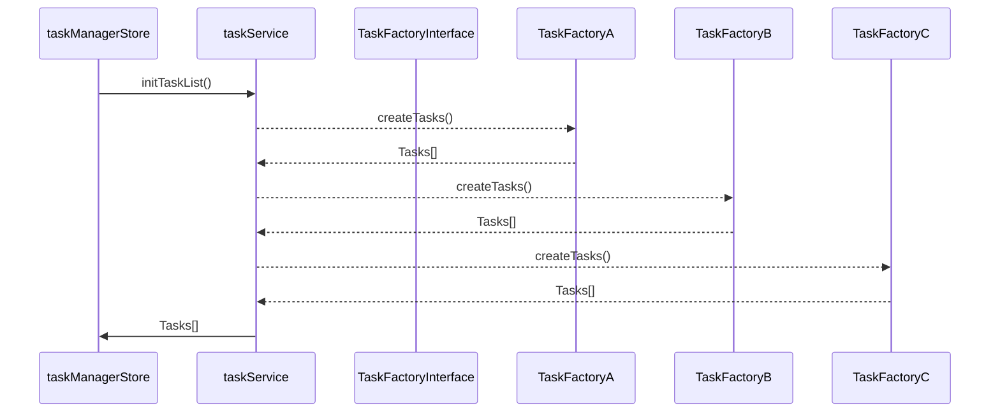

# Erstellen der Task List

Beim initialen Laden der WLS-GUI (Wahllokalsystem) muss für die Startseite eine Liste von Tasks erstellt werden.
Diese Liste zeigt an, wie viele Tasks noch geladen werden müssen und ob die zu ladenden Tasks erfolgreich abgeschlossen wurden oder nicht.
Zur Erstellung der Tasks werden Factories verwendet, die von einem `TaskFactoryInterface` erben.

Das initiale Erstellen der Tasks erfolgt nur einmal beim Start der Anwendung. Danach sind alle Tasks über den `TaskManager` abrufbar.

Das `TaskFactoryInterface` enthält eine `createTasks` Methode, die jede Factory implementieren und zugänglich machen muss.


Für die Umsetzung der Factories wurden Composables verwendet.

```ts
export function useFactory(): TaskFactoryInterface {
    createTasks(taskFactoryContext: TaskFactoryContext): Task[]
}
```

Der Ablauf, wie Tasks erstellt werden kann wie folgt abgebildet werden:


