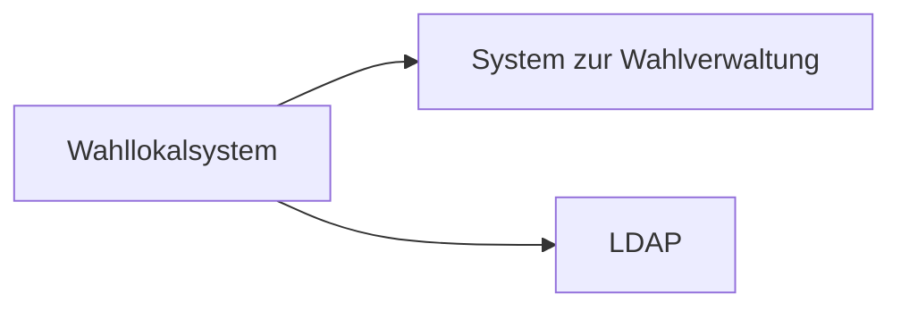
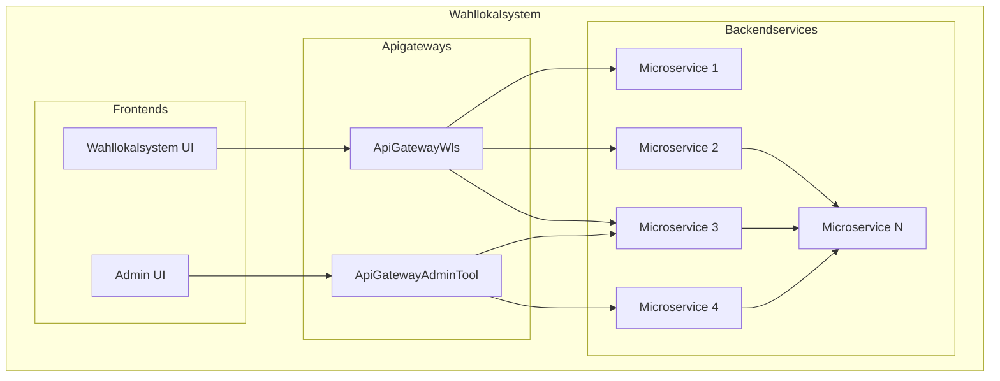

# Systemspezifikation vom Wahllokalsystem

🚧 -> <https://github.com/it-at-m/Wahllokalsystem/issues/741>

## Systemarchitektur

### Übersicht der Systeme

Damit das Wahllokalsystem betrieben werden kann, wird ein externes System benötigt. Dieses stellt Informationen
zu den Wahlen bereit, welche durch das WLS unterstützt werden sollen.

LDAP wird zur [Authentifizierung](security#authentifizierung) der Benutzer verwendet,

### Komponenten des WLS

Das WLS besteht aus 3 Arten von Komponenten. Die **Frontends** stellen das Userinterface für die Benutzer dar.
Über die **Apigateways** wird der Zugriff auf die **Backendservices** ermöglicht, welche die Anwendungslogik
umsetzen und sich um die Datenhaltung kümmern.

### Architektur der Laufzeitumgebung

Das Wahllokalsystem wird in OpenShift betrieben. Der Zugriff auf den Cluster erfolgt über die Routes (Reverse Proxy)
mittels HTTPS. Innerhalb des Clusters wird über HTTP kommuniziert.

Die Datenbank der Services ist nicht Teil des Clusters, sondern befindet sich separat.
