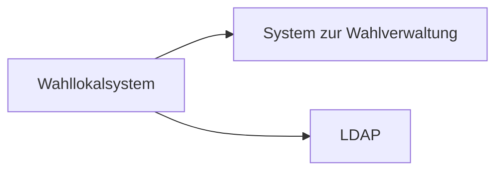
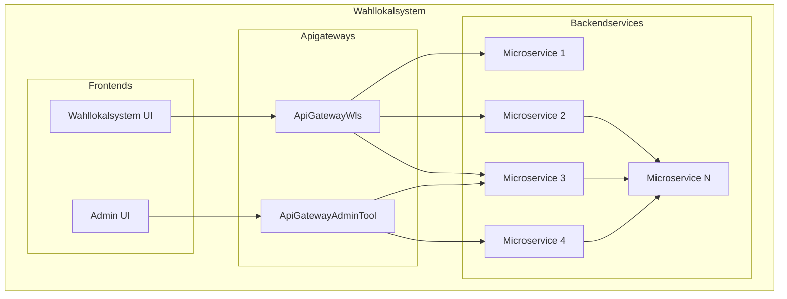
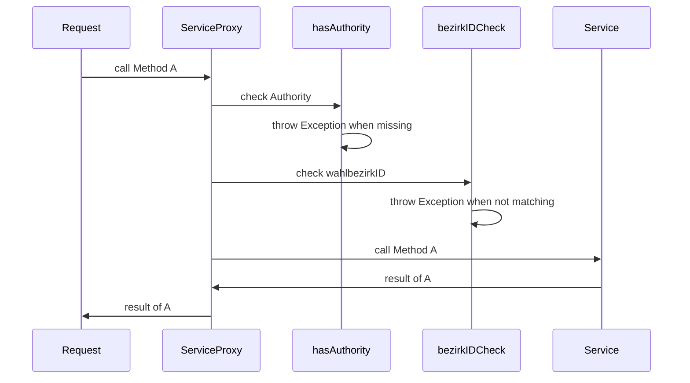
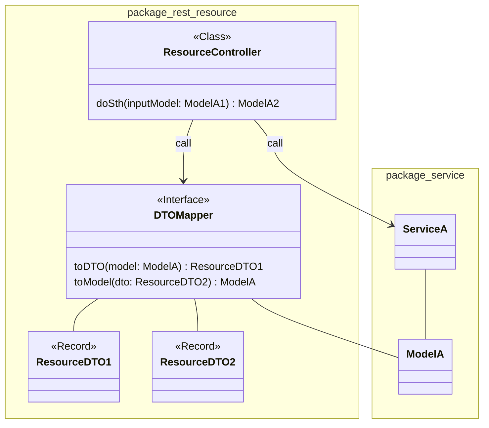
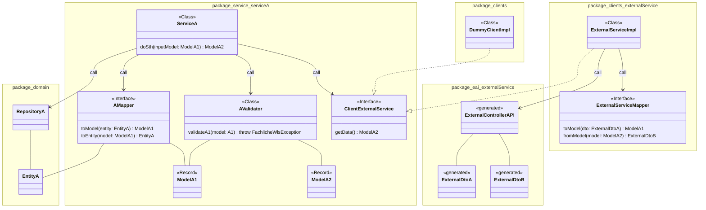
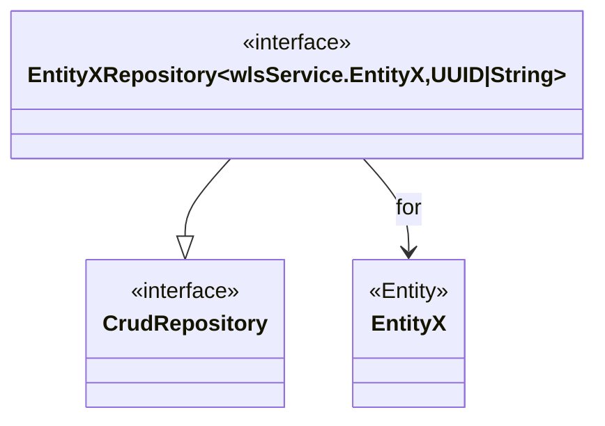

# Systemspezifikation vom Wahllokalsystem

🚧 -> <https://github.com/it-at-m/Wahllokalsystem/issues/741>

## Systemarchitektur

### Übersicht der Systeme



Damit das Wahllokalsystem betrieben werden kann, wird ein externes System benötigt. Dieses stellt Informationen
zu den Wahlen bereit, welche durch das WLS unterstützt werden sollen.

LDAP wird zur [Authentifizierung](security#authentifizierung) der Benutzer verwendet,

### Komponenten des WLS



Das WLS besteht aus 3 Arten von Komponenten. Die **Frontends** stellen das Userinterface für die Benutzer dar.
Über die **Apigateways** wird der Zugriff auf die **Backendservices** ermöglicht, welche die Anwendungslogik
umsetzen und sich um die Datenhaltung kümmern.

## Servicearchitektur

In diesem Abschnitt wird beschrieben wie ein Microservice in der Regel aufgebaut ist. Abweichungen von diesem
Aufbau werden bei dem jeweiligen Service dokumentiert.

### Backendservices

  
*Grundlegende Architektur eines Backendservices*

Ein Backendservice besteht in der Regel aus 3 Layern.

- `access layer` ... Ermöglicht den Zugriff auf den Service
- `service layer` ... Durchführung der fachlichen Logik, wie Validierung oder Lesen und Speichern sowie die Verwendung  
dritter Services zur Erfüllung der Aufgaben
- `persistence layer` ... Zugriff auf die Datenbank

#### Security

Komponenten die eine rote Umrandung haben sind Teil der Security.

Zum einen gibt es eine Zugriffskontrolle im `access layer`. Hier wird geprüft, ob für den Zugriff auf die geforderte
Resource die erforderliche Authentifizierung gegeben ist. Die meisten Ressourcen erfordern eine Authentifizierung. Es gibt
wenige Resource die ohne Authentifizierung abrufbar sind.

Die Security im `service layer` und `persistence layer` prüft die Autorisierung. Die Methoden erfordern in der Regel
mindestens 1 der funktion entsprechendes Recht. Das Verändern der Daten eines bestimmten Wahlbezirkes erfordert auch
der User berechtigt ist für diesen Wahlbezirk Daten zu verändern.



`bezirkIDCheck` wird definiert durch das Interface
`de.muenchen.oss.wahllokalsystem.wls.common.security.BezirkIDPermissionEvaluator` und hat folgende Implementierungen:

- `BezirkIDPermissionEvaluatorImpl` ... führt eine Prüfung des Authenticationobjektes durch
- `DummyBezirkIdPermissionEvaluatorImpl` ... liefert immer `true`

#### Fehlerbehandlung

Exceptions die während der Verarbeitung geworfen werden, werden durch den `GlobalExceptionHandler` verarbeitet.
Dieser erzeugt daraus ein `WlsExceptionDTO` und definiert den entsprechenden Http-Statuscode.

Grundlegen gilt folgeden Mapping von Subklassen einer WlsException zu dem Http-Statuscode:

- FachlicheWlsException ... 400
- TechnischeWlsException ... 500
- InfrastrukturelleWlsException ... 500
- SicherheitsWlsException ... 403

Weil das Fehlerhandling in allen Services gleich sein soll wird es über die Bibliothek `wls-common:exception`
bereitgestellt.

Restclients, die auf andere Services zugreifen, verwenden den [`WlsResponseErrorHandler`](../guides/api-client-generation/how-to-create-client-from-open-api-json.html#context-um-beans-erweitern) um konsequent `WlsException`s
zu werden.

#### Accesslayer

Im Accesslayer befinden sich die Klassen, Interfaces und Records welchen den Zugriff auf den Microservice mitels REST via http
ermöglichen.

Je Domain gibt es ein Subpackage. In jedem Subpackage gibt es einen RestController, einen Mapper und die Records für
das Datenmodell.

  
*Komponenten des AccessLayers*



_Abhängigkeiten der Klassen des Accesslayers untereinander, sowie den Zugriff auf den Servicelayer*

#### Servicelayer

Im Servicelayer befinden sind die Klassen, Interfaces und Records die zur Umsetzung der fachlichen Anforderungen
notwendig sind.

  
*Komponenten des Servicelayers*

Der Großteil der Implementierung wird im Package `service` erfolgen. Je Domain, die durch den Microservice abgedeckt wird,
gibt es ein Subpackage. Dieses beinhaltet die Serviceklasse, den Mapper, den Validator sowie die Klassen für das Datenmodell.

Die Rückgabewerte und Parameter der des Services sind Klassen des Datenmodells des Services. Im Mapper werden die Klassen
des Servicedatenmodells auf die Klassen des Domaindatenmodells gemappt. Durch den Validator wird sichergestellt das
die Parameter valide sind. Werden Daten von anderen Microservices benötigt, so wird diese Schnittstelle durch ein Interface
abgebildet. Die Rückgabewerte und Parameter sind wie beim Service Klassen des Datenmodells des Services.

Im Package `clients` ist die Funktionalität für den Zugriff auf einen anderen Microservice implementiert.
Der Dummyclient implementiert alle in den Services definierten Interfaces die für den Zugriff auf andere Microservices
definiert sind. Er dient primär den Testzwecken und soll eine Eigenständigkeit des Services ermöglichen.

In den Subpackages von `clients` werden die Zugriffe je externen Microservice gebündelt. In den jeweiligen
Packages gibt es eine Implementierungsklasse für den Zugriff auf den externen Microservice sowie einen Mapper. Der Mapper
konvertiert das Datenmodell des externen Microservices auf das geforderte Datenmodell im Microservice.

> [!IMPORTANT]
> Unter [Umständen](../adr/adr002-controller-service-datamodels.md) kann auf ein Datenmodell im Servierlayer verzichtet werden.



<em>Abhängigkeiten der Klassen des Serviceslayers untereinander, sowie den Zugriff auf den Persistencelayer</em>

<details>

<summary>Beispiel Packagestruktur in Basisdatenservice</summary>

```text
├─ clients
|     ├─ DummyClientImpl
|     ├─ WahlbezirkeClientImpl
|     └─ WahlbezirkeClientMapper
├─ service
|     ├─ common
|     |    ├─ WahlbezirkArtModel
|     |    └─ WahltagIdUndWahlbezirksart
|     ├─ wahlbezirke
|     |    ├─ WahlbezirkeClient
|     |    ├─ WahlbezirkeValidator
|     |    ├─ WahlbezirkeService
|     |    ├─ WahlbezirkModel
|     |    └─ WahlbezirkModelMapper
```  

*`WahlbezirkArtModel` wird nicht nur in `wahlbezirke` verwendet. `clients.WahlbezirkeClientImpl` implementiert
`service.wahlbezirke.WahlbezirkeClient`*

</details>

#### Persistencelayer

Für den Zugriff auf die Datenbank wird [Spring-Data](https://spring.io/projects/spring-data) verwendet.

  
*Komponenten des Persistencelayers*



<emBeziehungen der Komponenten des Persistencelayers</em>

Die Klasse und Interfaces werden im Package `domain` abgelegt. Analog zu den Services werden Subpackages je
Domain definiert.

Klassen die durch Entitäten verschiedene Subpackages verwenden werden sind in dem Subpackage `common` abzulegen.

<details>

<summary>Beispiel Packagestruktur in Basisdatenservice</summary>

```text
├─ domain
|     ├─ common
|     |    ├─ WahlbezirkArt
|     |    └─ WahltagIdUndWahlbezirksart
|     ├─ handbuch
|     |    ├─ Handbuch
|     |    └─ HandbuchRepository
|     ├─ ungueltigeWahlscheine
|     |    ├─ UngueltigeWahlscheine
|     |    └─ UngueltigeWahlscheineRepository
```  

<em>`WahlbezirkArt` wird in `handbuch` und `ungueltigeWahlscheine` auf dieselbe Weise verwendet</em>

</details>
