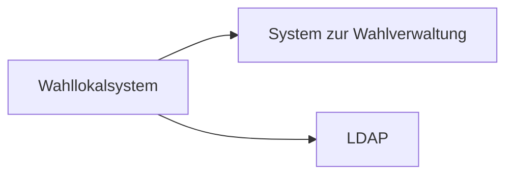
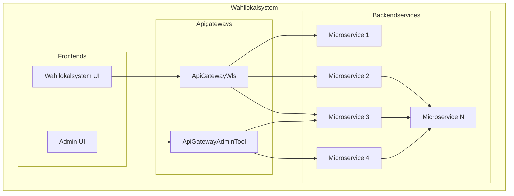
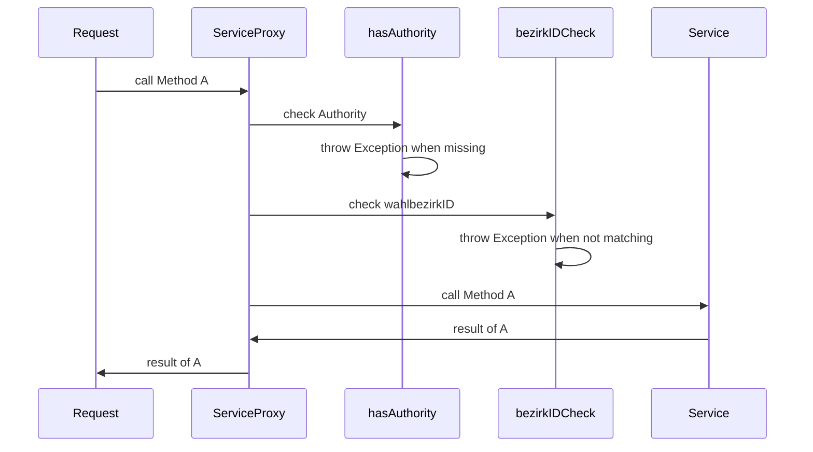
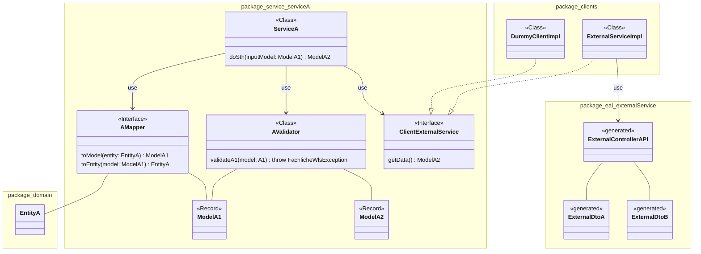
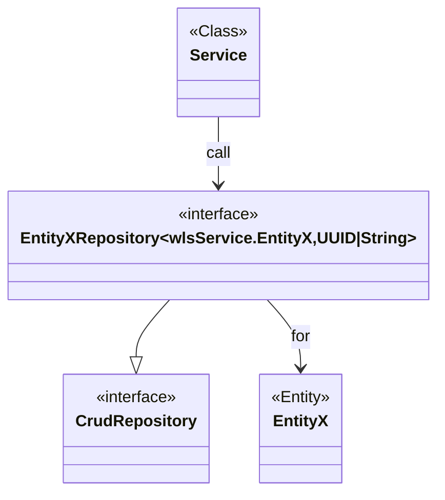

# Systemspezifikation vom Wahllokalsystem

🚧 -> <https://github.com/it-at-m/Wahllokalsystem/issues/741>

## Systemarchitektur

### Übersicht der Systeme



Damit das Wahllokalsystem betrieben werden kann, wird ein externes System benötigt. Dieses stellt Informationen
zu den Wahlen bereit, welche durch das WLS unterstützt werden sollen.

LDAP wird zur [Authentifizierung](security#authentifizierung) der Benutzer verwendet,

### Komponenten des WLS



Das WLS besteht aus 3 Arten von Komponenten. Die **Frontends** stellen das Userinterface für die Benutzer dar.
Über die **Apigateways** wird der Zugriff auf die **Backendservices** ermöglicht, welche die Anwendungslogik
umsetzen und sich um die Datenhaltung kümmern.

## Servicearchitektur

### Backendservices


Ein Backendservice besteht in der Regel aus 3 Layern.

- `access layer` ... Ermöglicht den Zugriff auf den Service
- `service layer` ... Durchführung der fachlichen Logik, wie Validierung oder Lesen und Speichern sowie die Verwendung  
dritter Services zur Erfüllung der Aufgaben
- `persistence layer` ... Zugriff auf die Datenbank

#### Security

Komponenten die eine rote Umrandung haben sind Teil der Security.

Zum einen gibt es eine Zugriffskontrolle im `access layer`. Hier wird geprüft, ob für den Zugriff auf die geforderte
Resource die erforderliche Authentifizierung gegeben ist. Die meisten Ressourcen erfordern eine Authentifizierung. Es gibt 
wenige Resource die ohne Authentifizierung abrufbar sind.

Die Security im `service layer` und `persistence layer` prüft die Autorisierung. Die Methoden erfordern in der Regel
mindestens 1 der funktion entsprechendes Recht. Das Verändern der Daten eines bestimmten Wahlbezirkes erfordert auch
der User berechtigt ist für diesen Wahlbezirk Daten zu verändern.



`bezirkIDCheck` wird definiert durch das Interface
`de.muenchen.oss.wahllokalsystem.wls.common.security.BezirkIDPermissionEvaluator` und hat folgende Implementierungen:

- `BezirkIDPermissionEvaluatorImpl` ... führt eine Prüfung des Authenticationobjektes durch
- `DummyBezirkIdPermissionEvaluatorImpl` ... liefert immer `true`

#### access layer

#### service layer

Im Servicelayer befinden sind die Klassen, Interfaces und Records die zur Umsetzung der fachlichen Anforderungen
notwendig sind.

##### Komponenten


[Designentscheidung](../adr/adr002-controller-service-datamodels.md) zu den Datenmodellen für die Kommunikation zwischen den Layern.




<details>

<summary>Beispiel Packagestruktur in Basisdatenservice</summary>

```
├─ clients
|     ├─ DummyClientImpl
|     ├─ WahlbezirkeClientImpl
|     └─ WahlbezirkeClientMapper
├─ service
|     ├─ common
|     |    ├─ WahlbezirkArtModel
|     |    └─ WahltagIdUndWahlbezirksart
|     ├─ wahlbezirke
|     |    ├─ WahlbezirkeClient
|     |    ├─ WahlbezirkeValidator
|     |    ├─ WahlbezirkeService
|     |    ├─ WahlbezirkModel
|     |    └─ WahlbezirkModelMapper
```

</details>

#### persistence layer



Für den Zugriff verwenden wird [Spring-Data](https://spring.io/projects/spring-data).

Die Klasse und Interfaces werden im Package `domain` abgelegt. Analog zu den Services werden Subpackages je
Themenkomplex definiert.

Klassen die durch Entitäten verschiedene Subpackages verwenden werden sind in dem Subpackage `common` abzulegen.

<details>

<summary>Beispiel Packagestruktur in Basisdatenservice</summary>

```
├─ domain
|     ├─ common
|     |    ├─ WahlbezirkArt
|     |    └─ WahltagIdUndWahlbezirksart
|     ├─ handbuch
|     |    ├─ Handbuch
|     |    └─ HandbuchRepository
|     ├─ ungueltigeWahlscheine
|     |    ├─ UngueltigeWahlscheine
|     |    └─ UngueltigeWahlscheineRepository
```

</details>