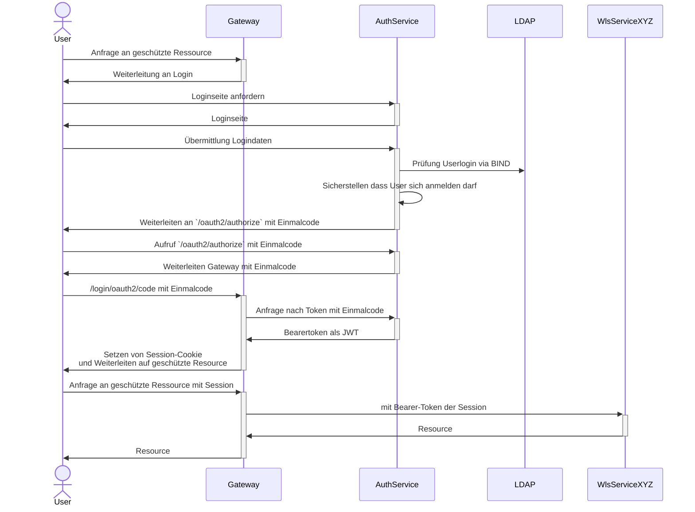

# Sicherheitskonzept von WLS

## Authentifizierung

Zur Authentifizierung wird OAuth2 mit dem Grant Type `authorization_code` verwenden.
Dabei wird ein Token vom Authorization-Server ([`wls-auth-service`](/services/auth-service)) ausgestellt.
Der ausgestellt Token wird in der Session hinterlegt, die der Client verwenden soll. Anfragen an
Services erfolgen mit der SessionsID an das Gatway, welches die Anfrage dann an den jeweiligen Service
unter Verwendung des Bearer-Tokens weiterleiten.

> [!NOTE]
> Nutzer des Wahllokalsystems dürfen sich nur innerhalb einer bestimmten Zeit anmelden. Nutzer des Admin-Tools
> dürfen sich zu jeder Zeit anmelden. Um welche Art eines Nutzers es sich handelt, wird anhand von Authorities
> bestimmt.